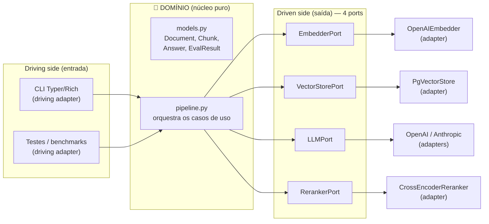

# Arquitetura Hexagonal (Ports e Adapters)

> [!abstract] TL;DR
> A arquitetura hexagonal coloca o **domínio no centro** e empurra toda a infraestrutura (DB, rede, CLI, APIs externas) para as **bordas**. O domínio define **interfaces (ports)**; as bordas trazem **implementações concretas (adapters)**. A dependência aponta **de fora para dentro** — o núcleo nunca conhece a infra. No `density`, isso é o que torna possível **trocar de provedor e rodar o mesmo eval**: você troca o adapter, não o domínio.

## O problema que ela resolve

Alistair Cockburn cunhou o padrão "Ports and Adapters" em 2005, com um objetivo explícito no título original do artigo: *"permitir que uma aplicação seja igualmente dirigida por usuários, programas, testes automatizados ou scripts em lote, e ser desenvolvida e testada isoladamente de seus dispositivos e bancos de dados de runtime"*.

Repare no verbo: **isolar a lógica de negócio dos detalhes de I/O**. O inimigo que Cockburn atacava é aquele acoplamento sorrateiro em que a regra de negócio "vaza" para dentro do código de infraestrutura (SQL espalhado no meio da lógica, chamadas HTTP fincadas dentro de um caso de uso). Quando isso acontece, você não consegue testar a regra sem subir um banco, não consegue trocar o banco sem reescrever a regra, e não consegue nem enxergar onde a regra termina e a plumbing começa.

O nome "hexágono" é quase um acidente feliz: Cockburn desenhou um hexágono só para ter **múltiplos lados** onde encaixar adaptadores diferentes, deixando claro que não existe apenas um "topo" (UI) e um "fundo" (DB) como no diagrama de camadas tradicional. O número seis não significa nada — poderiam ser quatro ou oito lados.

## O coração: inversão de dependência

O mecanismo central é o **Princípio da Inversão de Dependência** (o "D" de SOLID). Sem hexagonal, o fluxo de dependência costuma ser:

```
domínio  →  banco de dados concreto (psycopg, pgvector...)
```

O domínio *importa* e *depende* de um detalhe de infra. Com hexagonal, invertemos a seta:

```
domínio define a interface  ←  adapter concreto implementa a interface
```

Agora o adapter depende do domínio (implementa a abstração que o domínio ditou), e o domínio não sabe que `pgvector`, `psycopg` ou OpenAI existem. Essa inversão é o que dá liberdade: o núcleo fala uma linguagem que *ele* definiu, e o mundo externo se pluga nessa linguagem. Veja [[Injeção de Dependência]] para o mecanismo concreto de "entregar o adapter certo em runtime" e [[Camadas, Domínio e Fronteiras]] para a **Regra da Dependência** que formaliza esse "sempre para dentro".

## Ports vs Adapters

- **Port (porta)**: um **contrato** — uma interface abstrata que o domínio *define* porque *precisa* daquela capacidade. Ex.: "eu preciso transformar texto em vetor". Isso é uma `EmbedderPort`. O port é código de domínio; vive perto do núcleo. Pense no `base.py` de cada módulo como o arquivo canônico de cada port no `density`.
- **Adapter (adaptador)**: uma **implementação concreta** do port, que mora na borda e conhece um detalhe do mundo. Ex.: `OpenAIEmbedder` que chama a API da OpenAI e devolve `list[float]`. É a materialização do [[Adapter Pattern]].

A distinção mais importante para não errar: **o port pertence ao domínio, o adapter pertence à infraestrutura**. Se você definir a interface dentro da pasta de infra, inverteu tudo errado.

## Driving ports vs driven ports

Cockburn separa dois lados do hexágono, e essa distinção é sutil mas essencial:

- **Driving ports / primary (entrada, "quem dirige a aplicação")**: quem *inicia* a interação. A CLI do usuário, um teste automatizado, um endpoint HTTP. O ator externo chama *para dentro*. No `density`, o [[Typer e Rich (o CLI)]] é o driving adapter — o usuário roda `density ingest doc.pdf` e isso aciona um caso de uso.
- **Driven ports / secondary (saída, "a aplicação dirige")**: as capacidades que o domínio *consome* do mundo. O domínio chama *para fora* através dessas portas. São os quatro pilares do `density`:
  - `EmbedderPort` → transformar texto em vetor ([[Embeddings]])
  - `VectorStorePort` → persistir e buscar por similaridade ([[Busca Vetorial (ANN)]], [[pgvector - tipo vector e operadores de distância]])
  - `LLMPort` → gerar texto a partir de um prompt fundamentado ([[Grounding e Geração]])
  - `RerankerPort` → reordenar candidatos por relevância fina ([[Reranking]])

> [!tip] Regra prática para classificar
> Pergunte "quem chama quem?". Se o ator externo chama a aplicação, é **driving**. Se a aplicação chama o recurso externo, é **driven**. A CLI dirige; o Postgres é dirigido.

## O hexágono do density



Note que **todas as setas de dependência de código apontam para o CORE** (os adapters implementam interfaces do domínio), mesmo que as setas de *chamada em runtime* saiam do core em direção aos adapters. Essa é a diferença entre "quem depende de quem" (compile-time) e "quem chama quem" (runtime), e confundir as duas é o erro clássico de quem está aprendendo o padrão.

## Como difere de camadas / MVC clássico

Na arquitetura em **camadas** tradicional (apresentação → serviço → repositório → dados), a dependência é **unidirecional e vertical**, e — crucialmente — a camada de negócio depende da camada de dados que está *abaixo* dela. O DB fica no "fundo" e a lógica depende dele.

Diferenças-chave da hexagonal:

| Aspecto | Camadas / MVC | Hexagonal |
|---|---|---|
| Direção da dependência | Cima → baixo (negócio depende do dado) | Tudo → centro (dado depende do negócio) |
| Posição do DB | Camada de fundo, privilegiada | Só mais um adapter na borda |
| Entrada | UI é o topo, especial | CLI, teste, HTTP são adapters equivalentes |
| Testar o núcleo | Precisa de mocks das camadas de baixo | Núcleo roda sozinho, sem I/O |

O ganho conceitual: no hexagonal **o banco de dados não é especial**. Ele é um detalhe substituível, exatamente como a CLI. Isso é libertador quando o "banco" na verdade são *quatro* serviços externos caros e trocáveis (OpenAI, Anthropic, pgvector, cross-encoder), como no RAG.

## Por que encaixa perfeito no density

O `density` tem uma tese central: **avaliação rigorosa como cidadã de primeira classe**. Para avaliar, você precisa **benchmarkar** — comparar `text-embedding-3-small` contra outro embedder, comparar OpenAI contra Anthropic na geração, comparar busca densa pura contra híbrida com rerank.

Com ports e adapters, um benchmark é literalmente: **troque o adapter, rode o mesmo eval**. O caso de uso em `pipeline.py`, os modelos em `models.py` e a suíte [[Avaliação com RAGAS]] não mudam **uma linha**. Você injeta `OpenAIEmbedder` numa rodada e `OutroEmbedder` na outra, e o módulo `evaluation/` mede as duas com a mesma régua. Isso só é barato porque o domínio não conhece a implementação — é o [[Strategy Pattern]] operando em escala de arquitetura, montado via [[Factory Method]] e entregue por [[Injeção de Dependência]].

> [!example] O benchmark como prova de fogo do desenho
> Se trocar de embedder exigisse mexer no pipeline, o desenho estaria errado. O fato de que **não exige** é a validação empírica de que a fronteira está no lugar certo.

## Custos honestos

Nenhum padrão é grátis. Seja cético:

> [!warning] Quando hexagonal é overkill
> - **Indireção**: para ler "de onde vem o embedding de verdade", você salta interface → factory → adapter. Um leitor novo demora mais para achar o código que faz a chamada HTTP.
> - **Boilerplate**: cada capacidade vira `base.py` (o port) + um ou mais adapters + fiação de DI. Para uma capacidade que **nunca** terá segunda implementação, isso é cerimônia sem retorno.
> - **Script pequeno**: um script de 80 linhas que lê um PDF e chama a OpenAI uma vez **não deve** ser hexagonal. O padrão paga quando há (a) múltiplas implementações reais do mesmo contrato, (b) necessidade de testar o núcleo sem I/O, ou (c) benchmark/troca de provedor — exatamente o caso do `density`. Sem esses gatilhos, você paga o custo e não colhe o benefício.

A regra do sênior: **adote a fronteira onde a substituição é real ou iminente; não abstraia por esporte.** No `density`, os quatro driven ports existem porque cada um tem substituição concreta e mensurável. Se amanhã surgir um `CachePort` que só terá Redis para sempre, talvez ele nem precise virar port.

## Onde isso aparece no density

- Cada estágio plugável tem seu **port** num `base.py`: `embeddings/base.py` (`EmbedderPort`), `store/base.py` (`VectorStorePort`), `generation/base.py` (`LLMPort`), e o reranker em `retrieval/rerank.py`.
- Os **adapters** concretos ficam ao lado: `embeddings/openai.py`, `store/pgvector.py`, adapters OpenAI/Anthropic para o LLM.
- `cli.py` é o **driving adapter** (Typer+Rich); `pipeline.py` é o caso de uso que orquestra os driven ports sem conhecer suas implementações.
- `models.py` e `config.py` formam o núcleo que **não importa** nada de infra — a checagem visual do desenho é: abra `models.py` e confirme que não há `import openai` nem `import psycopg` lá.
- É essa arquitetura que sustenta o diferencial do projeto: **trocar implementação + rodar o mesmo eval** em [[Avaliação com RAGAS]].

## Conexões

- [[Camadas, Domínio e Fronteiras]] — a Regra da Dependência que formaliza o "sempre para dentro".
- [[Estrutura de Pastas do density]] — como o hexágono vira árvore de diretórios.
- [[Adapter Pattern]] — o padrão que dá nome à borda.
- [[Strategy Pattern]] — trocar comportamento (adapter) sem tocar no cliente (pipeline).
- [[Factory Method]] — como o adapter certo é construído a partir da [[Pydantic v2]] `config`.
- [[Injeção de Dependência]] — como o adapter chega ao caso de uso.
- [[Repository Pattern]] — o `VectorStorePort` é um repositório especializado.
- [[Fluxo de Dados no Pipeline RAG]] — o hexágono em movimento, ponta a ponta.
- [[Modelos de Domínio com Pydantic (DTO e Value Object)]] — o que cruza as fronteiras.
