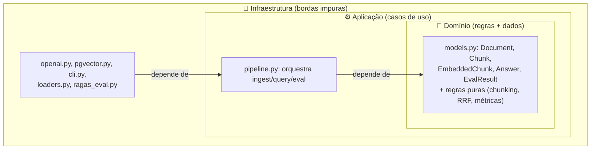
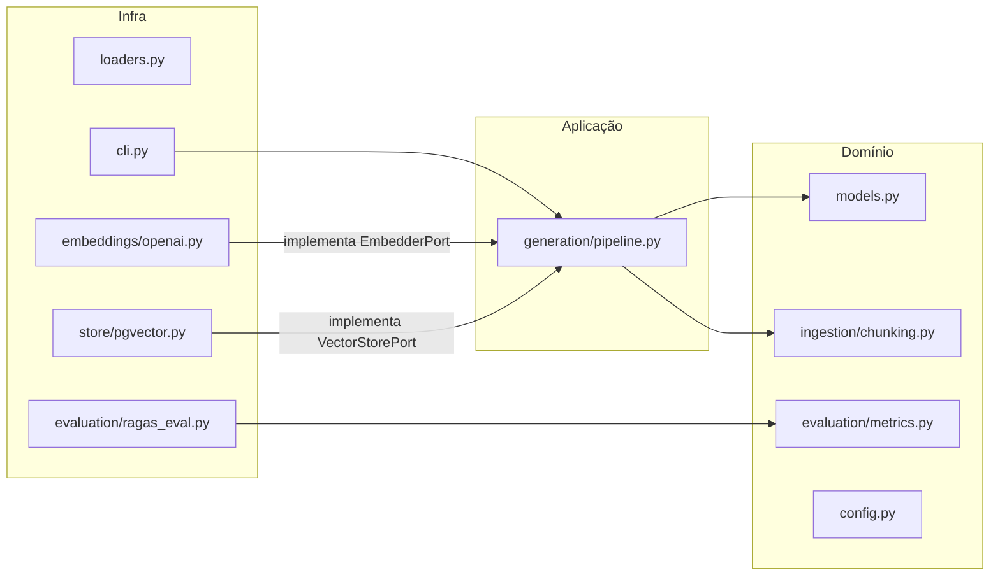

# Camadas, Domínio e Fronteiras

> [!abstract] TL;DR
> Todo sistema tem três anéis: **domínio** (as regras e os dados que seriam verdade mesmo sem computador), **aplicação** (os casos de uso que orquestram o domínio) e **infraestrutura** (o I/O: DB, rede, arquivos, CLI). A **Regra da Dependência** diz: as setas de dependência apontam **sempre para dentro**, rumo ao domínio. Os dados cruzam as **fronteiras** como [[Modelos de Domínio com Pydantic (DTO e Value Object)]]. O núcleo é puro e determinístico (barato de testar); as bordas são impuras (I/O, caras, mockadas). No `density`, é isso que torna testes e benchmark baratos.

## Domínio, aplicação, infraestrutura

Essas três palavras são jargão de Clean Architecture / DDD, mas o conteúdo é simples e concreto. Pense em anéis concêntricos:



- **Domínio**: o que seria verdade **mesmo sem computador nenhum**. Um `Chunk` é um pedaço de texto com metadados; a fórmula do [[Busca Híbrida e Reciprocal Rank Fusion|RRF]]; o cálculo de `recall@k`. Nada disso precisa de rede ou banco para existir. É o coração do valor. No `density`: `models.py` + as funções puras de [[Chunking]], fusão e o cálculo de métricas (`metrics.py`).
- **Aplicação**: os **casos de uso** — as sequências que dão sentido às operações do usuário. "Ingerir um documento" = carregar → chunkar → embedar → armazenar. "Responder uma query" = recuperar → rerankear → gerar → avaliar. A aplicação **coordena** o domínio e pede coisas às bordas *através de ports*. No `density`: `pipeline.py`.
- **Infraestrutura**: o mundo sujo. Chamadas HTTP à OpenAI, SQL no Postgres, leitura de PDF, o terminal do usuário. Tudo que envolve I/O, latência, falha de rede, estado externo. No `density`: `openai.py`, `pgvector.py`, `loaders.py`, `cli.py`, `ragas_eval.py`.

> [!tip] Teste mental para saber em que anel algo vive
> Pergunte: "isso pode falhar por causa da rede, disco ou banco?" Se sim, é infraestrutura. "Isso continua fazendo sentido num quadro-branco, sem máquina?" Se sim, é domínio. O caso de uso é a cola no meio.

## A Regra da Dependência

A regra é uma frase só, de Robert C. Martin: **"dependências de código-fonte apontam apenas para dentro, em direção às políticas de mais alto nível"**. Traduzindo para o `density`:

- `pipeline.py` (aplicação) pode importar `models.py` (domínio). ✅
- `openai.py` (infra) pode importar o `EmbedderPort` (contrato do domínio) e `models.py`. ✅
- `models.py` (domínio) **não pode** importar `openai.py`, `pgvector.py` nem qualquer coisa de `store/`. ❌

A seta nunca aponta para fora. O domínio é o anel mais estável e mais valioso, e ele **não sabe** que OpenAI, Postgres ou Typer existem. Isso é exatamente a inversão de dependência que sustenta a [[Arquitetura Hexagonal (Ports e Adapters)]] — o port é o ponto onde a seta se inverte: a infra depende de uma interface *que o domínio definiu*.

> [!warning] O sintoma de que a regra foi violada
> Se você abrir `models.py` e encontrar `import openai` ou `from psycopg import ...`, o domínio vazou para a borda. A consequência prática: você não consegue mais testar o modelo sem a biblioteca externa instalada, não consegue trocar o provedor sem tocar no núcleo, e o "coração" do sistema passou a depender de detalhes que mudam toda semana. A checagem é literal e barata — abra o arquivo e olhe os imports.

## Fronteiras e o que as cruza

Uma **fronteira** é a linha entre dois anéis — o ponto onde o controle passa da aplicação para a infraestrutura (ou vice-versa). É o lugar mais perigoso do sistema, porque é onde acoplamentos indevidos nascem. A disciplina que mantém a fronteira limpa: **os dados a cruzam como estruturas simples e explícitas, não como objetos da biblioteca externa**.

No `density`, isso significa que o que passa pelas fronteiras são os [[Modelos de Domínio com Pydantic (DTO e Value Object)]]:

```python
# Ilustrativo — a forma importa mais que os detalhes.
# O que cruza a fronteira é um MODELO DO DOMÍNIO, não um objeto da OpenAI.

class EmbedderPort(Protocol):
    def embed(self, texts: list[str]) -> list[list[float]]: ...

# Adapter na borda: recebe/devolve tipos do domínio,
# esconde o SDK da OpenAI lá dentro.
class OpenAIEmbedder:
    def embed(self, texts: list[str]) -> list[list[float]]:
        resp = self._client.embeddings.create(...)   # detalhe da borda
        return [d.embedding for d in resp.data]        # traduz para o domínio
```

O ponto-chave: o `pipeline.py` recebe `list[list[float]]` (ou um `EmbeddedChunk` do `models.py`), **nunca** um objeto `openai.types.CreateEmbeddingResponse`. Se o objeto da OpenAI vazasse para dentro, o domínio passaria a depender do formato da OpenAI — e a fronteira teria sido furada. O adapter é um **tradutor**: fala "Openês" para fora e "domínio" para dentro. É por isso que os modelos Pydantic são o "idioma franco" das fronteiras — validados, tipados, sem lógica de I/O.

## Núcleo puro × bordas impuras

Essa é a distinção que paga todas as contas do desenho:

| | Núcleo (domínio + casos de uso puros) | Bordas (infra) |
|---|---|---|
| Natureza | Determinístico: mesma entrada → mesma saída | Não-determinístico: rede, relógio, DB |
| Efeitos colaterais | Nenhum | I/O, mutação de estado externo |
| Custo de teste | Trivial (chamada de função) | Caro (mock, container, fixture) |
| Velocidade | Microssegundos | Milissegundos a segundos |
| Estabilidade | Muda com a regra de negócio (raro) | Muda com o fornecedor (frequente) |

**Funções puras** como a de [[Chunking]] (texto → `list[Chunk]`), a fusão [[Busca Híbrida e Reciprocal Rank Fusion|RRF]] (dois rankings → um ranking) e as métricas de avaliação (predições + gabarito → número) são o sonho do testador: você passa entrada em memória e compara a saída, sem subir nada. **Bordas impuras** como o `pgvector.py` ou o `openai.py` você testa contra um fake do port, ou com um container efêmero, e só de vez em quando.

> [!example] Por que essa separação é o que torna o benchmark barato
> O diferencial do `density` é comparar configurações medindo o **mesmo eval**. Isso só é barato porque:
> 1. O **eval** e o **pipeline** são núcleo/aplicação — não mudam quando você troca o adapter.
> 2. O que muda entre duas rodadas de benchmark é **só qual adapter de borda** você injeta (ver [[Injeção de Dependência]]).
> 3. As métricas são funções puras: rodar a mesma régua em duas saídas diferentes é grátis.
> Se a lógica de eval estivesse acoplada ao provedor, cada benchmark exigiria reescrever a medição — e comparações justas seriam impossíveis.

## Como isso mapeia nos módulos do density



- **Domínio puro**: `models.py`, `config.py`, `ingestion/chunking.py` (a política de fatiar), `evaluation/metrics.py`, e a fusão em `retrieval/hybrid.py`.
- **Aplicação**: `generation/pipeline.py` — orquestra sem conhecer implementações.
- **Infra**: `ingestion/loaders.py`, `embeddings/openai.py`, `store/pgvector.py`, `cli.py`, `evaluation/ragas_eval.py`.

Repare em `chunking.py`: é infra? Não — é *política* pura (dado um texto, produza chunks). O `loaders.py` é que é infra (abre o PDF). Essa separação dentro de `ingestion/` é a Regra da Dependência aplicada em pequena escala. Ver [[Estrutura de Pastas do density]].

## Custos e honestidade

> [!warning] O que essa disciplina cobra de você
> - **Mapeamento (mapping)**: traduzir objeto externo → modelo do domínio na borda é código extra que não "faz nada" visível. Em troca, isola o núcleo de mudanças do fornecedor.
> - **Tentação de vazar por preguiça**: é sedutor passar o objeto da OpenAI direto "só desta vez". Cada vez que você cede, fura uma fronteira e o domínio adoece um pouco.
> - **Overhead em sistemas triviais**: se não há segunda implementação nem eval, os três anéis viram cerimônia. A regra vale quando há substituição real ou testabilidade em jogo — que é o caso do `density`.

## Onde isso aparece no density

- A Regra da Dependência é verificável abrindo `models.py`/`config.py`: **sem imports de `openai`, `psycopg`, `anthropic`** — o núcleo não conhece a borda.
- Os ports (`embeddings/base.py`, `store/base.py`, `generation/base.py`, `retrieval/rerank.py`) são exatamente os pontos de inversão onde a seta de dependência vira para dentro — a espinha da [[Arquitetura Hexagonal (Ports e Adapters)]].
- Funções puras (`chunking.py`, `hybrid.py`, `metrics.py`) são o núcleo determinístico que torna [[pytest e ruff|os testes]] triviais.
- A fronteira é cruzada pelos [[Modelos de Domínio com Pydantic (DTO e Value Object)]], não por objetos dos SDKs.
- É esse desenho que faz o benchmark de [[Avaliação com RAGAS]] ser barato: troca-se só o adapter, mede-se com a mesma régua.

## Conexões

- [[Arquitetura Hexagonal (Ports e Adapters)]] — os ports como pontos de inversão da dependência.
- [[Estrutura de Pastas do density]] — os anéis materializados em diretórios.
- [[Fluxo de Dados no Pipeline RAG]] — os dados atravessando as fronteiras, passo a passo.
- [[Modelos de Domínio com Pydantic (DTO e Value Object)]] — o idioma franco das fronteiras.
- [[Injeção de Dependência]] — como o adapter de borda chega ao caso de uso.
- [[Repository Pattern]] — a fronteira do armazenamento como interface de domínio.
- [[Avaliação com RAGAS]] — por que a pureza do núcleo torna o benchmark barato.
