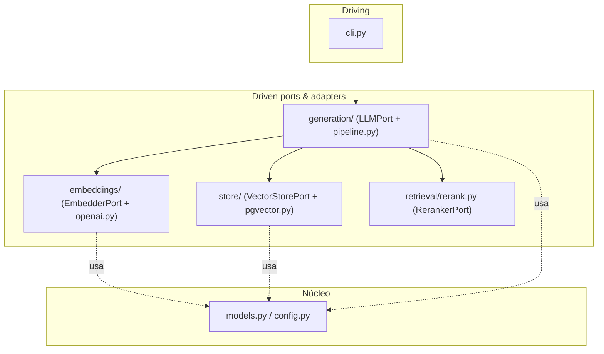

# Estrutura de Pastas do density

> [!abstract] TL;DR
> A árvore de pastas do `density` **é** a [[Arquitetura Hexagonal (Ports e Adapters)]] materializada em diretórios. Cada pasta tem uma responsabilidade única; o núcleo (`models.py`, `config.py`) mora no topo e não importa das bordas; cada capacidade plugável ganha um subpacote com um `base.py` (o port) e adapters concretos ao lado. O layout `src/` não é preciosismo — é o que garante que você teste o **pacote instalado**, não os arquivos soltos do repositório.

## A árvore completa

```text
density/
├── pyproject.toml            # metadados, deps, config de ruff/pytest (uv)
├── docker-compose.yml        # Postgres + pgvector para dev
├── Dockerfile
├── README.md
├── src/
│   └── density/
│       ├── __init__.py
│       ├── config.py         # Settings (Pydantic v2) — núcleo de configuração
│       ├── models.py         # Document, Chunk, EmbeddedChunk, Answer, EvalResult
│       ├── cli.py            # driving adapter: Typer + Rich
│       ├── ingestion/
│       │   ├── __init__.py
│       │   ├── loaders.py    # PDF/TXT/MD -> texto bruto
│       │   └── chunking.py   # texto -> list[Chunk]
│       ├── embeddings/
│       │   ├── __init__.py
│       │   ├── base.py       # EmbedderPort (interface)
│       │   └── openai.py     # OpenAIEmbedder (adapter)
│       ├── store/
│       │   ├── __init__.py
│       │   ├── base.py       # VectorStorePort (interface)
│       │   └── pgvector.py   # PgVectorStore (adapter)
│       ├── retrieval/
│       │   ├── __init__.py
│       │   ├── dense.py      # busca vetorial (ANN)
│       │   ├── sparse.py     # busca lexical (full-text / BM25-like)
│       │   ├── hybrid.py     # fusão (RRF)
│       │   └── rerank.py     # RerankerPort + cross-encoder adapter
│       ├── generation/
│       │   ├── __init__.py
│       │   ├── base.py       # LLMPort (interface)
│       │   └── pipeline.py   # orquestração do caso de uso RAG
│       └── evaluation/
│           ├── __init__.py
│           ├── ragas_eval.py # integração RAGAS
│           └── metrics.py    # métricas próprias (recall@k, MRR...)
├── tests/                    # espelha src/density/
│   ├── ingestion/
│   ├── embeddings/
│   ├── retrieval/
│   └── ...
├── benchmarks/               # scripts de comparação de provedores/configs
└── data/                     # PDFs de exemplo, fixtures — gitignored
```

## Por que `src/` layout e não flat layout

O flat layout (o pacote `density/` direto na raiz, sem `src/`) parece mais simples, e é a razão pela qual iniciantes o preferem. Mas ele tem uma armadilha real:

> [!danger] O bug de import que o `src/` layout previne
> No flat layout, o diretório raiz está no `sys.path` quando você roda os testes. Isso significa que `import density` **acha o código-fonte diretamente**, não o pacote instalado. Resultado: seus testes passam mesmo que o `pyproject.toml` esteja mal configurado, mesmo que você esqueça de listar um subpacote em `packages`, mesmo que um arquivo não vá para dentro do wheel. Você descobre o problema **só quando o usuário instala** — em produção.

Com o `src/` layout, o código não está no `sys.path` por acidente. Para importar `density` nos testes, você **precisa instalá-lo** (tipicamente `uv pip install -e .`, editable install). Isso força que o teste exercite exatamente o que o usuário vai instalar. É o padrão de biblioteca séria justamente porque **transforma erros de packaging em falhas de teste locais** em vez de bugs de produção. Ver [[uv (gerenciador de pacotes)]] e [[pytest e ruff]] para como isso se amarra ao fluxo de dev.

Benefícios secundários: separa nitidamente "código do produto" (`src/`) de "código de apoio" (`tests/`, `benchmarks/`), e evita que arquivos como `setup.py` ou `conftest.py` na raiz sejam importáveis por engano.

## Decisão por decisão

### `models.py` e `config.py` — o núcleo, no topo, sem dependências de infra

Ficam **na raiz do pacote**, fora de qualquer subpacote de borda, por uma razão semântica: eles são o **domínio**. `models.py` define os [[Modelos de Domínio com Pydantic (DTO e Value Object)]] que atravessam todo o pipeline (`Document`, `Chunk`, `EmbeddedChunk`, `Answer`, `EvalResult`). `config.py` centraliza as [[Pydantic v2]] `Settings`.

A regra de ouro, verificável a olho nu: **`models.py` não importa `openai`, `psycopg`, `anthropic` nem qualquer coisa de `store/` ou `embeddings/`**. Se importasse, o núcleo dependeria da borda e a inversão de dependência estaria quebrada. Ver [[Camadas, Domínio e Fronteiras]] para o porquê formal.

### `ingestion/` — a fronteira de entrada dos dados

Dividido em dois arquivos com responsabilidades distintas:
- `loaders.py`: I/O bruto. Abre PDF/TXT/MD e devolve texto. É borda impura (toca disco, parseia formatos).
- `chunking.py`: transformação pura de texto em `list[Chunk]`. É onde vive a política de [[Chunking]] (tamanho, overlap, quebra semântica). Separar carregamento de fatiamento permite testar a estratégia de chunk com uma string em memória, sem abrir arquivo.

### `embeddings/`, `store/`, `generation/` — o padrão `base.py` + adapter

Cada um segue a mesma anatomia hexagonal:
- `base.py` = o **port** (interface abstrata). Ex.: `EmbedderPort.embed(texts) -> list[list[float]]`.
- arquivo concreto = o **adapter**. Ex.: `openai.py` com `OpenAIEmbedder`, `pgvector.py` com `PgVectorStore`.

Essa repetição não é acidental — é a assinatura visual do [[Adapter Pattern]] + [[Strategy Pattern]]. Quando você vê um `base.py` num subpacote, sabe imediatamente: "aqui há uma capacidade trocável, e existe pelo menos um adapter ao lado". Para adicionar um provedor novo, você cria um arquivo irmão do adapter e implementa o mesmo `base.py`; nada mais muda.

> [!info] Por que o `LLMPort` mora em `generation/base.py` e não em `models.py`
> Ports são contratos de *capacidade* (comportamento), enquanto `models.py` guarda *dados* (estrutura). O contrato "gerar texto" pertence perto do estágio que o usa (`generation/`), não junto dos DTOs. Isso mantém `models.py` livre de interfaces de serviço.

### `retrieval/` — por que separar dense / sparse / hybrid / rerank

Recuperação **não é uma coisa só**; são estratégias com propriedades e falhas diferentes, e a separação em quatro arquivos torna cada uma testável e benchmarkável isoladamente:
- `dense.py`: [[Busca Vetorial (ANN)]] — captura similaridade *semântica* (sinônimos, paráfrase), mas erra em termos exatos, códigos, siglas.
- `sparse.py`: busca lexical (full-text do Postgres / BM25-like) — captura *correspondência exata de termos*, mas cega para sinônimos. Ver [[Full-text Search e Busca Híbrida no Postgres]].
- `hybrid.py`: funde os dois rankings via [[Busca Híbrida e Reciprocal Rank Fusion]] (RRF). Depende de `dense` e `sparse`, então é natural que fique num arquivo acima deles.
- `rerank.py`: [[Reranking]] com cross-encoder — reordena o top-k por relevância fina. Traz seu próprio `RerankerPort`.

Manter os quatro separados é o que permite o experimento central do `density`: "dense puro vs. híbrido vs. híbrido+rerank, medido pelo mesmo eval". Se estivessem num arquivo só, você não conseguiria ligar/desligar cada estágio limpo.

### `generation/pipeline.py` — o caso de uso, o maestro

`pipeline.py` é onde a orquestração acontece: recebe uma query, chama retrieval, chama rerank, monta o prompt fundamentado ([[Grounding e Geração]]) e chama o `LLMPort`. Ele **conhece os ports, não os adapters** — é o cliente do [[Strategy Pattern]] e o consumidor da [[Injeção de Dependência]]. É o coração do lado "driven" do hexágono.

### `evaluation/` — o diferencial do projeto como pasta de primeira classe

Que a avaliação tenha **seu próprio subpacote** (`ragas_eval.py` + `metrics.py`), e não seja um script perdido, é uma declaração de intenção: medir é parte do produto, não um extra. Ver [[Avaliação com RAGAS]]. `ragas_eval.py` integra o framework RAGAS (faithfulness, answer relevancy, context precision/recall); `metrics.py` guarda métricas próprias de recuperação (recall@k, MRR, nDCG).

### `cli.py` — o único driving adapter

Fica na raiz do pacote porque é o ponto de entrada do usuário. Usa [[Typer e Rich (o CLI)]]. Traduz `density ingest`, `density query`, `density eval` em chamadas ao pipeline. É fino de propósito: parseia argumentos, monta os adapters (via factory + config) e delega. **Nenhuma regra de negócio mora aqui.**

### `tests/` espelhando `src/density/`

Cada módulo de produto tem um módulo de teste no mesmo caminho relativo (`tests/embeddings/test_openai.py` ↔ `src/density/embeddings/openai.py`). Isso dá navegação previsível e revela lacunas: uma pasta em `src/` sem par em `tests/` grita "sem cobertura". Como o núcleo é puro, os testes dele são baratos (sem I/O); os adapters de borda usam fakes/mocks dos ports. Ver [[Camadas, Domínio e Fronteiras]].

### `benchmarks/` e `data/`

- `benchmarks/`: scripts que montam configurações diferentes (troca de adapter) e rodam o mesmo eval. É a materialização prática do benefício hexagonal — vive fora de `src/` porque não é código de produto.
- `data/`: PDFs de exemplo e fixtures, **gitignored**. Nunca versione corpora pesados nem documentos potencialmente sensíveis; o repo deve clonar leve, e o `.gitignore` protege contra commit acidental de dados.

## Mapa pasta → port/adapter



## Onde isso aparece no density

- A árvore acima **é** a estrutura real do projeto; cada `base.py` é um port de [[Arquitetura Hexagonal (Ports e Adapters)]].
- `src/` layout amarrado a [[uv (gerenciador de pacotes)]] (editable install) e [[pytest e ruff]] (testes contra o pacote instalado).
- `models.py`/`config.py` como núcleo sem imports de borda: a checagem concreta da [[Camadas, Domínio e Fronteiras]].
- `retrieval/` dividido é o que habilita o benchmark "dense vs híbrido vs rerank" medido por [[Avaliação com RAGAS]].
- `data/` gitignored e [[Docker e docker-compose]] para subir o Postgres+pgvector de dev.

## Conexões

- [[Arquitetura Hexagonal (Ports e Adapters)]] — o desenho que a árvore materializa.
- [[Camadas, Domínio e Fronteiras]] — por que o núcleo fica no topo e não importa das bordas.
- [[Fluxo de Dados no Pipeline RAG]] — como os dados atravessam essas pastas.
- [[Adapter Pattern]] · [[Strategy Pattern]] · [[Factory Method]] — o trio por trás do padrão `base.py` + adapter.
- [[uv (gerenciador de pacotes)]] · [[pytest e ruff]] — ferramentas que o `src/` layout serve.
- [[Docker e docker-compose]] — o ambiente que hospeda o `store/`.
