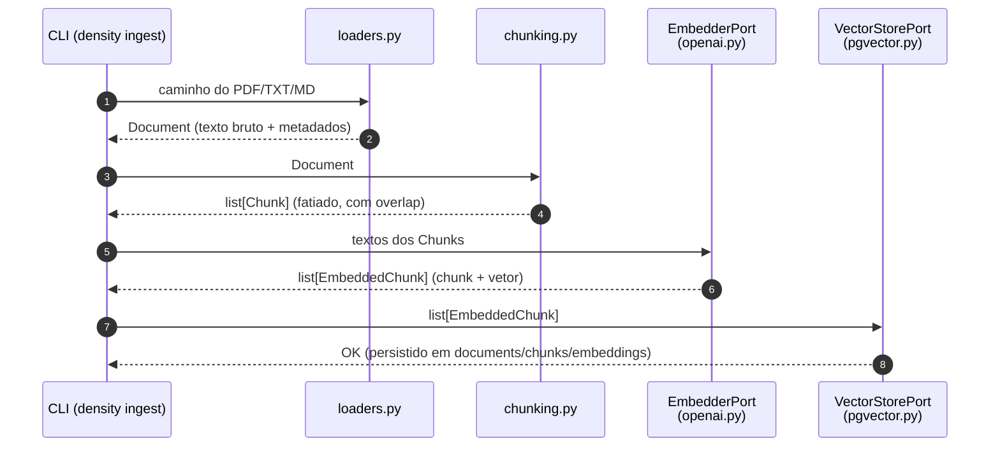
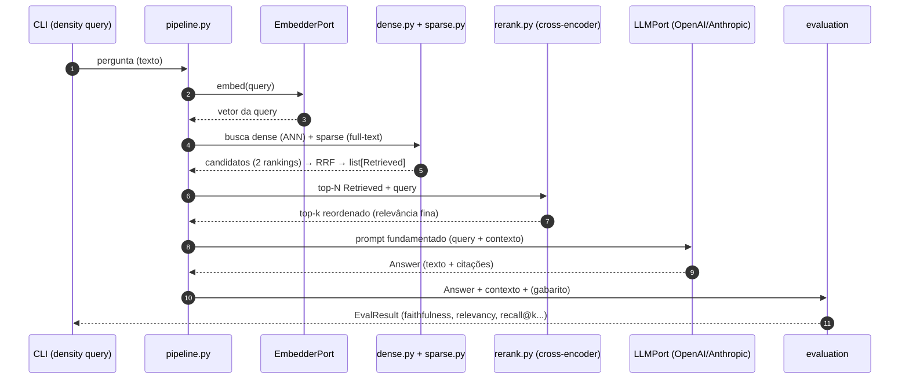
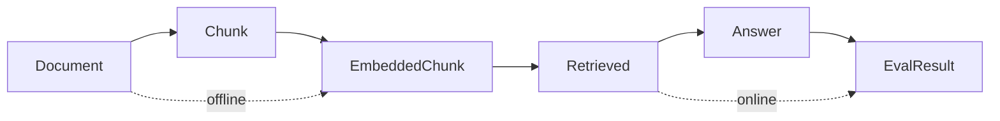

# Fluxo de Dados no Pipeline RAG

> [!abstract] TL;DR
> Um pipeline RAG tem duas metades com orçamentos de tempo opostos. **Indexação (offline)**: `ingest → chunk → embed → store` — roda uma vez por documento, pode ser cara. **Consulta (online)**: `query → retrieve (dense+sparse) → rerank → generate → evaluate` — roda a cada pergunta, tem que caber no orçamento de latência do usuário. Os dados mudam de forma a cada salto: `Document → Chunk → EmbeddedChunk → Retrieved → Answer → EvalResult`. A grande decisão de arquitetura é **o que você paga caro no offline para poder ser barato no online**.

## As duas metades: por que a distinção offline × online é o eixo de tudo

RAG é, no fundo, dois programas diferentes que compartilham um banco:

- **Indexação (offline / write path)**: acontece quando um documento entra no sistema. Ninguém está esperando na frente da tela por essa operação — ela pode levar minutos. Isso é uma licença para gastar: chunking semântico sofisticado, modelos de embedding maiores, limpeza de texto pesada. Você paga **uma vez** e amortiza por **todas** as consultas futuras.
- **Consulta (online / read path)**: acontece quando o usuário faz uma pergunta e **está esperando a resposta**. Aqui cada milissegundo conta. Você tem um orçamento de latência (digamos, 1–3s) e precisa espremer recuperação + rerank + geração dentro dele.

> [!tip] A regra mental do arquiteto de RAG
> "Empurre para o offline tudo que puder ser pré-computado; deixe no online só o que **depende da query**." O embedding dos chunks é pré-computável → offline. O embedding da *query* e o rerank *query-documento* dependem da pergunta → online, e por isso entram no orçamento de latência.

## Indexação (offline), salto a salto

1. **ingest** (`loaders.py`): abre o arquivo e produz um `Document` — texto extraído + metadados (fonte, página, título). É borda impura (I/O de disco, parsing de PDF). Falha de qualidade aqui: PDF com layout de colunas mal extraído, tabelas viram sopa de tokens. **Lixo aqui contamina tudo abaixo** — garbage in, garbage out.
2. **chunk** (`chunking.py`): fatia o `Document` em `list[Chunk]`. Aqui vive toda a política de [[Chunking]]: tamanho da janela, overlap, quebra em fronteiras semânticas (parágrafo/sentença) vs. corte cego por tokens. É **função pura**, e por ser offline pode ser cara (chunking semântico com detecção de tópico). Falha de qualidade: chunk grande demais dilui o sinal no embedding; pequeno demais fragmenta a ideia e perde contexto.
3. **embed** (`EmbedderPort` → `openai.py`): transforma o texto de cada chunk em vetor (`text-embedding-3-small`). Produz `EmbeddedChunk` (o chunk + seu vetor). Ver [[Embeddings]]. É borda de rede (chamada de API), mas offline — pode processar em lote, retry, rate-limit sem afetar o usuário. Falha: modelo de embedding fraco não separa bem os conceitos no espaço vetorial.
4. **store** (`VectorStorePort` → `pgvector.py`): persiste no Postgres — o `Document`, os `Chunk`s e seus `embedding`s, no schema `documents`/`chunks`/`embeddings`. Ver [[Design do Schema (documents, chunks, embeddings)]] e [[Por que Postgres e pgvector]]. Aqui também se constrói/atualiza o índice ANN ([[Índices ANN - HNSW vs IVFFlat]]) — construir o índice é caro, e por ser offline, tudo bem.

## Consulta (online), salto a salto

1. **query → embed**: a pergunta do usuário é embedada pelo **mesmo** `EmbedderPort` usado no offline. Detalhe crítico: query e chunks têm que viver no **mesmo espaço vetorial**, então o embedder da consulta precisa ser o mesmo (ou compatível) do da indexação. Custo online, mas barato (um vetor).
2. **retrieve** (`dense.py` + `sparse.py`): duas buscas paralelas. A **densa** ([[Busca Vetorial (ANN)]]) acha vizinhos por similaridade semântica no pgvector; a **esparsa** (full-text do Postgres, [[Full-text Search e Busca Híbrida no Postgres]]) acha por correspondência lexical de termos. Cada uma devolve um ranking; a fusão em `hybrid.py` combina via [[Busca Híbrida e Reciprocal Rank Fusion|RRF]] num único `list[Retrieved]`. Falha de qualidade: **recall** — se o chunk certo não sai daqui, nenhum estágio adiante conserta ("você não pode gerar a partir do que não recuperou").
3. **rerank** (`rerank.py`): pega o top-N da fusão e reordena com um **cross-encoder**, que lê query e chunk **juntos** e dá um score de relevância muito mais preciso que a similaridade de vetores. Ver [[Reranking]]. É o estágio mais caro por candidato do caminho online — por isso roda só no top-N, não no corpus inteiro. Falha: se você reranqueia poucos candidatos, o cross-encoder não tem como resgatar um bom chunk que a recuperação deixou em 50º lugar.
4. **generate** (`LLMPort` → OpenAI/Anthropic): monta o prompt fundamentado (query + top-k chunks como contexto) e gera a `Answer`. Ver [[Grounding e Geração]]. O **grounding** — instruir o modelo a responder *só* com base no contexto e citar — é o que combate alucinação. Falha: contexto bom mas prompt fraco → o modelo ignora as fontes e inventa.
5. **evaluate** (`ragas_eval.py` + `metrics.py`): produz `EvalResult`. Mede **recuperação** (recall@k, MRR, context precision/recall) e **geração** ([[Avaliação com RAGAS|RAGAS]]: faithfulness, answer relevancy). É o diferencial do `density`. Em produção pode rodar assíncrono/amostrado; em benchmark, roda sobre um dataset de avaliação inteiro.

## A estrutura de dados que flui em cada salto

O pipeline é uma **transformação progressiva de tipos** — cada estágio enriquece ou transforma o modelo anterior. Isso é a materialização da [[Camadas, Domínio e Fronteiras]]: o que atravessa cada fronteira é sempre um [[Modelos de Domínio com Pydantic (DTO e Value Object)|modelo Pydantic do domínio]], nunca um objeto de SDK.

| Modelo | Nasce em | Carrega |
|---|---|---|
| `Document` | `loaders.py` | texto bruto + metadados de origem |
| `Chunk` | `chunking.py` | pedaço de texto + posição/overlap + ref ao doc |
| `EmbeddedChunk` | `openai.py` | `Chunk` + vetor de embedding |
| `Retrieved` | `dense/sparse/hybrid` | `Chunk` + score(s) + rank (pós-RRF) |
| `Answer` | `pipeline.py`/LLM | texto gerado + citações + contexto usado |
| `EvalResult` | `evaluation/` | métricas de recuperação e geração |

Essa cadeia tipada é o que dá rastreabilidade: dado um `EvalResult` ruim, você caminha de volta pela cadeia (a `Answer` estava fundamentada? o `Retrieved` continha o chunk certo? o `Chunk` estava bem fatiado?) e localiza **em qual salto a qualidade quebrou**.

## O que a distinção offline × online permite pagar caro

> [!example] Orçamentos opostos, decisões opostas
> - **Chunking semântico** (detectar fronteiras de tópico, respeitar estrutura): caro, mas **offline** → pode pagar. Roda uma vez por doc.
> - **Construção do índice HNSW**: cara, **offline** → paga sem dó; acelera *todas* as consultas.
> - **Rerank com cross-encoder**: caro por par query-chunk, mas **online** → só cabe se limitado ao top-N e dentro do orçamento de latência. Não dá para reranquear o corpus inteiro por query.
> - **Embedding da query**: **online**, mas barato (um vetor) → tranquilo.
> A assimetria é a alavanca central do design: **pré-compute agressivamente no offline para que o online fique dentro do budget de latência.**

## Onde cada estágio pode falhar em qualidade

| Estágio | Falha típica | Sintoma no `EvalResult` |
|---|---|---|
| ingest | extração ruim de PDF (colunas, tabelas) | contexto incoerente; recall baixo sem culpa da busca |
| chunk | tamanho/overlap errados | chunk dilui ou fragmenta a ideia |
| embed | modelo fraco / espaços incompatíveis | vizinhos irrelevantes |
| retrieve | recall baixo | context recall despenca — chunk certo nem aparece |
| rerank | top-N pequeno / modelo inadequado | context precision baixa; ruído no top-k |
| generate | grounding fraco / prompt ruim | faithfulness baixa (alucinação apesar de bom contexto) |

O valor do `density` é justamente **fechar esse loop**: o `EvalResult` diz *onde* dói, e a arquitetura hexagonal ([[Arquitetura Hexagonal (Ports e Adapters)]]) permite trocar o adapter do estágio suspeito e **re-medir com a mesma régua**.

## Onde isso aparece no density

- **Offline**: `cli.py ingest` → `ingestion/loaders.py` → `ingestion/chunking.py` → `embeddings/openai.py` → `store/pgvector.py`.
- **Online**: `cli.py query` → `generation/pipeline.py` orquestrando `retrieval/{dense,sparse,hybrid}.py` → `retrieval/rerank.py` → `generation/base.py` (LLMPort) → `evaluation/{ragas_eval,metrics}.py`.
- Os modelos da cadeia vivem em `models.py` (`Document`, `Chunk`, `EmbeddedChunk`, `Retrieved`, `Answer`, `EvalResult`) — ver [[Modelos de Domínio com Pydantic (DTO e Value Object)]].
- A persistência segue o [[Design do Schema (documents, chunks, embeddings)]] com índice de [[Índices ANN - HNSW vs IVFFlat]] construído no offline.
- O loop de qualidade é fechado por [[Avaliação com RAGAS]], habilitado pela substituição de adapters da [[Arquitetura Hexagonal (Ports e Adapters)]].

## Conexões

- [[Arquitetura Hexagonal (Ports e Adapters)]] — cada estágio é um port plugável.
- [[Camadas, Domínio e Fronteiras]] — os modelos como o que cruza as fronteiras.
- [[Estrutura de Pastas do density]] — o mapa de onde cada estágio mora.
- [[Chunking]] · [[Embeddings]] · [[Busca Vetorial (ANN)]] · [[Busca Híbrida e Reciprocal Rank Fusion]] · [[Reranking]] · [[Grounding e Geração]] — o detalhe de cada salto.
- [[Design do Schema (documents, chunks, embeddings)]] · [[Índices ANN - HNSW vs IVFFlat]] — a metade offline persistida.
- [[Avaliação com RAGAS]] — o estágio que fecha o loop de qualidade.
