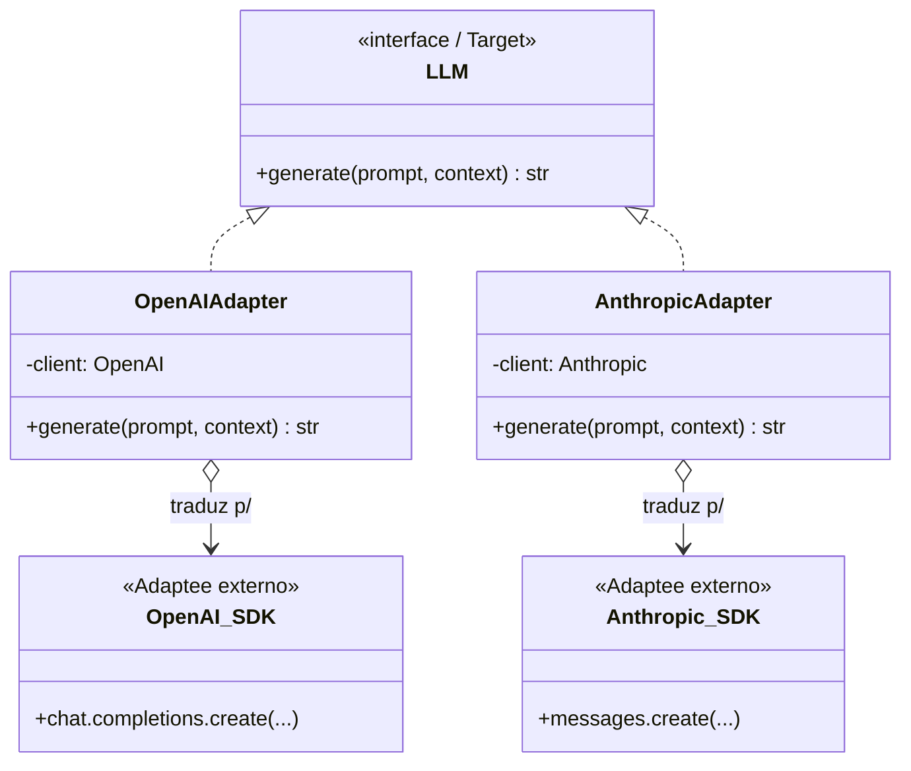

# Adapter Pattern

> [!abstract] TL;DR
> **Adapter** é a "tomada adaptadora" do software: uma casca fina que faz uma interface **incompatível que JÁ EXISTE** (um SDK externo, uma API de terceiro) encaixar no contrato que o *seu* código espera. No `density`, é o que permite plugar o SDK da **OpenAI** e o da **Anthropic** — que têm assinaturas e formatos de resposta diferentes — atrás de um único port `LLM`, e o SQL do **pgvector** atrás de um `VectorStore`. A abstração te dá uniformidade; o preço é que features específicas de um provedor tendem a vazar ou sumir.

## Intenção

> Converter a interface de uma classe na interface que o cliente espera. Adapter permite que classes com interfaces incompatíveis trabalhem juntas. — *GoF*

A metáfora física é perfeita e vale guardar: seu notebook tem um plugue de dois pinos chatos (padrão americano); a tomada na parede é de dois pinos redondos (padrão brasileiro). Nenhum dos dois vai mudar. O **adaptador** de tomada não gera energia nem altera o aparelho — ele só **traduz o formato do encaixe**. Adapter em software é exatamente isso: **zero lógica de negócio, só tradução de interface.**

O gatilho para usá-lo: você quer usar um componente existente (que você não controla e não vai reescrever), mas a interface dele não bate com a que o resto do seu sistema fala.

## Estrutura

Três papéis:

- **Target** — a interface que o *seu* cliente espera. No `density`, o port `LLM` em `generation/base.py`.
- **Adaptee** — o objeto existente e incompatível que você quer usar. Ex.: o cliente `anthropic.Anthropic()` do SDK oficial.
- **Adapter** — a classe que *implementa Target* e, por dentro, *chama Adaptee*, traduzindo argumentos e resultados nos dois sentidos.



Repare: o `Pipeline` (cliente) fala **só** com `LLM`. Ele nunca vê `chat.completions.create` nem `messages.create`. Toda a incompatibilidade fica presa dentro do Adapter.

## Exemplo real no density: um port `LLM`, dois SDKs

O `density` usa **OpenAI e Anthropic com abstração** justamente para poder comparar provedores no eval. Mas os dois SDKs são incompatíveis em detalhes que importam:

- **OpenAI**: `client.chat.completions.create(model=..., messages=[{role, content}, ...])`; a resposta vem em `resp.choices[0].message.content`. O `system` é uma mensagem com `role="system"` dentro de `messages`.
- **Anthropic**: `client.messages.create(model=..., system=..., messages=[...], max_tokens=...)`; a resposta vem em `resp.content[0].text`. O `system` é um **parâmetro separado**, não uma mensagem, e `max_tokens` é **obrigatório**.

O Adapter absorve essas diferenças:

```python
# generation/base.py — o Target (port)
from abc import ABC, abstractmethod

class LLM(ABC):
    @abstractmethod
    def generate(self, prompt: str, *, system: str | None = None) -> str: ...
```

```python
# generation/openai.py — Adapter para o SDK da OpenAI
from openai import OpenAI

class OpenAILLM(LLM):
    def __init__(self, model: str = "gpt-4o-mini"):
        self.client = OpenAI()
        self.model = model
    def generate(self, prompt: str, *, system: str | None = None) -> str:
        messages = ([{"role": "system", "content": system}] if system else []) \
                 + [{"role": "user", "content": prompt}]
        resp = self.client.chat.completions.create(
            model=self.model, messages=messages,
        )
        return resp.choices[0].message.content   # <- traduz o formato de saída
```

```python
# generation/anthropic.py — Adapter para o SDK da Anthropic
from anthropic import Anthropic

class AnthropicLLM(LLM):
    def __init__(self, model: str = "claude-3-5-sonnet-latest", max_tokens: int = 1024):
        self.client = Anthropic()
        self.model, self.max_tokens = model, max_tokens
    def generate(self, prompt: str, *, system: str | None = None) -> str:
        resp = self.client.messages.create(
            model=self.model,
            system=system or "",                 # <- system vira PARÂMETRO, não mensagem
            messages=[{"role": "user", "content": prompt}],
            max_tokens=self.max_tokens,          # <- diferença que o Adapter esconde
        )
        return resp.content[0].text              # <- outro formato de saída
```

Do lado do consumidor — o [[Grounding e Geração|pipeline de geração]] — nada disso aparece:

```python
class GenerationPipeline:
    def __init__(self, llm: LLM):     # recebe o port, não sabe qual provedor
        self.llm = llm
    def answer(self, question: str, context: list[str]) -> str:
        prompt = self.build_prompt(question, context)
        return self.llm.generate(prompt, system="Você é um assistente factual.")
```

### O outro Adapter: `VectorStore` sobre pgvector

O mesmo padrão aparece em `store/pgvector.py`. O port `VectorStore` (em `store/base.py`) expõe operações de domínio como `add(chunks, embeddings)` e `search(query_vec, k)`. Por dentro, o Adapter traduz isso em SQL de pgvector — `INSERT ... INTO chunks`, `SELECT ... ORDER BY embedding <=> $1 LIMIT $k` com o operador de distância. O pipeline pensa em "coleção de vetores"; o Adapter fala "SQL do Postgres". Aqui há sobreposição forte com o [[Repository Pattern]] — a fronteira entre "adaptar uma API" e "abstrair persistência" é borrada de propósito. Ver [[pgvector - tipo vector e operadores de distância]] e [[Por que Postgres e pgvector]].

## O jeito pythônico

Como em quase tudo, Python enxuga a cerimônia:

- **Não precisa de ABC — `typing.Protocol` basta.** Se `GenerationPipeline` só chama `.generate(...)`, um `Protocol` com essa assinatura já define o Target por tipagem estrutural, e nenhum adapter precisa herdar nada.
- **Adapter de função** quando o Adaptee é uma função e o Target também: uma `functools.partial` ou uma pequena closure já "adapta". Nem sempre há classe.
- **Cuidado com o `__init__`**: no `density`, o Adapter é também onde mora o *estado de conexão* (o `client` do SDK, a pool do Postgres). Isso é natural — o Adapter é o único lugar que conhece o Adaptee.

> [!tip] Adapter é uma casca FINA
> Se o seu adapter começou a acumular lógica de negócio (montar prompt complexo, decidir estratégia de retry sofisticada, pós-processar semanticamente a resposta), ele deixou de ser Adapter. Empurre essa lógica para o pipeline ou para uma [[Strategy Pattern|Strategy]] dedicada. Adapter só *traduz interface*.

## Adapter vs Strategy — a distinção crucial

Estruturalmente são gêmeos (interface + implementações). A diferença é **por que você criou as implementações**:

| | [[Adapter Pattern]] | [[Strategy Pattern]] |
|---|---|---|
| **Motivação** | Compatibilidade: encaixar algo que **já existe** e é incompatível | Escolha: alternar entre algoritmos **projetados** para serem intercambiáveis |
| **Origem das implementações** | Externa (SDK de terceiro que você não controla) | Interna (você escreveu cada variante de propósito) |
| **Pergunta que responde** | "Como faço ESTE objeto caber no MEU contrato?" | "QUAL destes algoritmos eu uso agora?" |
| **Exemplo no density** | `OpenAILLM`/`AnthropicLLM` sobre SDKs; `PgVectorStore` sobre SQL | `FixedSizeChunking`/`RecursiveChunking`; modos de retrieval |

> [!example] O mesmo objeto, dois chapéus
> `OpenAILLM` é um **Adapter** (encaixa o SDK da OpenAI no port `LLM`) *e*, quando o benchmark alterna entre `OpenAILLM` e `AnthropicLLM`, cada um funciona como uma **Strategy** de geração. Isso não é contradição: **Adapter descreve como a peça foi construída; Strategy descreve como ela é usada.** A intenção é o que nomeia o pattern, não a forma.

## Trade-offs

> [!warning] A abstração vaza — este é o custo central
> O port `LLM` é, por definição, o **mínimo denominador comum** entre OpenAI e Anthropic. Features específicas de um provedor não cabem no contrato uniforme:
> - **Prompt caching** da Anthropic, **structured outputs / JSON mode** da OpenAI, **tool use** com formatos distintos, **logprobs**, streaming — cada um tem semântica própria.
> - Se você adiciona um parâmetro ao port para acomodar um provedor, os outros adapters precisam ou ignorá-lo ou emulá-lo — a interface incha.
> - A saída também vaza: `finish_reason`, contagem de tokens e metadados vêm em formatos diferentes; o Adapter tem que normalizar (e algo se perde).

Como lidar (a resposta pragmática):
- **Mantenha o port pequeno** e cubra 90% dos casos com o denominador comum.
- Para os 10% que precisam de features exclusivas, aceite acessar o SDK concreto naquele ponto específico, documentando o acoplamento — ou modele a feature como uma capability opcional (`supports_caching`) em vez de forçá-la no contrato base.
- Lembre que **para o objetivo do `density` — benchmark comparativo — o denominador comum é exatamente o que você quer**: comparar provedores exige tratá-los uniformemente. A "vazão" da abstração é aceitável porque a *comparação justa* depende dela.

Outros custos menores: uma camada a mais de indireção para depurar, e o risco de o Adapter mascarar erros do Adaptee se não repassar exceções com fidelidade.

## Onde isso aparece no density

- `generation/base.py` (port `LLM`) + `generation/openai.py` e `generation/anthropic.py` (Adapters) — o caso central: dois SDKs incompatíveis sob um contrato.
- `store/base.py` (port `VectorStore`) + `store/pgvector.py` (Adapter para o SQL do pgvector) — sobrepõe-se ao [[Repository Pattern]].
- `embeddings/openai.py` — adapta a API de embeddings da OpenAI ao port `Embedder` (também é uma [[Strategy Pattern|Strategy]] do ponto de vista do pipeline).
- A abstração de provedores é o que viabiliza o benchmark: mesmo eval, adapters diferentes. Ver [[Avaliação com RAGAS]].

## Conexões

- [[Strategy Pattern]] — mesma estrutura, intenção oposta; a comparação lado a lado é essencial.
- [[Repository Pattern]] — o `VectorStore` é Adapter *e* Repository ao mesmo tempo.
- [[Factory Method]] — quem *escolhe e cria* qual Adapter instanciar a partir da config.
- [[Injeção de Dependência]] — como o Adapter escolhido chega ao pipeline.
- [[Arquitetura Hexagonal (Ports e Adapters)]] — "Adapter" está literalmente no nome da arquitetura; esta nota é o zoom no conceito.
- [[Grounding e Geração]] · [[Embeddings]] · [[pgvector - tipo vector e operadores de distância]] — os domínios adaptados.
- [[O que são Design Patterns]] — a família estrutural.
