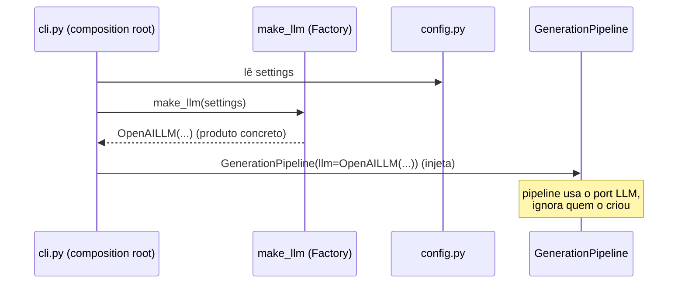

# Factory Method

> [!abstract] TL;DR
> **Factory** desacopla a **criação** de um objeto do seu **uso**: em vez de o pipeline dar `OpenAILLM()` na mão, ele pede a uma fábrica "me dê o `LLM` que a config pediu" e recebe a implementação concreta certa — decidida em runtime a partir de uma string como `"openai"` ou `"anthropic"`. No `density`, isso é um **registry** (dicionário `{"openai": OpenAILLM, ...}`) lido a partir de `config.py`. Evita `if/else` de construção espalhado pelo código e honra o princípio **Aberto/Fechado**.

## Intenção e o problema que resolve

O problema recorrente: **em algum ponto, alguém tem que escrever `OpenAILLM()`** — e se esse `new` concreto ficar espalhado pelo código, você acopla todo o sistema à classe concreta. Trocar de provedor, ou escolher em runtime, vira uma caça a `new`s pelo projeto inteiro.

Factory centraliza essa decisão. A intenção clássica:

> Definir uma interface para criar um objeto, mas deixar as subclasses (ou uma função/registry) decidirem qual classe instanciar. — *adaptado da GoF*

O ganho é **desacoplar a criação do uso**. O código que *usa* um `LLM` não deveria conhecer a lista de provedores possíveis nem como cada um é construído. Ele só quer *um* `LLM` que satisfaça o [[Adapter Pattern|port]].

## Desfazendo a confusão: Simple Factory × Factory Method × Abstract Factory

Estes três termos são embaralhados o tempo todo. Vale fixar a diferença de uma vez:

> [!info] Os três "factories"
> - **Simple Factory** (não é um pattern GoF oficial, mas é o mais usado no dia a dia): uma **função ou método** que recebe um parâmetro e retorna a instância concreta certa. `make_llm("openai") -> OpenAILLM()`. É o que o `density` usa de fato.
> - **Factory Method** (GoF, criacional): um **método** numa classe base, deixado para as **subclasses sobrescreverem** para decidir o produto. A "escolha" acontece via herança/polimorfismo. Ex.: uma classe base `Pipeline` com `create_llm()` abstrato, e `OpenAIPipeline` sobrescrevendo. Mais cerimonioso, faz sentido quando o criador *já é* uma hierarquia.
> - **Abstract Factory** (GoF, criacional): um objeto que cria **famílias inteiras de produtos relacionados** que devem ser usados juntos. Ex.: uma `ProviderFactory` que cria *o embedder E o LLM do mesmo provedor* garantindo que combinam.

Na prática Python, **"Factory Method" costuma ser usado como guarda-chuva** para "qualquer coisa que centraliza a criação". O `density` não precisa da hierarquia de subclasses do Factory Method canônico nem da família do Abstract Factory — precisa de um **Simple Factory / registry**. Isso é bom: é o mínimo que resolve. Aplicar Abstract Factory aqui seria "patternite" (ver [[O que são Design Patterns]]).

## Exemplo real no density: da string de config ao adapter certo

O `density` lê a configuração via [[Pydantic v2]] em `config.py` — algo como `settings.llm_provider == "anthropic"`. A fábrica traduz essa string no [[Adapter Pattern|Adapter]] concreto:

```python
# generation/base.py — o produto abstrato (Target/port)
class LLM(ABC):
    @abstractmethod
    def generate(self, prompt: str, *, system: str | None = None) -> str: ...
```

A implementação **ingênua** (o anti-exemplo) espalharia isto em todo lugar que precisa de um LLM:

```python
# NÃO faça isto espalhado pelo código
if settings.llm_provider == "openai":
    llm = OpenAILLM(settings.llm_model)
elif settings.llm_provider == "anthropic":
    llm = AnthropicLLM(settings.llm_model)
else:
    raise ValueError(...)
```

Cada `elif` novo (adicionar Gemini, um modelo local) obriga a **editar todos esses pontos**. Isso viola o **Princípio Aberto/Fechado**: o código deveria estar *aberto para extensão* (novo provedor) mas *fechado para modificação* (sem mexer no que já funciona).

## O jeito pythônico: registry como dicionário

Em Python, classes são objetos de primeira classe — então a fábrica não precisa de um `switch`; precisa de um **dicionário que mapeia string → classe (ou factory callable)**:

```python
# generation/factory.py — esboço ilustrativo
from density.generation.openai import OpenAILLM
from density.generation.anthropic import AnthropicLLM
from density.config import Settings

# o registry: string -> callable que produz um LLM
_LLM_REGISTRY: dict[str, type[LLM]] = {
    "openai": OpenAILLM,
    "anthropic": AnthropicLLM,
}

def make_llm(settings: Settings) -> LLM:
    try:
        cls = _LLM_REGISTRY[settings.llm_provider]
    except KeyError:
        raise ValueError(
            f"Provedor '{settings.llm_provider}' desconhecido. "
            f"Disponíveis: {list(_LLM_REGISTRY)}"
        )
    return cls(model=settings.llm_model)     # <- criação centralizada
```

Agora **adicionar um provedor é adicionar uma linha ao dicionário** — o `make_llm` nunca muda. Isso é o Aberto/Fechado na prática. Duas evoluções idiomáticas comuns:

**1. Auto-registro via decorator** — cada adapter se inscreve sozinho, eliminando o import central:

```python
def register_llm(name: str):
    def deco(cls: type[LLM]) -> type[LLM]:
        _LLM_REGISTRY[name] = cls
        return cls
    return deco

@register_llm("openai")
class OpenAILLM(LLM): ...
```

**2. Um factory por porta** — o mesmo padrão se repete para `Embedder` (`make_embedder`, registry `{"openai": OpenAIEmbedder}`), `VectorStore`, `Reranker`. Cada estágio plugável do `density` tem sua fábrica lendo o mesmo `config.py`. É isto que faz a arquitetura ser *configurável por fora* — trocar `llm_provider = "anthropic"` no `.env` reconfigura o sistema sem tocar em código de aplicação.

> [!tip] Registry vs `match/case`
> Com poucos casos estáveis, um `match settings.provider:` também é legível e type-checkável. Prefira o **registry (dict)** quando: (a) quer auto-registro/plugins, (b) a lista cresce, ou (c) quer *iterar* sobre os provedores disponíveis (útil no benchmark, que roda todos). O `density` quer as três coisas — o dict vence.

## Relação com Injeção de Dependência: quem cria vs quem entrega

Factory e [[Injeção de Dependência|DI]] são parceiros que resolvem metades diferentes do mesmo problema — e confundi-los atrapalha:

- **Factory** responde *"COMO nasce o objeto certo?"* — encapsula a **lógica de construção** (ler config, escolher classe, passar parâmetros).
- **DI** responde *"COMO o objeto chega a quem precisa?"* — o pipeline **recebe** a dependência pronta pelo construtor, sem saber de onde veio.

O fluxo típico no `density` combina os dois:



A **composition root** (tipicamente o `cli.py`, a borda do sistema) é o único lugar que *sabe* as duas coisas: chama a **Factory** para *criar* e faz a **DI** para *entregar*. O núcleo do `density` — os pipelines — só vê interfaces. **Factory cria, DI entrega.** Ver [[Injeção de Dependência]].

## Trade-offs

> [!warning] Custos e limites
> - **Indireção na criação**: para descobrir "que classe realmente instanciou", você tem que abrir a fábrica e olhar o registry. Com **uma única** implementação e nenhuma escolha em runtime, uma fábrica é overhead puro — instancie direto (de novo, YAGNI e "patternite" de [[O que são Design Patterns]]).
> - **Erros movidos para runtime**: uma string errada no `.env` (`"opnai"`) só estoura quando a fábrica roda, não na compilação. Mitigue validando o provedor no schema Pydantic (`Literal["openai", "anthropic"]`) — aí o erro vira validação de config, cedo e claro. Ver [[Pydantic v2]].
> - **Parâmetros heterogêneos**: se `OpenAILLM` precisa de `api_key` e `AnthropicLLM` também precisa de `max_tokens`, a fábrica tem que saber montar cada um. Isso tende a puxar toda a config para dentro da fábrica. A saída limpa é a fábrica receber o objeto `Settings` inteiro e cada classe pegar o que precisa (como no esboço acima), em vez de a fábrica ter assinaturas distintas por provedor.
> - **Registro tardio**: com auto-registro por decorator, a classe só entra no dicionário se o módulo dela for **importado**. Um provedor "some" silenciosamente se ninguém importa seu módulo. Garanta os imports no `__init__` do pacote ou use entry points.

> [!question] Vale a pena mesmo com 2 provedores?
> Sim — porque a *segunda* variação já é real (OpenAI **e** Anthropic) **e** porque o benchmark precisa *iterar sobre todos os provedores* programaticamente. Um `if/else` não te dá a lista iterável; o registry dá. Aqui a fábrica paga o próprio custo. Fosse um único provedor sem plano de benchmark, seria over-engineering.

## Onde isso aparece no density

- `config.py`: a fonte da verdade (strings `llm_provider`, `embedding_provider`) validada por Pydantic, que alimenta as fábricas.
- Construção de `LLM` (`generation/`) e `Embedder` (`embeddings/`): um Simple Factory / registry por porta, mapeando string → classe concreta.
- `cli.py`: a **composition root** onde a fábrica é chamada e o resultado é injetado nos pipelines.
- O loop de [[Avaliação com RAGAS|benchmark]]: itera sobre o registry para rodar o mesmo eval contra cada provedor/estratégia.

## Conexões

- [[Injeção de Dependência]] — o par indispensável: Factory **cria**, DI **entrega**; leia em sequência.
- [[Adapter Pattern]] — o *produto* que a fábrica cria costuma ser um Adapter de SDK.
- [[Strategy Pattern]] — a fábrica também produz Strategies (chunkers, rerankers) a partir da config.
- [[Modelos de Domínio com Pydantic (DTO e Value Object)]] · [[Pydantic v2]] — validam a string de config, movendo o erro de runtime para a fronteira.
- [[Arquitetura Hexagonal (Ports e Adapters)]] · [[Camadas, Domínio e Fronteiras]] — a fábrica vive na borda (composition root), não no núcleo.
- [[O que são Design Patterns]] — a família criacional e a distinção Simple/Method/Abstract Factory.
