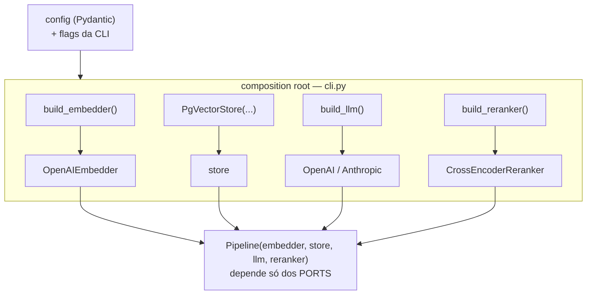

# Injeção de Dependência

> [!abstract] TL;DR
> **Injeção de Dependência (DI)** é uma ideia quase boba de tão simples: um objeto **recebe** seus colaboradores de fora (pelo construtor, tipicamente) em vez de **instanciá-los** por dentro. Só isso. O ganho é enorme: quem usa não fica preso a *qual* implementação usa, o que habilita testar com fakes e **benchmarkar** trocando peças. No `density`, as peças (embedder, store, LLM, reranker) são montadas num único lugar — o **composition root** em `cli.py` — e injetadas no pipeline. E não, Python quase nunca precisa de um "framework de DI".

## O que é, no nível mais concreto

Compare os dois. Sem DI, o pipeline **cria** o que precisa:

```python
# ANTES — dependência escondida e amarrada
class Pipeline:
    def __init__(self):
        self.store = PgVectorStore(dsn="postgres://...")   # amarrado ao pgvector
        self.embedder = OpenAIEmbedder(model="text-embedding-3-small")
        self.llm = OpenAILLM(model="gpt-4o-mini")          # amarrado à OpenAI
```

Esse `Pipeline` está **soldado** ao pgvector e à OpenAI. Para testar sem rede, você não tem por onde entrar. Para trocar OpenAI por Anthropic no benchmark, você **edita o código do pipeline**. As dependências estão escondidas lá dentro, decididas no pior lugar possível.

Com DI, o pipeline **declara** o que precisa e recebe pronto:

```python
# DEPOIS — dependências explícitas e injetadas
class Pipeline:
    def __init__(self, embedder: Embedder, store: VectorStore,
                 llm: LLM, reranker: Reranker):
        self.embedder = embedder
        self.store = store
        self.llm = llm
        self.reranker = reranker
```

Agora o pipeline depende de **contratos** (os ports `Embedder`, `VectorStore`, `LLM`, `Reranker`), não de classes concretas. Ele nem sabe se o `store` é pgvector ou um fake in-memory — e é exatamente esse "não saber" que compra a testabilidade e o benchmark. Repare que a assinatura virou uma lista honesta das dependências: ler o construtor te diz *tudo* de que a classe precisa. Isso é a **injeção via construtor**, a forma preferida em Python (existem também injeção por setter e por parâmetro de método, mas construtor é a que dá objetos sempre válidos).

## DI × DIP × IoC container — três coisas que confundem

Esses três termos vivem juntos e são constantemente misturados. Separe-os com precisão:

| Termo | O que é | Nível |
|---|---|---|
| **DI** (Injeção de Dependência) | A **técnica**: passar colaboradores de fora | Mecânica, concreta |
| **DIP** (Princípio de Inversão de Dependência) | O **princípio** (o "D" de SOLID): dependa de abstrações, não de concretos | Design, abstrato |
| **IoC container** | Uma **ferramenta**: monta o grafo de objetos automaticamente | Infraestrutura opcional |

- **DIP** é o *porquê*: "módulos de alto nível não devem depender de módulos de baixo nível; ambos dependem de abstrações". É o princípio que a [[Arquitetura Hexagonal (Ports e Adapters)]] materializa — o domínio define os ports, os adapters os implementam.
- **DI** é *um dos mecanismos* que realiza o DIP na prática. Você pode obedecer ao DIP (pipeline depende do port `VectorStore`) e realizar isso via DI (recebendo a instância no construtor).
- **IoC container** (Spring no Java, `dependency-injector` no Python) é uma **biblioteca** que resolve o grafo de dependências por reflexão/config e te entrega o objeto raiz montado. É útil quando o grafo é enorme; é peso morto quando não é.

> [!tip] A frase que resolve na entrevista
> "DIP é o princípio, DI é a técnica que o realiza, e um container IoC é uma ferramenta opcional para *automatizar* a DI. Você pode ter DI sem container nenhum — é só passar argumentos no construtor. Container ≠ DI."

## O composition root do density

Se as dependências não são criadas *dentro* dos objetos, alguém precisa criá-las em *algum* lugar. Esse lugar tem nome: **composition root** — o ponto único, o mais próximo possível da entrada do programa, onde o grafo de objetos é montado. Ter *um* lugar é justamente o objetivo; espalhar `new`/construção por todo canto é o que DI evita.

No `density`, a entrada é a CLI, então o composition root vive em `cli.py` (ou num pequeno `builder`/factory que a CLI chama):

```python
# cli.py — o COMPOSITION ROOT: onde tudo se encontra, uma vez só
@app.command()
def query(question: str, provider: str = "openai"):
    cfg = load_config()  # Pydantic v2 — ver [[Pydantic v2]]

    # 1) Constrói os adapters concretos a partir da config (via Factory)
    embedder = build_embedder(cfg)          # -> OpenAIEmbedder
    store    = PgVectorStore(cfg.database_url, distance=cfg.distance)
    llm      = build_llm(provider, cfg)     # -> OpenAILLM ou AnthropicLLM
    reranker = build_reranker(cfg)          # -> CrossEncoderReranker

    # 2) INJETA tudo no pipeline (que só conhece os contratos)
    pipeline = Pipeline(embedder=embedder, store=store,
                        llm=llm, reranker=reranker)

    # 3) Roda o caso de uso
    answer = pipeline.run(question)
    render(answer)  # Rich — ver [[Typer e Rich (o CLI)]]
```

Três coisas para notar. **(1)** A escolha do provedor (`openai` vs `anthropic`) é resolvida *aqui*, na borda, a partir da [[Pydantic v2|config]] e de flags da CLI — o pipeline nunca decide isso. **(2)** A construção dos adapters delega ao [[Factory Method]] (`build_llm` etc.), que traduz config → objeto certo. **(3)** O pipeline recebe tudo pronto e só orquestra. É a divisão de trabalho clássica: **a factory decide *qual*, o composition root *monta o grafo*, o pipeline *usa*.**



## Por que Python normalmente NÃO precisa de framework de DI

Vindo de Java/Spring, o instinto é procurar um container. Resista. Python já tem, na própria linguagem, os recursos que no Java só o container oferecia:

- **Funções são objetos de primeira classe.** Onde o Java injetaria uma `Strategy` só para passar um comportamento, em Python você passa a função direto. Metade dos casos de DI viram "passe a função".
- **Argumentos default no construtor** dão o "padrão de produção" sem esconder a dependência: `def __init__(self, store: VectorStore | None = None): self.store = store or PgVectorStore(...)`. Roda sem cerimônia em produção, aceita um fake no teste. (Cuidado com o clássico *mutable default*: use `None` como sentinela, como acima.)
- **Closures e factories simples** montam o grafo sem XML nem decorators mágicos. Uma função `build_pipeline(cfg) -> Pipeline` de dez linhas é o seu "container".
- **Duck typing / `Protocol`** significa que o fake nem precisa herdar do port — basta ter os métodos certos. Menos boilerplate ainda.

> [!warning] Quando um container se justifica (e quando é peso morto)
> Um container IoC paga quando o grafo é **grande e profundo** (dezenas de serviços, ciclos de vida distintos — singleton vs por-request — como num backend web grande). Para o `density`, o grafo tem **quatro** peças e um pipeline. Um container aqui seria mais código de configuração do que o código que ele configura. A regra: *não adote a ferramenta antes de sentir a dor que ela cura.* Uma função `build_*` explícita é mais legível e debugável que qualquer resolução mágica.

## Como DI habilita testes e o benchmark

Este é o retorno prático, e é o coração do diferencial do `density`.

**Testabilidade.** Como o pipeline recebe os ports, o teste injeta fakes e roda sem I/O, determinístico e rápido:

```python
def test_pipeline_grounds_answer():
    pipeline = Pipeline(
        embedder=FakeEmbedder(),              # devolve vetor fixo
        store=InMemoryStore(seed=known_chunks),  # dados controlados
        llm=EchoLLM(),                        # devolve o contexto recebido
        reranker=IdentityReranker(),          # não reordena
    )
    answer = pipeline.run("qual a cláusula 3?")
    assert answer.citations  # asserção sobre grounding, sem tocar rede
```

**Benchmark (o diferencial).** Avaliar variações é *só trocar o que se injeta*, com o resto do sistema — pipeline, modelos, suíte de [[Avaliação com RAGAS]] — intacto:

```python
for llm in [OpenAILLM("gpt-4o-mini"), AnthropicLLM("claude-...")]:
    pipeline = Pipeline(embedder, store, llm, reranker)   # troca 1 peça
    result = evaluate(pipeline, gold_set)                 # mesma régua
    report[llm.name] = result   # faithfulness, answer relevancy...
```

Sem DI, cada variação exigiria editar o pipeline. Com DI, o eixo de variação vira um **loop**. É o [[Strategy Pattern]] (comportamento plugável) montado por [[Factory Method]] e entregue por DI — a tríade que faz o benchmark sair de graça.

## Trade-offs: explicitude × verbosidade

DI não é grátis, e o custo é honesto:

- **Verbosidade.** O construtor cresce com o número de dependências. Um `Pipeline(embedder, store, llm, reranker)` é mais palavrão que um `Pipeline()`. O antídoto é manter o número de dependências pequeno (se passou de ~5, talvez a classe faça demais) e centralizar a montagem no composition root, não espalhá-la.
- **Indireção na leitura.** "De onde vem esse `store` de verdade?" exige subir até o `cli.py` para descobrir qual concreto foi injetado. É o mesmo custo da [[Arquitetura Hexagonal (Ports e Adapters)]]: você troca "óbvio e amarrado" por "flexível e um-salto-mais-longe".
- **Ganho que compensa:** em troca desse palavrão, você ganha construtores que são **documentação honesta** (a assinatura lista tudo que a classe precisa), testes sem I/O e o benchmark como loop. Para um projeto cuja tese é *avaliação rigorosa*, o troco é claramente favorável.

## Onde isso aparece no density

- `cli.py` é o **composition root**: lê a [[Pydantic v2|config]], constrói os adapters via [[Factory Method]] e injeta `embedder + store + llm + reranker` no `Pipeline`.
- O `Pipeline` (`generation/pipeline.py`) recebe os **ports** no construtor e nunca instancia adapters — é o que permite [[Pipeline (Chain of Responsibility)|trocar um estágio isolado]].
- Os testes ([[pytest e ruff]]) injetam fakes in-memory (`InMemoryStore`, `FakeEmbedder`) para rodar o RAG sem Docker nem rede.
- O benchmark de [[Avaliação com RAGAS]] varia provedores injetando adapters diferentes no mesmo pipeline — o diferencial do [[PROJETO]].

## Conexões

- [[Factory Method]] — a factory *decide qual* adapter construir; a DI *entrega* o adapter construído. Trabalham juntas no composition root.
- [[Arquitetura Hexagonal (Ports e Adapters)]] — DI é o mecanismo runtime que realiza a inversão de dependência do hexágono.
- [[Strategy Pattern]] — a estratégia plugável precisa ser injetada para valer; DI é como ela chega ao cliente.
- [[Repository Pattern]] — o `VectorStore` injetado é um repositório; DI é o que permite trocar pgvector por um fake.
- [[Modelos de Domínio com Pydantic (DTO e Value Object)]] — os contratos que os objetos injetados trocam entre si.
- [[Camadas, Domínio e Fronteiras]] — o composition root vive na borda; o domínio recebe as peças prontas.
