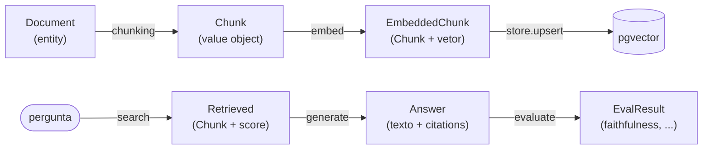

# Modelos de Domínio com Pydantic (DTO e Value Object)

> [!abstract] TL;DR
> Os modelos Pydantic do `density` (`Document`, `Chunk`, `EmbeddedChunk`, `Retrieved`, `Answer`, `EvalResult`) são os **contratos** que cruzam as fronteiras entre estágios do pipeline. Escolher se um modelo é **DTO**, **Value Object** ou **Entity** não é preciosismo acadêmico — muda se ele tem identidade, se é imutável e como você o compara. E adotar *"parse, don't validate"* na borda significa que, uma vez que o dado virou um modelo válido, o resto do sistema **nunca mais** precisa checá-lo. Isso é o que torna o [[Avaliação com RAGAS|RAGAS]] e os testes triviais: os dados já chegam estruturados e garantidos.

## Três conceitos que parecem o mesmo objeto (mas não são)

Vindo de DDD (Domain-Driven Design), há três categorias de "objeto que carrega dados", e a diferença está em **identidade** e **mutabilidade**:

| | **Entity** | **Value Object** | **DTO** |
|---|---|---|---|
| Identidade | Tem **id** próprio; dois objetos com mesmos campos ainda são *diferentes* | **Não** tem id; igualdade é **por valor** (mesmos campos = mesma coisa) | Não tem identidade de domínio; é só um pacote de transporte |
| Igualdade | Por **identidade** (`a.id == b.id`) | Por **valor** (todos os campos iguais) | Irrelevante (existe para mover dados) |
| Mutabilidade | Pode mudar de estado ao longo da vida | **Imutável** por definição | Geralmente imutável em trânsito |
| Comportamento | Costuma ter regras de negócio | Pode ter métodos que retornam *novos* VOs | Anêmico de propósito — só dados |
| Metáfora | Uma *pessoa* (muda de endereço, continua a mesma) | Uma *cor* `#FF0000` (dois vermelhos são o mesmo vermelho) | Um *envelope* que leva dados de A para B |

O teste mental clássico: **"se eu troco todos os campos, ainda é a mesma coisa?"** Se sim → Entity (a identidade persiste através da mudança). Se dois objetos com os mesmos campos são intercambiáveis → Value Object. Uma nota de R$10 na sua carteira: você não liga *qual* nota é (Value Object); mas *sua conta bancária* tem identidade mesmo com saldo mudando (Entity).

No `density`, um `Document` tende a **Entity** (tem `id`/hash estável; é "aquele PDF" mesmo se você reprocessá-lo). Um `Chunk` é ambíguo e pragmaticamente tratado como **Value Object com id de referência** — o `id` serve para *ligar* às tabelas ([[Design do Schema (documents, chunks, embeddings)]]), mas o conteúdo é imutável e comparável por valor. `Retrieved`, `Answer` e `EvalResult` são essencialmente **DTOs/Value Objects imutáveis**: pacotes de resultado que fluem pela esteira.

> [!tip] Na prática, com Pydantic, a fronteira é fluida
> Não gaste horas classificando cada modelo dogmaticamente. O valor da distinção é operacional: *este modelo precisa ser comparado por valor?* → `frozen=True` te dá `__eq__`/`__hash__` por valor de graça. *Este precisa de identidade estável?* → garanta um `id` determinístico. A taxonomia serve à decisão, não o contrário.

## Por que os modelos Pydantic são os contratos entre fronteiras

Este é o papel central deles no `density`. Cada estágio do [[Pipeline (Chain of Responsibility)]] recebe um modelo e devolve outro — e é *o tipo* que define o encaixe entre estágios. O ingestion produz `list[Chunk]`; o embedder consome `Chunk` e produz `EmbeddedChunk`; o store consome `EmbeddedChunk` e, na busca, produz `Retrieved`; o generate consome `list[Retrieved]` e produz `Answer`; a avaliação consome `Answer` e produz `EvalResult`.



Como os contratos são **tipados e explícitos**, a fronteira entre estágios não é "um dict com as chaves que espero que existam" — é uma classe cujo formato o type checker (e o próprio Pydantic, em runtime) garante. Isso é o que sustenta o desacoplamento da [[Arquitetura Hexagonal (Ports e Adapters)]]: os estágios só compartilham **os modelos de domínio**, nunca detalhes de infra. Nenhum `Row` do psycopg, nenhum objeto de resposta da OpenAI, vaza de um estágio para o outro — o adapter os traduz para o modelo de domínio na borda.

## "Parse, don't validate": valide na borda, confie no núcleo

O princípio (de Alexis King) é uma virada de chave mental. **Validar** é checar e devolver um booleano/exceção, deixando o dado no *mesmo tipo frouxo* de antes — então quem recebe o dado depois **não tem prova** de que ele foi checado e precisa checar de novo (ou torcer). **Parsear** é *transformar* o dado frouxo em um tipo *mais preciso* que **torna o inválido inexpressável**. Depois de parsear, o tipo carrega a garantia: se você tem um `EmbeddedChunk`, ele *tem* um vetor com a dimensão certa — não há como não ter.

```python
# models.py — o parse acontece AQUI, uma vez, na fronteira de entrada
from pydantic import BaseModel, ConfigDict, Field

class Chunk(BaseModel):
    model_config = ConfigDict(frozen=True)   # imutável -> value object
    id: str
    document_id: str
    text: str = Field(min_length=1)          # texto vazio é inexpressável
    index: int = Field(ge=0)                  # ordem dentro do documento

class EmbeddedChunk(BaseModel):
    model_config = ConfigDict(frozen=True)
    chunk: Chunk
    embedding: list[float] = Field(min_length=1536, max_length=1536)  # dim fixa

class Retrieved(BaseModel):
    model_config = ConfigDict(frozen=True)
    chunk: Chunk
    score: float                              # similaridade da busca

class Answer(BaseModel):
    model_config = ConfigDict(frozen=True)
    question: str
    text: str
    citations: list[Retrieved]                # rastreabilidade -> grounding

class EvalResult(BaseModel):
    model_config = ConfigDict(frozen=True)
    faithfulness: float = Field(ge=0, le=1)
    answer_relevancy: float = Field(ge=0, le=1)
    context_precision: float = Field(ge=0, le=1)
```

A força disso: a checagem de "vetor tem 1536 dimensões?" acontece **uma vez**, quando o `EmbeddedChunk` é construído no adapter de [[Embeddings]]. Dali para frente, todo código que recebe um `EmbeddedChunk` *sabe* que o vetor está correto — sem `assert len(vec) == 1536` espalhado pelo store, pelo pipeline, pelos testes. O tipo é a prova. É o mesmo espírito do "parse na borda" que a [[Camadas, Domínio e Fronteiras]] formaliza: dados frouxos (bytes de PDF, JSON da API) entram, viram modelos precisos na fronteira, e o núcleo trabalha só com o preciso. Detalhes de por que Pydantic v2 é rápido e ergonômico nisso estão em [[Pydantic v2]].

## Imutabilidade (`frozen=True`): por que congelar

Marcar os modelos como `frozen=True` (imutável) tem três retornos concretos, não é frescura funcional:

- **Segurança na esteira.** O `Chunk` que sai do chunking é o *mesmo* que chega ao store — nenhum estágio pode mutá-lo por engano no meio do caminho. Num pipeline com vários estágios, mutação compartilhada é fonte clássica de bug ("quem mexeu no `score`?"). Congelar mata a classe inteira desses bugs.
- **Igualdade e hash por valor de graça.** Frozen torna o modelo *hashable*: dá para pôr `Chunk` num `set` (deduplicar) ou como chave de `dict` (cachear embeddings por chunk). Isso é o comportamento de **Value Object** materializado.
- **Raciocínio local.** Se nada muda depois de criado, você lê uma função e sabe que os argumentos não serão alterados sob seus pés. Menos carga cognitiva, especialmente em concorrência.

O custo: "atualizar" um modelo imutável é criar um novo (`chunk.model_copy(update={...})`). Para dados que fluem numa esteira e são descartados, isso é irrelevante — você não está atualizando, está transformando de um tipo no próximo.

## Por que isso torna RAGAS e testes triviais

Este é o retorno que amarra tudo. Duas frentes:

**RAGAS.** A [[Avaliação com RAGAS]] precisa, para cada exemplo, de um pacote bem definido: a *pergunta*, a *resposta gerada*, os *contextos recuperados* e (às vezes) a *ground truth*. Como o pipeline já produz um `Answer` com `question`, `text` e `citations: list[Retrieved]`, montar o dataset do RAGAS é **projeção direta** dos campos — nada de raspar dicts ou reconstruir de onde veio cada contexto. Os dados *já* chegam estruturados:

```python
# evaluation/ragas_eval.py — o Answer já tem tudo estruturado
def to_ragas_row(answer: Answer, ground_truth: str | None = None) -> dict:
    return {
        "question": answer.question,
        "answer":   answer.text,
        "contexts": [r.chunk.text for r in answer.citations],  # rastreável
        "ground_truth": ground_truth,
    }
```

**Testes.** Com modelos tipados e imutáveis, o teste constrói entradas exatas e faz asserções precisas, sem montar dicts frágeis:

```python
def test_answer_only_cites_retrieved_context():
    answer = pipeline.run("qual a cláusula 3?")
    assert isinstance(answer, Answer)          # contrato garantido
    assert answer.citations                    # grounding presente
    assert all(0 <= r.score <= 1 for r in answer.citations)
```

Como o `Answer` é um contrato, o teste não precisa saber *como* foi construído — só que o formato bate. Dados estruturados na entrada = asserções triviais na saída. Ver [[pytest e ruff]].

## Trade-offs: custo de validação e o debate do "modelo anêmico"

Dois custos honestos:

> [!warning] Validação não é grátis
> Pydantic valida em runtime, e isso custa CPU. Em ingestão de *milhões* de chunks, construir um `EmbeddedChunk` por vez com validação completa pode pesar. Mitigações: validar na borda **uma vez** (não revalidar internamente), usar `model_construct()` para pular validação em caminhos quentes *já provados seguros*, e lembrar que, para o `density` (documentos longos, não streaming de bilhões de eventos), o custo é ruído perto de uma chamada de embedding ou LLM. Pague a validação onde o dado é *não confiável* (entrada), economize onde já é *confiável* (dentro do núcleo).

**Modelo anêmico vs lógica no modelo.** Os modelos acima são quase só dados — "anêmicos" no jargão DDD, que Fowler cunhou como *anti-padrão* quando toda a lógica escapa para "serviços". Aqui a escolha é **deliberada e correta**: em arquitetura de pipeline, os modelos são **DTOs/Value Objects** que *transportam* dados entre estágios, e a lógica (chunking, embedding, geração) mora nos **adapters/estágios**, não nos dados. Isso é apropriado porque as regras de RAG são *transformações entre tipos*, não *invariantes de um agregado*. O que faz sentido pôr no modelo são invariantes *do próprio dado* — validadores (`score` entre 0 e 1, vetor com dimensão certa, texto não-vazio) e talvez um método puro que derive um novo VO (`chunk.with_score(0.9)`). A régua: **invariante do dado → no modelo; orquestração/transformação → no estágio.** Modelo anêmico só é *anti*-padrão quando havia lógica de domínio rica para encapsular e ela vazou; num pipeline de transformação, DTOs enxutos são exatamente o desenho certo.

## Onde isso aparece no density

- `models.py` reúne `Document`, `Chunk`, `EmbeddedChunk`, `Retrieved`, `Answer`, `EvalResult` — os contratos que cruzam toda fronteira do sistema.
- São construídos (parseados) nas **bordas**: no ingestion (`Chunk`), no adapter de [[Embeddings]] (`EmbeddedChunk`), no `store` na busca (`Retrieved`), no generate (`Answer`), na avaliação (`EvalResult`).
- `frozen=True` os torna imutáveis e hashable — seguros de passar pela esteira do [[Pipeline (Chain of Responsibility)]].
- Sustentam o diferencial do [[PROJETO]]: como `Answer.citations` já rastreia o contexto, [[Avaliação com RAGAS]] e o benchmark viram projeções diretas dos campos.

## Conexões

- [[Pydantic v2]] — a ferramenta que faz o parse/validação na borda com performance.
- [[Camadas, Domínio e Fronteiras]] — o "parse na borda, núcleo confia" formalizado como regra de fronteira.
- [[Pipeline (Chain of Responsibility)]] — os estágios que trocam esses modelos entre si.
- [[Design do Schema (documents, chunks, embeddings)]] — como `Document`/`Chunk`/`EmbeddedChunk` mapeiam para as tabelas.
- [[Arquitetura Hexagonal (Ports e Adapters)]] — os modelos são o que os ports recebem e devolvem, sem vazar infra.
- [[Avaliação com RAGAS]] — o consumidor final que colhe `Answer` e produz `EvalResult`.
