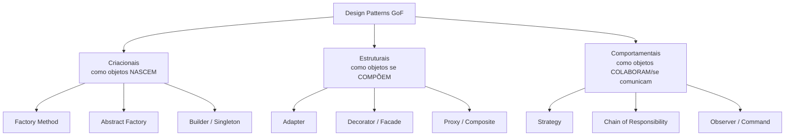

# O que são Design Patterns

> [!abstract] TL;DR
> Um **design pattern** é uma **solução nomeada e reutilizável para um problema recorrente dentro de um contexto**. Não é código pronto para copiar — é um *esqueleto de solução* e, principalmente, um **vocabulário compartilhado** que deixa dois engenheiros alinharem uma decisão de design em três palavras em vez de trinta minutos de whiteboard. O maior risco não é ignorá-los, é usá-los demais ("patternite").

## A definição que importa

A palavra-chave da definição clássica é **"num contexto"**. Um pattern não é uma verdade universal; é uma resposta condicionada. "Encapsule o algoritmo que varia atrás de uma interface" (o [[Strategy Pattern]]) só é uma boa ideia *quando* o algoritmo realmente varia e você paga o custo da indireção com o benefício da troca. Fora desse contexto, é peso morto.

Uma formulação que vale internalizar: um pattern descreve um **problema** que ocorre repetidamente, o **núcleo da solução** para esse problema, e as **consequências** (trade-offs) de aplicá-la. Se você só decora "a solução" e esquece o "problema" e as "consequências", você vira aquele engenheiro que aplica Factory em tudo. Guarde os três.

> [!info] Pattern ≠ biblioteca ≠ algoritmo
> Um **algoritmo** resolve um problema computacional (ordenar, buscar). Uma **biblioteca** é código concreto que você importa. Um **pattern** é um *arranjo de classes/objetos/funções* — mais abstrato que biblioteca, mais estrutural que algoritmo. Você não faz `pip install strategy`; você *estrutura* seu código como Strategy.

## De onde vieram

A ideia nasceu **fora da computação**. O arquiteto (de prédios) **Christopher Alexander**, nos anos 1970, escreveu *A Pattern Language*, catalogando soluções recorrentes de arquitetura urbana e de edifícios — "uma janela de cada lado de um canto torna o cômodo acolhedor". A tese dele: existe uma "qualidade sem nome" em bons espaços, e ela emerge de padrões componíveis.

Em **1994**, quatro autores — Gamma, Helm, Johnson e Vlissides, eternizados como a **"Gang of Four" (GoF)** — publicaram *Design Patterns: Elements of Reusable Object-Oriented Software*, transportando a ideia para software OO. Catalogaram **23 patterns**. Esse livro é o cânone — mas atenção ao contexto histórico: é **C++ e Smalltalk de 1994**. Várias das 23 soluções existem para contornar limitações dessas linguagens (ausência de funções de primeira classe, de metaprogramação leve, etc.). Em Python moderno, algumas **desaparecem** ou viram uma linha. Voltaremos a isso.

## As três categorias

A GoF organiza os 23 patterns em três baldes, pela **intenção**:

- **Criacionais** — controlam *como e quando os objetos são instanciados*, desacoplando o código do `new`/construtor concreto. Ex.: [[Factory Method]], Abstract Factory, Builder, Singleton. Pergunta que respondem: *"quem decide qual classe concreta criar?"*
- **Estruturais** — tratam de *como objetos e classes se compõem* em estruturas maiores sem enrijecer. Ex.: [[Adapter Pattern]], Decorator, Facade, Proxy, Composite. Pergunta: *"como encaixo estas peças?"*
- **Comportamentais** — cuidam de *responsabilidades e comunicação* entre objetos em tempo de execução. Ex.: [[Strategy Pattern]], [[Pipeline (Chain of Responsibility)]], Observer, Command, Template Method. Pergunta: *"quem faz o quê, e como conversam?"*

> [!tip] Como decidir a categoria de cabeça
> Pergunte: o problema é **criar** algo (criacional), **conectar** algo (estrutural) ou **coordenar/variar comportamento** (comportamental)? Essa tríade resolve 90% da classificação sem decorar tabela.

## O valor REAL: patterns são vocabulário

Aqui está o insight que separa quem "leu o livro da GoF" de quem *usa* patterns na prática: **o principal produto de um pattern não é a estrutura de classes — é o nome.**

Quando você diz num code review "isso aqui pede um Adapter para o SDK da Anthropic", o outro engenheiro instantaneamente carrega na cabeça: existe uma interface-alvo, existe um objeto externo incompatível, e você vai escrever uma casca fina que traduz um no outro. Você comprimiu um parágrafo inteiro de design em uma palavra. Isso é **densidade de comunicação** — e é por isso que patterns sobrevivem mesmo quando a linguagem torna a implementação trivial.

> [!example] O mesmo diálogo, com e sem vocabulário
> **Sem:** "Cria uma classe com os mesmos métodos que a gente já usa pra OpenAI, mas por dentro ela chama os métodos diferentes da Anthropic e converte o formato da resposta pro nosso."
> **Com:** "Faz um Adapter da Anthropic pro nosso port `LLM`."
> Mesma informação. A segunda cabe num commit message.

## O anti-padrão: patternite e over-engineering

O contraveneno tem que vir junto com o remédio. O abuso de patterns tem nome informal: **"patternite"** — a compulsão de aplicar patterns onde o problema não existe. Sintomas:

- **"Tudo vira Factory"**: você tem uma única implementação e mesmo assim cria `FooFactory`, `AbstractFooProvider` e `FooRegistry` "pro caso de um dia ter outra". Isso viola **YAGNI** (*You Aren't Gonna Need It*).
- **Indireção sem variação**: uma interface com exatamente um implementante que ninguém vai trocar. Você pagou o custo de leitura (agora tem que pular de arquivo em arquivo pra entender o fluxo) sem receber o benefício (flexibilidade que nunca é exercida).
- **Astronautas de arquitetura**: camadas sobre camadas "genéricas" que resolvem problemas hipotéticos, tornando o problema real mais difícil de enxergar.

> [!warning] A regra prática do density
> Introduza a abstração **quando aparecer o segundo caso concreto** (a "regra do três" é uma boa heurística), ou quando a variação for **parte declarada do objetivo do projeto**. No `density`, a abstração de [[Injeção de Dependência|providers]] (OpenAI vs Anthropic) NÃO é especulativa: o diferencial do projeto é **benchmark comparativo**, então poder trocar a implementação e rodar o mesmo eval é *requisito*, não YAGNI. Contexto muda tudo — de novo.

Corolário importante: **um `if/else` explícito muitas vezes é a resposta certa.** Se há duas variações e nunca haverá uma terceira, um condicional simples é mais legível que um pattern. Patterns compram *extensibilidade futura* com *complexidade presente*. Só compre se for gastar.

## A nuance Python: metade dos GoF "somem"

Como você já é fluente em Python, o ponto mais valioso: **muitos dos 23 patterns da GoF são cicatrizes de linguagens sem funções de primeira classe.** Em Python:

- **Strategy** frequentemente vira **passar uma função/callable** como argumento — sem classe `Strategy` nenhuma. Ver [[Strategy Pattern]].
- **Factory Method** vira um **dicionário-registry** `{"openai": OpenAILLM}` ou o próprio construtor passado como objeto. Ver [[Factory Method]].
- **Singleton** vira um **módulo** (módulos já são singletons no Python) ou um `@lru_cache`.
- **Command** vira uma função ou `functools.partial`.
- **Iterator** já é nativo (protocolo `__iter__`/`__next__`, geradores).

Isso **não** significa que os patterns "não existem" em Python — significa que a *intenção* permanece e a *implementação* encolhe. Peter Norvig notou isso já nos anos 90: dinamismo e funções de primeira classe dissolvem 16 dos 23. A lição para suas notas: sempre mostre **o jeito pythônico** (`typing.Protocol`, ABC, callables, `@dataclass`), não a tradução literal de Java. Escrever `AbstractStrategyFactoryBean` em Python é sinal de que você trouxe bagagem de outra linguagem.

## Mapa: quais patterns o density usa e por quê

O `density` é RAG production-ready com foco em **avaliação rigorosa**, e sua arquitetura é [[Arquitetura Hexagonal (Ports e Adapters)|hexagonal enxuta]]. Os patterns não são enfeite — cada um resolve um problema concreto de *plugabilidade* que serve ao benchmark:

| Pattern | Onde no density | Problema que resolve |
|---|---|---|
| [[Strategy Pattern]] | `ingestion/chunking.py` (fixed/recursive/semantic), embedders, rerankers | Trocar o *algoritmo* de um estágio e medir o impacto |
| [[Adapter Pattern]] | `generation/openai.py` e `anthropic.py`, `store/pgvector.py` | Encaixar SDKs externos incompatíveis atrás de um port único |
| [[Factory Method]] | construção de `LLM`/`Embedder` a partir de string de `config.py` | Decidir a classe concreta em runtime, sem `if/else` espalhado |
| [[Repository Pattern]] | `store/base.py` + `pgvector.py` | Esconder SQL/persistência atrás de uma interface de coleção |
| [[Injeção de Dependência]] | `pipeline.py` recebendo as portas prontas | Entregar dependências de fora, sem o pipeline instanciar nada |
| [[Pipeline (Chain of Responsibility)]] | `generation/pipeline.py`, fluxo de ingestão | Encadear estágios (load→chunk→embed→store) componíveis |
| [[Modelos de Domínio com Pydantic (DTO e Value Object)]] | `models.py` | Trafegar dados validados e imutáveis entre as fronteiras |

> [!question] Por que TANTOS patterns num projeto "enxuto"?
> Porque todos servem **um mesmo objetivo**: tornar cada estágio do RAG *plugável* para que o eval possa comparar variantes de forma barata. Não é patternite — é o pattern certo para um projeto cuja tese é "meça tudo". A abstração aqui *é o produto*.

## Onde isso aparece no density

- A tese inteira do `density` — "cada estágio é uma interface abstrata (`base.py`) com implementações concretas por trás" — é uma *aplicação deliberada* de patterns estruturais e comportamentais a serviço do benchmark. Ver [[Arquitetura Hexagonal (Ports e Adapters)]].
- Cada `base.py` (`embeddings/base.py`, `store/base.py`, `generation/base.py`, `retrieval/`) é um **port**: a interface abstrata que os patterns [[Strategy Pattern]] e [[Adapter Pattern]] preenchem.
- `config.py` alimenta o [[Factory Method]] que escolhe as implementações concretas em runtime.
- `models.py` (Pydantic v2) materializa os [[Modelos de Domínio com Pydantic (DTO e Value Object)]] que fluem entre as camadas.

## Conexões

- [[Strategy Pattern]] — o pattern comportamental que torna o benchmark barato (trocar algoritmo).
- [[Adapter Pattern]] — encaixa SDKs externos incompatíveis (OpenAI/Anthropic) num port.
- [[Factory Method]] — cria a implementação concreta a partir da config.
- [[Repository Pattern]] — abstrai a persistência (pgvector) como coleção.
- [[Injeção de Dependência]] — entrega as portas prontas ao pipeline.
- [[Pipeline (Chain of Responsibility)]] — encadeia os estágios do RAG.
- [[Modelos de Domínio com Pydantic (DTO e Value Object)]] — os dados que trafegam.
- [[Arquitetura Hexagonal (Ports e Adapters)]] — o "meta-pattern" que dá contexto a todos os outros.
- [[Camadas, Domínio e Fronteiras]] — onde cada pattern vive na topologia do código.
- [[APRENDIZADOS]] · [[PROJETO]]
