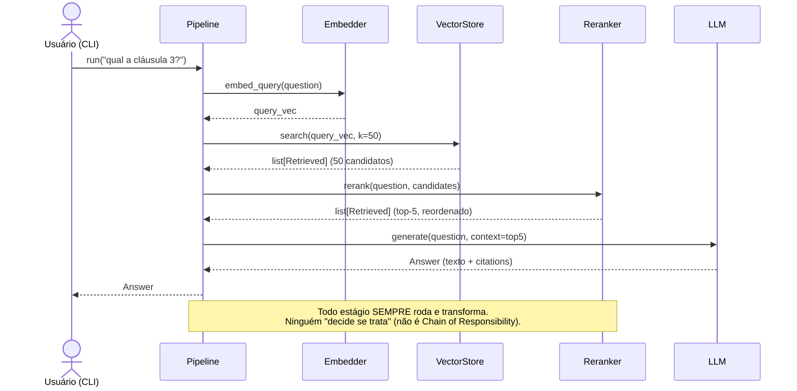

# Pipeline (Chain of Responsibility)

> [!abstract] TL;DR
> Um sistema RAG é uma **esteira de estágios**: recuperar → reordenar → gerar. Cada estágio recebe um modelo de domínio, **transforma** e passa adiante. O título desta nota carrega uma armadilha proposital: o que o `density` usa é **Pipes and Filters** (todo estágio transforma e repassa), **não** o Chain of Responsibility do GoF (onde cada handler *decide se trata ou passa adiante*). São padrões parecidos na forma de "corrente", mas com intenções opostas. Vamos ser honestos sobre a diferença e sobre por que a escolha importa para o benchmark.

## A esteira de estágios do RAG

O núcleo do `density` orquestra uma sequência clara. Em `generation/pipeline.py`:

```
pergunta
   │  embed
   ▼
[ retrieve ] ── busca densa/híbrida no VectorStore ──► list[Retrieved]  (k grande, ~50)
   ▼
[ rerank   ] ── cross-encoder reordena por relevância ──► list[Retrieved]  (top-n, ~5)
   ▼
[ generate ] ── LLM fundamenta a resposta no contexto ──► Answer
   ▼
resposta com citações
```

Cada caixa é um **estágio componível**: uma unidade que recebe uma entrada tipada, faz *uma* coisa e devolve uma saída tipada. E — ponto crucial — o que entra e sai de cada estágio são [[Modelos de Domínio com Pydantic (DTO e Value Object)]], não dicts soltos: `list[Retrieved]` entra no rerank e `list[Retrieved]` (menor, reordenado) sai; `Answer` sai do generate. Os tipos são o *encaixe* da esteira — como o formato dos conectores de um trilho de trem garante que só a peça certa engata.

## A honestidade que o título exige: Pipes and Filters ≠ Chain of Responsibility

Os dois são padrões de "corrente de objetos", e principiante troca um pelo outro. A distinção é a intenção:

| | **Pipes and Filters / Pipeline** | **Chain of Responsibility (GoF)** |
|---|---|---|
| O que cada nó faz | **Transforma** a entrada e **sempre** repassa a saída | **Decide** se *ele* trata a requisição; se não, **delega** ao próximo |
| Todos rodam? | **Sim** — todo estágio participa, em ordem | **Não** — a corrida para no primeiro que "assume" (tipicamente) |
| Dados | Cada nó **muda** o dado (retrieve→rerank→answer) | O dado costuma passar **inalterado** até alguém tratar |
| Metáfora | **Linha de montagem**: cada estação agrega valor | **Suporte técnico**: nível 1 resolve ou escala pro nível 2 |
| Pergunta central | "Como transformo isto no próximo formato?" | "Sou *eu* que devo tratar isto?" |
| Exemplos típicos | Compiladores, ETL, processamento de mídia, **RAG** | Middleware HTTP, tratadores de evento, `try/except` em cascata |

O GoF define Chain of Responsibility como *"evitar acoplar o remetente de uma requisição ao seu receptor, dando a mais de um objeto a chance de tratá-la — encadeie os receptores e passe a requisição pela cadeia até que um a trate"*. A palavra é **tratar** (handle): o padrão é sobre *seleção de handler*, não sobre transformação em esteira.

> [!question] Então por que "Chain of Responsibility" está no título da nota?
> Porque é o rótulo que muita gente (e muito material de entrevista) usa por reflexo para "coisas encadeadas", e porque é o nome canônico do GoF — vale saber para *rejeitar* o rótulo com propriedade. A resposta madura numa entrevista é: *"a estrutura lembra uma corrente, mas a intenção é Pipes and Filters — cada estágio transforma e sempre repassa; não há decisão de 'trato ou escalo'. CoR seria se um estágio pudesse dizer 'isto não é comigo' e curto-circuitar a cadeia."*

## Qual o density realmente usa — e por quê

O `density` usa **Pipes and Filters (Pipeline)**. O motivo é a natureza do problema: em RAG, **todo** estágio precisa rodar e **cada um transforma** o dado. O rerank não "decide se trata a lista de candidatos" — ele *sempre* a reordena e encolhe. O generate não "decide se responde" — ele *sempre* produz a `Answer` a partir do contexto reordenado. Não existe a semântica de "este handler assume e os outros nem veem o dado". Logo, forçar CoR aqui seria modelar a intenção errada.

```python
# generation/pipeline.py — Pipeline (Pipes and Filters), NÃO Chain of Responsibility
class Pipeline:
    def __init__(self, embedder: Embedder, store: VectorStore,
                 llm: LLM, reranker: Reranker):
        # dependências injetadas — ver [[Injeção de Dependência]]
        self.embedder, self.store = embedder, store
        self.reranker, self.llm = reranker, llm

    def run(self, question: str, k: int = 50, top_n: int = 5) -> Answer:
        query_vec = self.embedder.embed_query(question)          # str  -> vetor
        candidates = self.store.search(query_vec, k=k)           # vetor -> list[Retrieved]
        reranked   = self.reranker.rerank(question, candidates)[:top_n]  # -> list[Retrieved]
        return self.llm.generate(question, context=reranked)     # -> Answer
```

Repare que `run` é praticamente uma **função de composição**: a saída de um estágio é a entrada do próximo (`query_vec` → `candidates` → `reranked` → `Answer`). Isso é o `.` de composição matemática vestido de método. Não há `if this_handler_can_handle(...)` em lugar nenhum — o marcador de que **não** é CoR.

> [!tip] Pythônico: quando os estágios têm a mesma forma, componha por dados
> Se todos os estágios tivessem a assinatura homogênea `Ctx -> Ctx`, dava para representar o pipeline como uma **lista de funções** e dobrá-la com `reduce`, tornando "adicionar/remover estágio" um append na lista. No `density` os estágios têm formas *diferentes* (`str→vetor`, `vetor→list`, `list→Answer`), então a composição explícita e tipada em `run()` é mais legível e mais fácil de checar por tipos do que um `reduce` genérico. Pythônico não é "mais abstrato"; é "tão abstrato quanto o problema pede". Ver [[Fluxo de Dados no Pipeline RAG]].

## Como a composição habilita o benchmark

Aqui a esteira paga o diferencial do [[PROJETO]]. Como cada estágio é **isolado** e conversa por **contratos tipados**, você pode trocar *um* estágio e medir o efeito, com o resto imóvel:

- **Ligar/desligar o rerank** → medir o ganho real do cross-encoder ([[Reranking]]). É comentar uma linha (ou injetar um `IdentityReranker` que não reordena).
- **Trocar retrieve denso por híbrido** → comparar busca vetorial pura contra híbrida com RRF ([[Busca Híbrida e Reciprocal Rank Fusion]]), sem tocar em rerank nem generate.
- **Trocar o LLM** (OpenAI ↔ Anthropic) no generate → medir faithfulness com a mesma régua da [[Avaliação com RAGAS]].

Cada um desses experimentos é uma variação em **um** ponto da esteira. Isso só é barato porque os estágios não estão entrelaçados — a fronteira entre eles é um tipo de domínio, entregue via [[Injeção de Dependência]] e escolhido via [[Factory Method]]. É o [[Strategy Pattern]] operando *por estágio* dentro do pipeline.



## Trade-offs

Nenhuma esteira é grátis. Os custos honestos:

- **Acoplamento pela ordem e pelos tipos.** Os estágios dependem da *sequência* e do *formato* que fluem entre eles. Mudar o que `rerank` devolve pode quebrar `generate`. O antídoto é justamente ter os [[Modelos de Domínio com Pydantic (DTO e Value Object)]] como contratos explícitos e versionáveis — o tipo é o teste que pega a quebra cedo.
- **Rigidez do fluxo linear.** Pipeline puro é ótimo para fluxo reto; fica desconfortável com **ramificações e loops** (ex.: RAG agêntico que re-recupera se a resposta ficou fraca, ou que roteia perguntas por tipo). Aí a intenção começa a pedir *outra* coisa — um grafo/máquina de estados, ou aí sim um toque de CoR/roteamento. Para o RAG linear do MVP, pipeline é o encaixe certo; para o RAG agêntico futuro, o desenho evoluiria.
- **Latência acumulada.** Como todos os estágios rodam, a latência é a **soma** deles (embed + search + rerank + generate). Não há atalho "alguém trata e encerra cedo" como no CoR — o que é *bom* para qualidade (todo estágio agrega valor) e *ruim* para p95. Otimizações (paralelizar, cachear embeddings) vivem *dentro* de cada estágio, sem quebrar a esteira.

> [!warning] O erro de nomear errado
> Chamar isto de "Chain of Responsibility" no README ou na entrevista sinaliza confusão conceitual. Se um dia você adicionar um estágio de **roteamento** ("se a pergunta é factual, vá por este caminho; se é resumo, por aquele"), *aí* você terá um pedaço genuíno de CoR/dispatch embutido no pipeline — e deve nomeá-lo assim, com precisão. Precisão de vocabulário é o que separa "sei o nome" de "sei o padrão".

## Onde isso aparece no density

- `generation/pipeline.py` é a esteira: `Pipeline.run()` compõe `retrieve → rerank → generate`, cada estágio recebendo e devolvendo modelos de domínio.
- Os estágios são os ports injetados (`Embedder`, `VectorStore`, `Reranker`, `LLM`) — trocar um é [[Injeção de Dependência|injeção]] de outro adapter, sem tocar nos demais.
- O benchmark do [[PROJETO]] varia *um* estágio por vez (com/sem [[Reranking]], denso vs [[Busca Híbrida e Reciprocal Rank Fusion|híbrido]]) e mede com [[Avaliação com RAGAS]].
- É Pipes and Filters, não Chain of Responsibility — não há handler que "assume e encerra"; todo estágio transforma e repassa.

## Conexões

- [[Fluxo de Dados no Pipeline RAG]] — a mesma esteira vista como fluxo de dados ponta a ponta (PDF → resposta).
- [[Modelos de Domínio com Pydantic (DTO e Value Object)]] — os contratos tipados que encaixam os estágios.
- [[Strategy Pattern]] — cada estágio é uma estratégia plugável dentro do pipeline.
- [[Injeção de Dependência]] — como cada estágio (adapter) chega ao pipeline.
- [[Factory Method]] — como o estágio concreto é construído a partir da config.
- [[Arquitetura Hexagonal (Ports e Adapters)]] — o pipeline é o caso de uso que orquestra os driven ports.
