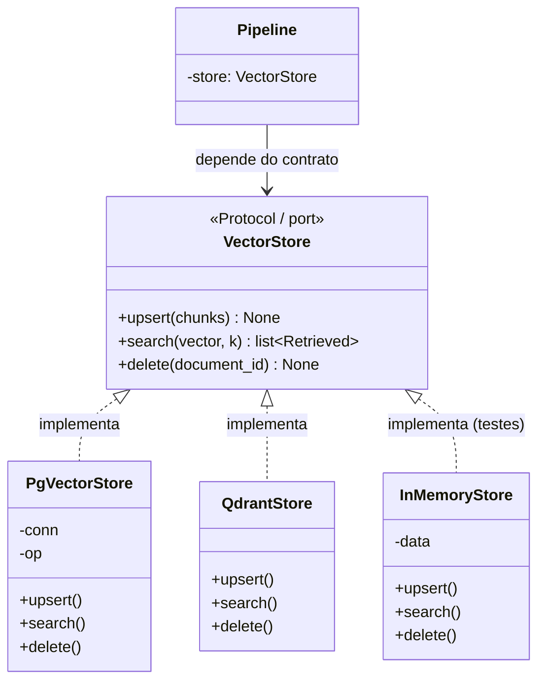

# Repository Pattern

> [!abstract] TL;DR
> O **Repository** medeia entre o domínio e a camada de persistência, oferecendo ao domínio uma interface **tipo-coleção** ("adicione estes itens", "encontre os que se parecem com isto") em vez de SQL cru. O domínio conversa com uma abstração de armazenamento e **não sabe** que existe um `INSERT`, um índice HNSW ou um driver `psycopg` do outro lado. No `density`, o repositório é o port `VectorStore` (`store/base.py`), e o pgvector (`store/pgvector.py`) é só *uma* das encarnações possíveis dele.

## A intenção: o domínio pensa em coleção, não em banco

O padrão foi catalogado por Martin Fowler em *Patterns of Enterprise Application Architecture* com uma definição que vale decorar: um Repository *"medeia entre o domínio e as camadas de mapeamento de dados, agindo como uma coleção de objetos de domínio em memória"*. A palavra-chave é **coleção**. Quando você tem uma `list` em Python, você não pensa em "como os bytes estão dispostos na RAM" — você pensa em `append`, em iterar, em filtrar. O Repository quer te dar essa mesma sensação, só que a "coleção" por baixo é um Postgres com pgvector.

O inimigo que ele ataca é o **vazamento de persistência para dentro da regra de negócio**. Sem repositório, o caso de uso de recuperação teria `SELECT ... ORDER BY embedding <=> %s LIMIT %s` escrito no meio da lógica de RAG. Aí a regra de negócio passa a *depender* do dialeto do pgvector — o operador `<=>`, a sintaxe do `psycopg`, os detalhes do índice. Trocar de banco vira reescrever a regra; testar a regra vira subir um Postgres. O Repository corta esse nó pondo uma fronteira: de um lado, intenção ("busque os k mais parecidos"); do outro, mecânica (o SQL que realiza isso).

Isso é a mesma inversão de dependência que rege a [[Arquitetura Hexagonal (Ports e Adapters)]] — o Repository é o nome clássico (pré-hexagonal, vindo do mundo DDD/enterprise) para um **driven port de persistência**. Um `VectorStore` é, portanto, um repositório especializado em vetores.

## O exemplo real no density: o port `VectorStore`

O contrato vive em `store/base.py` e é minúsculo de propósito — só o que o domínio *precisa*:

```python
# store/base.py — o PORT (contrato de domínio)
from typing import Protocol
from density.models import EmbeddedChunk, Retrieved

class VectorStore(Protocol):
    def upsert(self, chunks: list[EmbeddedChunk]) -> None:
        """Persiste chunks já embeddados (idempotente por id)."""
        ...

    def search(self, vector: list[float], k: int) -> list[Retrieved]:
        """Retorna os k chunks mais similares ao vetor de consulta."""
        ...

    def delete(self, document_id: str) -> None:
        """Remove todos os chunks de um documento."""
        ...
```

Repare no vocabulário: `upsert`, `search`, `delete`. É linguagem de **coleção**, não de banco. Não aparece `connection`, `cursor`, `commit`, `<=>`. E os tipos que cruzam a fronteira são [[Modelos de Domínio com Pydantic (DTO e Value Object)]] (`EmbeddedChunk`, `Retrieved`) — nunca uma `Row` do psycopg ou um dict solto.

O adapter concreto é quem sabe SQL:

```python
# store/pgvector.py — o ADAPTER concreto
class PgVectorStore:  # satisfaz VectorStore estruturalmente
    def __init__(self, dsn: str, distance: str = "cosine"):
        self._conn = psycopg.connect(dsn)
        self._op = {"cosine": "<=>", "l2": "<->", "ip": "<#>"}[distance]

    def search(self, vector: list[float], k: int) -> list[Retrieved]:
        sql = f"""
            SELECT c.id, c.text, c.document_id,
                   1 - (e.embedding {self._op} %s::vector) AS score
            FROM embeddings e JOIN chunks c ON c.id = e.chunk_id
            ORDER BY e.embedding {self._op} %s::vector
            LIMIT %s
        """
        rows = self._conn.execute(sql, (vector, vector, k)).fetchall()
        return [Retrieved(chunk_id=r[0], text=r[1],
                          document_id=r[2], score=r[3]) for r in rows]
```

Toda a sujeira — o operador de distância, o cast `::vector`, o join com a tabela de embeddings — está **presa aqui dentro**. O detalhe do schema é assunto de [[Design do Schema (documents, chunks, embeddings)]]; o domínio nunca o vê.

## Por que Repository aqui: os dois pagamentos concretos

Abstrair custa; então vale nomear exatamente o que se compra.

**1. Trocar pgvector ↔ Qdrant sem tocar no domínio.** O `PROJETO` já sinaliza a intenção de, mais adiante, comparar pgvector com Qdrant. Com o Repository, isso é escrever `QdrantStore` implementando os mesmos três métodos e injetá-lo no lugar. O `pipeline.py`, os modelos e a suíte de [[Avaliação com RAGAS]] não mudam **uma linha**. É o benchmark de infra saindo de graça — a mesma tese da [[Arquitetura Hexagonal (Ports e Adapters)]].

**2. Testar com um fake in-memory.** Testar retrieval contra um Postgres real é lento, exige Docker de pé e é frágil. Com o port, escrevo um fake trivial:

```python
class InMemoryStore:  # também satisfaz VectorStore
    def __init__(self): self._data: list[EmbeddedChunk] = []
    def upsert(self, chunks): self._data.extend(chunks)
    def delete(self, document_id):
        self._data = [c for c in self._data if c.document_id != document_id]
    def search(self, vector, k):
        ranked = sorted(self._data, key=lambda c: _cosine(c.embedding, vector),
                        reverse=True)
        return [Retrieved(chunk_id=c.id, text=c.text,
                          document_id=c.document_id, score=_cosine(c.embedding, vector))
                for c in ranked[:k]]
```

Agora o teste do pipeline de RAG roda em milissegundos, sem I/O, determinístico. Esse fake só é possível porque o domínio depende do **contrato**, não da classe concreta — e chegar até o pipeline via [[Injeção de Dependência]] é o que fecha o ciclo.

## Diagrama



A seta que importa é `Pipeline --> VectorStore`: o domínio aponta para a **abstração**. As três implementações apontam de volta para o contrato. Trocar de banco é trocar qual delas é instanciada no [[Injeção de Dependência|composition root]].

## Repository vs DAO — não confunda

Os dois escondem persistência, mas operam em níveis diferentes, e o entrevistador adora essa distinção:

| Aspecto | DAO (Data Access Object) | Repository |
|---|---|---|
| Nível de abstração | Baixo, colado à tabela | Alto, colado ao domínio |
| Vocabulário | `insert`, `update`, `selectById` — espelha CRUD/SQL | `upsert`, `search` — espelha intenção do negócio |
| Granularidade | Geralmente **um DAO por tabela** | Um repositório por **agregado/conceito** de domínio |
| Retorno | Linhas, records, DTOs de dados | **Objetos de domínio** ricos e válidos |
| Origem | Padrão de camada de dados (Java EE) | DDD / Fowler (padrão de domínio) |

Na prática: um DAO de `chunks` teria `insertChunk`, `deleteChunkById`, espelhando a tabela. O `VectorStore` do `density` é um **Repository** porque fala a língua do RAG (`search(vector, k)` é uma operação de *negócio*, "recupere contexto relevante"), coordena por baixo *duas* tabelas (`chunks` + `embeddings`) e devolve modelos de domínio `Retrieved`, não linhas cruas. O Repository frequentemente *usa* DAOs por dentro; aqui ele fala direto com o pgvector, o que é legítimo para uma abstração enxuta.

## O trade-off honesto: a abstração vaza os vetores

Aqui mora a tensão mais interessante — e a mais fácil de errar por idealismo. A promessa do Repository é "o domínio não sabe qual é o banco". Mas armazenamento vetorial tem **parâmetros que são semânticos, não só mecânicos**:

- **Operador de distância** — cosine, L2 ou inner product. Isso não é detalhe de infra puro: a escolha muda o *ranking* que o domínio recebe. Ver [[pgvector - tipo vector e operadores de distância]].
- **Parâmetros de índice ANN** — `ef_search` no HNSW, `probes` no IVFFlat. Eles regem o trade-off **recall × latência**, que é uma decisão de qualidade de recuperação, não de plumbing. Ver [[Índices ANN - HNSW vs IVFFlat]].
- **Busca híbrida** — se o store também faz o lado esparso (FTS/BM25), a fronteira fica ainda mais porosa. Ver [[Full-text Search e Busca Híbrida no Postgres]].

> [!warning] O anti-padrão "abstração de mentira"
> Se você tenta esconder *tudo*, ou vaza um `dict[str, Any]` de "opções do backend" que o domínio precisa preencher sabendo o que significam (aí a abstração é decorativa — o domínio conhece Qdrant assim mesmo), ou você amarra o domínio ao menor denominador comum e perde as features que justificaram escolher aquele banco. Ambos os extremos anulam o ganho.

**Como equilibrar (a resposta de sênior):** distinga *o que é decisão de domínio* de *o que é detalhe de adapter*. O operador de distância é decisão de domínio → exponha-o de forma **tipada e agnóstica** no contrato (ex.: um enum `Distance.COSINE` que cada adapter traduz para seu dialeto), não como string mágica de backend. Já `ef_search`/`probes` são tuning de infra → mantenha-os na **construção do adapter** (`PgVectorStore(ef_search=64)`), fora do port, decididos no [[Injeção de Dependência|composition root]]. A régua: *o port carrega intenção portável; o construtor do adapter carrega tuning específico.* Se um parâmetro só existe num backend, ele não pertence ao contrato — pertence ao adapter. E aceite que a fronteira nunca é 100% estanque; o objetivo é que **90% do código de domínio** rode contra qualquer store, não a perfeição teórica.

## Onde isso aparece no density

- `store/base.py` define o port `VectorStore` (`upsert`, `search`, `delete`) — o Repository canônico do projeto.
- `store/pgvector.py` é o adapter concreto que prende SQL, operador de distância e tuning de índice atrás do contrato.
- O fake in-memory (nos testes com [[pytest e ruff]]) implementa o mesmo port para testar retrieval sem Docker — habilitado por [[Injeção de Dependência]].
- O `pipeline.py` (ver [[Pipeline (Chain of Responsibility)]]) chama `store.search(vector, k)` sem saber que é Postgres, o que sustenta o benchmark pgvector×Qdrant descrito no [[PROJETO]].

## Conexões

- [[Design do Schema (documents, chunks, embeddings)]] — o que o adapter pgvector realmente persiste por baixo do repositório.
- [[Injeção de Dependência]] — quem escolhe e entrega qual `VectorStore` o domínio recebe.
- [[Arquitetura Hexagonal (Ports e Adapters)]] — o `VectorStore` é um driven port de persistência; Repository é o nome DDD para isso.
- [[Adapter Pattern]] — o `PgVectorStore` também é um adapter da API do psycopg.
- [[pgvector - tipo vector e operadores de distância]] e [[Índices ANN - HNSW vs IVFFlat]] — os detalhes que a abstração esconde (e às vezes vaza).
- [[Busca Vetorial (ANN)]] — a operação de negócio que `search` realiza.
