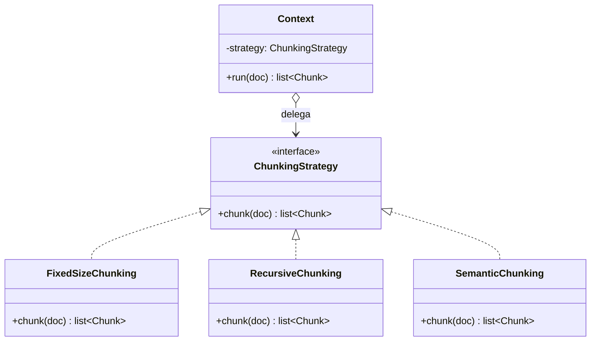

# Strategy Pattern

> [!abstract] TL;DR
> **Strategy** encapsula uma família de algoritmos intercambiáveis atrás de uma interface comum, permitindo **escolher qual usar em tempo de execução** sem que o código cliente saiba (ou se importe com) qual variante rodou. No `density` é o pattern que **torna o benchmark barato**: troca a estratégia de chunking/embedding/reranking, roda o *mesmo* eval, compara os números. Em Python idiomático, muitas vezes ele encolhe para "passar uma função como argumento".

## Intenção

> Definir uma família de algoritmos, encapsular cada um, e torná-los intercambiáveis. Strategy deixa o algoritmo variar independentemente dos clientes que o usam. — *GoF*

O problema que ele ataca: você tem **uma tarefa cuja *forma de fazer* varia**. Chunking é chunking — dado um documento, produza pedaços — mas *como* você corta (tamanho fixo? respeitando parágrafos? por similaridade semântica?) é uma decisão que muda. Sem Strategy, essa variação vira um `if modo == "fixed": ... elif modo == "recursive": ...` que cresce, mistura algoritmos no mesmo escopo e torna impossível testar/medir cada um isoladamente.

## Estrutura

Três papéis:

- **Context** — quem *usa* uma estratégia. Guarda uma referência à interface Strategy e delega o trabalho a ela. Não conhece a implementação concreta.
- **Strategy (interface)** — o contrato comum. No `density`, um `ChunkingStrategy` com um método `chunk(documento) -> list[Chunk]`.
- **ConcreteStrategy** — cada algoritmo real: `FixedSizeChunking`, `RecursiveChunking`, `SemanticChunking`.



O diagrama mostra o coração do pattern: o `Context` tem uma seta de **composição** (`o-->`) para a *interface*, nunca para uma classe concreta. Essa inversão é o que dá a flexibilidade.

## Exemplo real no density: estratégias de chunking

O [[Chunking]] é o estágio onde a escolha do algoritmo mais impacta a qualidade do RAG downstream. Por isso ele é o exemplo canônico de Strategy no `density`, vivendo em `ingestion/chunking.py`:

```python
# ingestion/chunking.py — esboço ilustrativo, não a implementação final
from abc import ABC, abstractmethod
from density.models import Document, Chunk

class ChunkingStrategy(ABC):
    @abstractmethod
    def chunk(self, doc: Document) -> list[Chunk]: ...

class FixedSizeChunking(ChunkingStrategy):
    def __init__(self, size: int = 512, overlap: int = 64):
        self.size, self.overlap = size, overlap
    def chunk(self, doc: Document) -> list[Chunk]:
        # janela deslizante de N tokens com sobreposição
        ...

class RecursiveChunking(ChunkingStrategy):
    def chunk(self, doc: Document) -> list[Chunk]:
        # tenta quebrar em \n\n, depois \n, depois ". " — respeita estrutura
        ...

class SemanticChunking(ChunkingStrategy):
    def __init__(self, embedder):  # depende de embeddings pra medir similaridade
        self.embedder = embedder
    def chunk(self, doc: Document) -> list[Chunk]:
        # agrupa sentenças por proximidade de embedding
        ...
```

E o Context — o pipeline de ingestão — apenas delega, sem saber qual variante recebeu:

```python
class IngestionPipeline:
    def __init__(self, chunker: ChunkingStrategy):  # recebe via injeção
        self.chunker = chunker
    def process(self, doc: Document) -> list[Chunk]:
        return self.chunker.chunk(doc)   # <- delegação cega
```

A mesma forma se repete em outros estágios plugáveis do `density`:

- **Embedders** (`embeddings/base.py` + `openai.py`): a interface `Embedder.embed(texts)` é uma Strategy; hoje há a implementação OpenAI, amanhã pode entrar uma local (BGE, Instructor). Ver [[Embeddings]].
- **Rerankers** (`retrieval/rerank.py`): reordenar candidatos com cross-encoder vs. sem reranking vs. outro modelo são estratégias intercambiáveis. Ver [[Reranking]].
- **Retrieval** (`retrieval/{dense,sparse,hybrid}.py`): busca densa, esparsa ou híbrida são estratégias de recuperação sob um contrato comum. Ver [[Busca Híbrida e Reciprocal Rank Fusion]].

> [!info] Nota sobre `Embedder`: Strategy *ou* Adapter?
> `OpenAIEmbedder` tem duas caras. Do ponto de vista do *pipeline* que escolhe entre embedders, é uma **Strategy** (algoritmo de embedding intercambiável). Do ponto de vista de *como ele fala com o SDK da OpenAI*, é um **Adapter**. O mesmo objeto pode desempenhar os dois papéis — a diferença é a *intenção sob a qual você o olha*. Ver [[Adapter Pattern]].

## O jeito pythônico: ABC vs Protocol vs callable

Aqui o Python muda o jogo. Existem três níveis de formalidade, do mais cerimonioso ao mais idiomático:

**1. ABC (herança nominal)** — o mais próximo do GoF. Bom quando você quer forçar o contrato e talvez compartilhar código base:

```python
class ChunkingStrategy(ABC):
    @abstractmethod
    def chunk(self, doc: Document) -> list[Chunk]: ...
```

**2. `typing.Protocol` (tipagem estrutural / duck typing tipado)** — muitas vezes *superior* em Python. A estratégia concreta **não precisa herdar de nada**; basta ter o método certo. Isso desacopla ainda mais (a implementação nem importa o seu módulo) e casa com a alma dinâmica do Python:

```python
from typing import Protocol

class ChunkingStrategy(Protocol):
    def chunk(self, doc: Document) -> list[Chunk]: ...

# qualquer objeto com .chunk(doc) satisfaz o contrato — sem herdar
```

**3. Só uma função/callable** — o mais idiomático quando a estratégia é *stateless* e simples. Não há "família de classes"; há funções passadas como argumento:

```python
from typing import Callable
Chunker = Callable[[Document], list[Chunk]]

def fixed_chunk(doc: Document) -> list[Chunk]: ...
def recursive_chunk(doc: Document) -> list[Chunk]: ...

class IngestionPipeline:
    def __init__(self, chunker: Chunker):   # a "strategy" é uma função
        self.chunker = chunker
```

> [!tip] Como escolher
> - **Estado + parametrização** (ex.: `FixedSizeChunking(size, overlap)`, `SemanticChunking(embedder)`) → classe (ABC ou Protocol). É o caso real do `density`.
> - **Sem estado, uma linha de lógica** → passe a função. Escrever uma classe com um método único e nenhum atributo é a "patternite" pythônica.
> - **Quer o contrato explícito, mas sem acoplar por herança** → `Protocol`.

## Por que Strategy TORNA o benchmark barato

Este é o ponto que amarra o pattern à tese do `density`. A [[Avaliação com RAGAS|avaliação rigorosa]] só é viável se **trocar uma variável for barato e não invasivo**. Strategy dá exatamente isso: como toda estratégia satisfaz a *mesma* interface, o loop de eval fica assim:

```python
for chunker in [FixedSizeChunking(512), RecursiveChunking(), SemanticChunking(emb)]:
    chunks = chunker.chunk(doc)
    index = build_index(chunks)
    scores = run_ragas(index, gold_questions)   # MESMO eval, sempre
    report(chunker.__class__.__name__, scores)
```

Sem Strategy, cada variante exigiria mexer no corpo do pipeline — e você nunca teria certeza de que comparou maçãs com maçãs. **Com** Strategy, a *única* coisa que muda entre as rodadas é o objeto injetado; todo o resto do pipeline é idêntico por construção. Isso é *controle experimental* virando arquitetura. Ver [[Fluxo de Dados no Pipeline RAG]].

## Trade-offs

> [!warning] O que você paga
> - **Indireção**: para entender "o que realmente rodou" você salta do Context para a estratégia concreta. Com uma única variante, é custo sem benefício (ver "patternite" em [[O que são Design Patterns]]).
> - **Proliferação de classes**: cada algoritmo é um tipo. Em Python, mitigue usando callables quando não houver estado.
> - **Interface no mínimo denominador comum**: se uma estratégia precisa de um parâmetro que as outras não têm (ex.: `SemanticChunking` precisa de um embedder), a interface tende a *vazar* ou você empurra a diferença para o construtor. Empurrar para o `__init__` é a saída limpa — o método `chunk(doc)` continua uniforme.

## Strategy vs Adapter (não confunda)

Ambos usam "uma interface + implementações por trás", então são fáceis de confundir. A diferença é de **intenção**, não de estrutura:

- **Strategy**: você *projetou* várias formas intercambiáveis de fazer a mesma coisa e quer **escolher** entre elas. As variantes são suas, criadas de propósito.
- **[[Adapter Pattern]]**: você tem *um objeto externo que já existe* com uma interface **incompatível** e precisa **encaixá-lo** no seu contrato. A motivação é compatibilidade, não escolha.

Regra de bolso: **Strategy responde "qual algoritmo?"; Adapter responde "como faço ISTO caber AQUI?".**

## Onde isso aparece no density

- `ingestion/chunking.py`: `ChunkingStrategy` com `FixedSizeChunking` / `RecursiveChunking` / `SemanticChunking` — o exemplo canônico.
- `embeddings/base.py` (`Embedder`) e `retrieval/rerank.py`: embedders e rerankers como estratégias intercambiáveis.
- `retrieval/{dense,sparse,hybrid}.py`: modos de recuperação sob contrato comum.
- O loop de [[Avaliação com RAGAS]]: itera sobre estratégias mantendo o eval fixo — o benefício econômico do pattern.

## Conexões

- [[O que são Design Patterns]] — a família comportamental e a nuance Python (callables).
- [[Adapter Pattern]] — mesma estrutura, intenção oposta; leia os dois juntos.
- [[Injeção de Dependência]] — como a estratégia escolhida *chega* ao Context (via construtor).
- [[Factory Method]] — quem *cria* a estratégia concreta a partir da config.
- [[Chunking]] · [[Embeddings]] · [[Reranking]] · [[Busca Híbrida e Reciprocal Rank Fusion]] — os domínios onde as estratégias vivem.
- [[Fluxo de Dados no Pipeline RAG]] · [[Avaliação com RAGAS]] — por que a intercambiabilidade importa.
