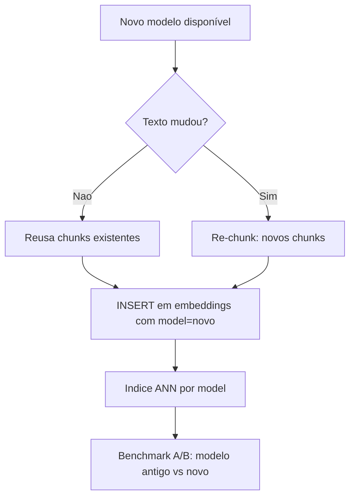
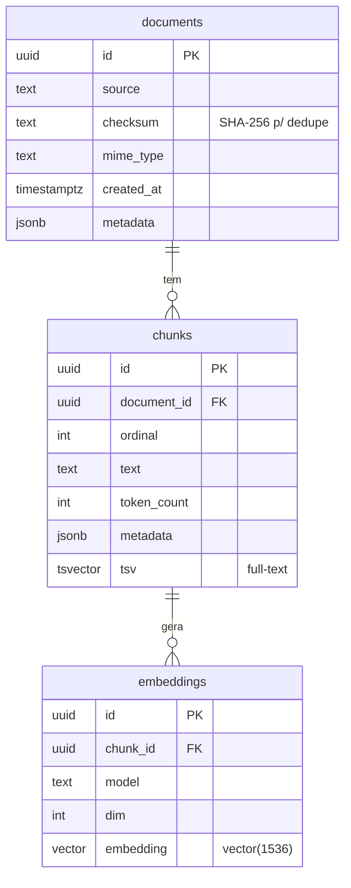

# Design do Schema (documents, chunks, embeddings)

> [!abstract] TL;DR
> O schema do `density` é modelado em **três entidades**: `documents` (a fonte), `chunks` (os pedaços de texto que serão recuperados) e `embeddings` (os vetores). A decisão de arquitetura mais importante aqui é **separar o embedding em sua própria tabela** em vez de colar o vetor na tabela `chunks`. Isso desnormaliza a preocupação "texto" da preocupação "representação vetorial", e paga em ouro na hora de **versionar por modelo de embedding e reindexar sem reprocessar o texto**. Esta nota é a planta baixa do banco.

## As três entidades e por que elas existem

Pense no fluxo de ingestão (veja [[Fluxo de Dados no Pipeline RAG]]): você recebe um PDF/TXT/MD, quebra em pedaços ([[Chunking]]), gera um vetor por pedaço ([[Embeddings]]) e guarda tudo para buscar depois. Cada passo tem uma granularidade diferente, e granularidade diferente = tabela diferente. Modelagem relacional boa é, no fundo, **respeitar a granularidade natural de cada coisa**.

### `documents` — a fonte de verdade

Um registro por arquivo ingerido.

- `id` — PK (UUID de preferência, para não vazar contagem e facilitar sistemas distribuídos).
- `source` / `path` — de onde veio (caminho, URL, nome do arquivo).
- `checksum` / `hash` — **o campo herói da reingestão.** Um hash (SHA-256) do conteúdo bruto. Antes de reprocessar, você compara o hash: se o arquivo não mudou, **não reingere** — economiza chunking e, principalmente, chamadas pagas de embedding. Também dá idempotência: rodar a ingestão duas vezes no mesmo arquivo não duplica dados.
- `mime_type` — `application/pdf`, `text/markdown`, etc. Direciona o parser certo.
- `created_at` / `ingested_at` — timestamps para auditoria e filtros temporais.
- `metadata` **JSONB** — o campo flexível: autor, título, tags, o que for. JSONB porque é semiestruturado, varia por fonte, e o Postgres indexa e consulta JSONB muito bem (`GIN`). Você não quer uma coluna por metadado possível.

> [!tip] Por que `checksum` é uma decisão de produção, não firula
> Reingestão é o caso comum, não o raro: documentos mudam, pipelines re-rodam, CI reprocessa. Sem o hash, cada re-run ou reprocessa tudo (caro, lento, chamadas de embedding desperdiçadas) ou você inventa lógica frágil de "esse arquivo já foi?". O hash resolve com uma comparação de string. Em entrevista, mencionar dedupe por checksum sinaliza que você pensa em operação, não só em happy-path.

### `chunks` — a unidade de recuperação

Um registro por pedaço de texto. **É isto que o retrieval devolve.**

- `id` — PK.
- `document_id` — **FK** para `documents`. `ON DELETE CASCADE`: apagou o documento, somem os chunks (e, por cascata, os embeddings). Consistência referencial de graça — um dos motivos de estar no Postgres (veja [[Por que Postgres e pgvector]]).
- `ordinal` / `chunk_index` — a ordem do chunk dentro do documento. Permite reconstruir contexto, buscar vizinhos ("chunk anterior/seguinte") e citar posição.
- `text` — o texto do pedaço. **Fica aqui, junto do relacional, e é o que você mostra/manda pro LLM** na geração ([[Grounding e Geração]]).
- `token_count` — quantos tokens tem. Útil para orçar o contexto do LLM e para diagnosticar o chunking.
- `metadata` **JSONB** — página de origem, seção, heading, etc.
- `tsv` — coluna **`tsvector`** para full-text search. É o que habilita a metade *esparsa/lexical* da [[Busca Híbrida e Reciprocal Rank Fusion]]. Detalhes em [[Full-text Search e Busca Híbrida no Postgres]]. Normalmente gerada (`GENERATED ALWAYS AS ... STORED`) a partir de `text`.

### `embeddings` — a representação vetorial

Um registro por (chunk × modelo de embedding). **Esta separação é a decisão-chave.**

- `id` — PK.
- `chunk_id` — **FK** para `chunks`.
- `model` — qual modelo gerou o vetor (`text-embedding-3-small`). Fundamental para versionamento.
- `dim` — a dimensionalidade (1536). Redundante com o tipo da coluna, mas explícito ajuda validação e auditoria.
- `embedding` — o `vector(1536)`. É sobre esta coluna que vive o índice ANN (veja [[Índices ANN - HNSW vs IVFFlat]]) e sobre ela que os operadores de distância operam (veja [[pgvector - tipo vector e operadores de distância]]).

## A decisão-chave: vetor em `chunks` vs. tabela `embeddings` separada

Você *poderia* colar `embedding vector(1536)` direto na tabela `chunks`. É mais simples e, para um protótipo, aceitável. Mas o `density` separa, e a justificativa é de trade-off de normalização:

> [!example] O que a separação te dá
> - **Versionar por modelo.** Amanhã você quer testar `text-embedding-3-large` (3072 dims) ou um modelo open-source. Com a tabela separada, você **adiciona linhas** com `model = 'novo-modelo'` — sem tocar nos chunks, sem migração destrutiva, mantendo os embeddings antigos para **comparar A/B**. Com o vetor colado em `chunks`, uma coluna só não comporta dois modelos, e trocar o modelo é ALTER TABLE destrutivo.
> - **Reindexar sem perder texto.** Reembedar = deletar/recriar linhas em `embeddings`. O `text`, o `document`, os metadados — tudo intacto. A cara operação de re-chunking fica desacoplada da barata (relativa) operação de re-embedding.
> - **Dimensões heterogêneas.** Modelos diferentes têm `n` diferente. Uma coluna `vector(1536)` fixa amarra você a um `n`. A tabela separada, com uma linha por modelo, acomoda dimensões distintas naturalmente.
> - **Cardinalidade limpa.** Um chunk pode ter zero embeddings (ainda não processado), um, ou vários (multi-modelo). A tabela separada expressa isso; a coluna embutida força "exatamente um ou nulo".

> [!warning] O custo da separação
> Você paga um `JOIN` a mais em toda query de retrieval (`chunks` ⋈ `embeddings`) e um pouco mais de complexidade no adapter. Para a escala do `density` isso é irrelevante perto do ganho de versionamento. **Se você tivesse certeza de um único modelo para sempre**, colar o vetor em `chunks` seria defensável. A separação é uma aposta consciente em *flexibilidade futura de modelo* — e como o diferencial do projeto é avaliação/comparação rigorosa (veja [[Avaliação com RAGAS]]), poder ter dois modelos coexistindo é praticamente um requisito.

## Por que guardar o texto separado do vetor

Repare que `text` mora em `chunks` e `embedding` mora em `embeddings`. Isso não é acidente:

- O **texto é o produto final** que vai pro LLM e pro usuário; o **vetor é só um índice de busca**, um meio para encontrar o texto. São coisas com ciclos de vida diferentes.
- Você reembeda sem tocar no texto (como já dito). E lê o texto sem carregar o vetor pesado (1536 floats ≈ 6 KB por chunk) quando não precisa dele.

## Versionamento de re-embedding, na prática



O `checksum` de `documents` decide se re-chunkar; a chave `model` de `embeddings` permite os dois modelos coexistirem; o benchmark compara. Todo o versionamento é *aditivo*, o que é a marca de um bom design de dados: você adiciona informação, raramente destrói.

## Diagrama ER



## Esboço de DDL

```sql
CREATE EXTENSION IF NOT EXISTS vector;

CREATE TABLE documents (
    id          uuid PRIMARY KEY DEFAULT gen_random_uuid(),
    source      text NOT NULL,
    checksum    text NOT NULL,                 -- dedupe de reingestão
    mime_type   text,
    created_at  timestamptz NOT NULL DEFAULT now(),
    metadata    jsonb NOT NULL DEFAULT '{}'::jsonb,
    UNIQUE (source, checksum)                  -- idempotência
);

CREATE TABLE chunks (
    id           uuid PRIMARY KEY DEFAULT gen_random_uuid(),
    document_id  uuid NOT NULL REFERENCES documents(id) ON DELETE CASCADE,
    ordinal      int  NOT NULL,
    text         text NOT NULL,
    token_count  int,
    metadata     jsonb NOT NULL DEFAULT '{}'::jsonb,
    tsv          tsvector GENERATED ALWAYS AS
                     (to_tsvector('portuguese', text)) STORED,
    UNIQUE (document_id, ordinal)
);
CREATE INDEX chunks_tsv_gin ON chunks USING gin (tsv);   -- FTS

CREATE TABLE embeddings (
    id         uuid PRIMARY KEY DEFAULT gen_random_uuid(),
    chunk_id   uuid NOT NULL REFERENCES chunks(id) ON DELETE CASCADE,
    model      text NOT NULL,
    dim        int  NOT NULL,
    embedding  vector(1536) NOT NULL,
    UNIQUE (chunk_id, model)                   -- 1 vetor por (chunk, modelo)
);
-- indice ANN vem em nota propria; casa com o operador de distancia:
CREATE INDEX embeddings_hnsw ON embeddings
    USING hnsw (embedding vector_cosine_ops);
```

> [!info] Note o `UNIQUE (chunk_id, model)`
> Ele materializa a regra "um vetor por chunk por modelo" no banco, não na aplicação. Constraint no schema > validação na app, sempre que possível — o banco é a última linha de defesa contra dados inconsistentes, e não confia que todo código que escreve nele esteja correto.

## Onde isso aparece no density

- O DDL vira as migrations que rodam quando o Postgres sobe via [[Docker e docker-compose]].
- As três tabelas têm contrapartes como modelos de domínio em `src/density/models.py` — `Document`, `Chunk`, `Embedding` como objetos Pydantic (veja [[Modelos de Domínio com Pydantic (DTO e Value Object)]]). O schema do banco e o modelo Pydantic são **espelhos**: um valida na fronteira de I/O, o outro persiste.
- `src/density/store/pgvector.py` traduz esses modelos para INSERT/SELECT; `src/density/store/base.py` define o contrato abstrato (veja [[Repository Pattern]]).
- A coluna `tsv` alimenta `src/density/retrieval/sparse.py`; a coluna `embedding` alimenta `src/density/retrieval/dense.py`; ambas se encontram em `src/density/retrieval/hybrid.py`.

## Conexões

- [[pgvector - tipo vector e operadores de distância]] — o tipo `vector` da coluna `embedding`.
- [[Full-text Search e Busca Híbrida no Postgres]] — a coluna `tsvector` e o índice GIN.
- [[Índices ANN - HNSW vs IVFFlat]] — o índice sobre a coluna `embedding`.
- [[Modelos de Domínio com Pydantic (DTO e Value Object)]] — o espelho em código das tabelas.
- [[Chunking]] — como nascem as linhas de `chunks`.
- [[Embeddings]] — como nascem as linhas de `embeddings`.
- [[Por que Postgres e pgvector]] — por que tudo isso mora num banco só.
- [[Fluxo de Dados no Pipeline RAG]] · [[Repository Pattern]]
- [[PROJETO]] · [[APRENDIZADOS]]
