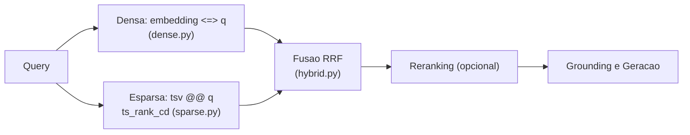

# Full-text Search e Busca Híbrida no Postgres

> [!abstract] TL;DR
> A busca vetorial densa é ótima para **semântica** mas cega para **correspondência exata de tokens** — siglas, números de lei, códigos, nomes próprios. A busca **esparsa/lexical** (full-text search, FTS) cobre exatamente esse buraco. O Postgres traz FTS nativa via `tsvector`/`tsquery`/`ts_rank_cd` + índice GIN — mas atenção: o ranking nativo é **BM25-*like*, não BM25 real**. Para BM25 de verdade, entra `pg_search`/ParadeDB (trade-off: dependência nova × precisão de ranking). Densa + esparsa combinadas = **busca híbrida**, e o "como" da combinação (RRF) mora em [[Busca Híbrida e Reciprocal Rank Fusion]].

## Denso vs. esparso: dois jeitos de "casar" texto

- **Denso (vetorial):** representa o texto por um vetor contínuo de ~1536 dims onde *significado* vira *proximidade geométrica* ([[Embeddings]], [[Busca Vetorial (ANN)]]). Capta sinônimos, paráfrase, intenção. "carro" e "automóvel" ficam perto.
- **Esparso (lexical):** representa o texto por um vetor gigante e majoritariamente zero — uma posição por termo do vocabulário, não-zero só nos termos presentes. Casa **tokens literais**, ponderados por frequência. "Lei 8.666" casa "Lei 8.666".

> [!warning] Por que a busca densa sozinha falha (e isto derruba RAG em produção)
> Embeddings **borram** exatamente o que às vezes precisa ser exato:
> - **Siglas e códigos:** "CID F41.1", "erro HTTP 429", "produto SKU-9931" — o embedding aproxima de coisas *semanticamente* parecidas e pode **perder o token exato** que o usuário quer.
> - **Números de lei / normas:** "Art. 5º da Lei 8.666" — para o embedding, um número é quase ruído; para o lexical, é uma chave precisa.
> - **Nomes próprios / termos raros:** nomes de pessoas, produtos, jargão que o modelo mal viu no treino ficam com embeddings pobres.
> - **Negação e termos fora do vocabulário do modelo.**
>
> A busca esparsa é **literal e precisa** justo onde a densa é vaga. Não competem — **complementam**. É por isso que sistemas de retrieval sérios são híbridos, e é por isso que o `density` guarda uma coluna `tsvector` lado a lado com o `vector` (veja [[Design do Schema (documents, chunks, embeddings)]]).

## FTS nativa do Postgres: as peças

### `tsvector` — o documento processado

`to_tsvector` pega o texto e produz um `tsvector`: tokens **normalizados** (stemming — "correndo"/"correu" → "corr"), sem stopwords, com posições. É o que você **indexa e armazena** (a coluna `tsv` de `chunks`).

```sql
SELECT to_tsvector('portuguese', 'A Lei 8.666 regula licitacoes publicas');
-- '8.666':3 'lei':2 'licit':5 'public':6 'regul':4   (stemmed, sem stopwords)
```

### `tsquery` — a consulta processada

`to_tsquery` / `plainto_tsquery` / `websearch_to_tsquery` transformam a busca do usuário em termos com operadores (`&`, `|`, `!`, `<->` para frase).

```sql
SELECT plainto_tsquery('portuguese', 'licitacao publica');
-- 'licit' & 'public'
```

### O match e o ranking

```sql
SELECT c.id, c.text,
       ts_rank_cd(c.tsv, q) AS rank
FROM chunks c,
     plainto_tsquery('portuguese', :query) q
WHERE c.tsv @@ q                 -- @@ = "casa?"; usa o indice GIN
ORDER BY rank DESC
LIMIT :k;
```

- `@@` é o operador de match (`tsvector @@ tsquery`).
- `ts_rank_cd` pontua a relevância considerando **frequência e proximidade** dos termos (o `cd` = *cover density*).

### Índice GIN — o que torna isso rápido

```sql
CREATE INDEX chunks_tsv_gin ON chunks USING gin (tsv);
```

**GIN** (Generalized Inverted Index) é o índice invertido clássico: mapeia *cada termo → lista de linhas que o contêm*. É o que faz o `@@` não varrer a tabela. No `density` a coluna `tsv` costuma ser `GENERATED ALWAYS AS (to_tsvector('portuguese', text)) STORED` — sempre sincronizada com o texto, sem código de aplicação para manter.

## O ponto crucial: FTS nativa é BM25-*like*, não BM25 real

Este é o detalhe que impressiona em entrevista e que muita gente ignora:

> [!danger] `ts_rank_cd` NÃO é BM25
> **BM25** é o algoritmo de ranking lexical padrão-ouro da recuperação de informação (o que Elasticsearch/Lucene usam). Ele modela **saturação de frequência de termo** (o 10º "licitação" acrescenta bem menos que o 2º) e **normalização por tamanho do documento** (documento curto não é injustamente penalizado). O `ts_rank_cd` do Postgres é uma **aproximação mais simples** — pondera frequência e proximidade, mas **não implementa a curva de saturação nem a normalização de comprimento do BM25**. Resultado: para muitas consultas ele funciona "bem o suficiente", mas o **ranking** pode ser mensuravelmente pior que BM25 de verdade. Chamar o FTS nativo de "BM25" é impreciso — é *BM25-like*.

### A saída para BM25 real: `pg_search` / ParadeDB

**ParadeDB** oferece a extensão **`pg_search`** (baseada em Tantivy, um motor à la Lucene em Rust) que traz **BM25 real** para dentro do Postgres, com índice próprio.

> [!example] O trade-off: dependência nova × precisão de ranking
> ✅ **Ganho:** ranking lexical de verdade (BM25), melhor qualidade da metade esparsa da busca híbrida — e ainda dentro do Postgres, sem sair para um Elasticsearch.
> ⚠️ **Custo:** uma **extensão a mais** para instalar/operar/versionar, nem sempre disponível em Postgres gerenciado (RDS pode não permitir), e um índice adicional a manter. Você trocou "zero dependências" por "melhor ranking".
>
> **A decisão do `density`:** começar com o **FTS nativo** (`tsvector` + `ts_rank_cd` + GIN) — zero dependências extras, alinhado à filosofia "um banco só, sobe com `docker compose`" (veja [[Por que Postgres e pgvector]] e [[Docker e docker-compose]]). E deixar `pg_search`/ParadeDB como **upgrade medido**: só adota se o benchmark de avaliação ([[Avaliação com RAGAS]]) provar que o ranking BM25 melhora o retrieval o suficiente para justificar a dependência. Rigor sobre hype — que é o lema do projeto.

## Combinar densa + esparsa: onde acontece?

Você tem duas listas ranqueadas — uma da busca densa (`<=>`), outra da esparsa (`ts_rank_cd`) — em **escalas incomparáveis** (distância cosseno vs. score de FTS). Fundir isso bem é o problema. A técnica robusta é **Reciprocal Rank Fusion (RRF)**, que combina por **posição no ranking**, não por score bruto — imune à diferença de escala. O *como* detalhado está em [[Busca Híbrida e Reciprocal Rank Fusion]]; aqui fica a decisão de **onde**:

> [!tip] RRF no app vs. RRF no SQL
> - **No SQL (uma query só):** dois `SELECT` (denso e esparso), cada um com `ROW_NUMBER()` para o rank, unidos por uma CTE que aplica a fórmula do RRF e reordena. **Prós:** uma ida ao banco, menos latência de rede, o Postgres faz o trabalho. **Contras:** SQL mais denso e menos flexível para tunar pesos/`k`.
> - **No app (Python):** dispara as duas buscas, recebe duas listas, funde em código. **Prós:** legível, testável, fácil de ajustar pesos e trocar a estratégia de fusão; casa com o design de `hybrid.py` orquestrando `dense.py` + `sparse.py`. **Contras:** duas idas ao banco (ou uma com dois resultsets), fusão fora do motor.
> - **A escolha do `density`:** a fusão como **estratégia plugável na aplicação** (`retrieval/hybrid.py`) — favorece clareza, testabilidade e experimentação, exatamente o que um projeto centrado em avaliação precisa. Veja [[Strategy Pattern]] e [[Pipeline (Chain of Responsibility)]].



### Esboço da metade esparsa (o que `sparse.py` roda)

```sql
-- top-k lexical, pronto para entrar no RRF
SELECT c.id AS chunk_id,
       ts_rank_cd(c.tsv, q) AS score,
       row_number() OVER (ORDER BY ts_rank_cd(c.tsv, q) DESC) AS rank
FROM chunks c,
     websearch_to_tsquery('portuguese', :query) q
WHERE c.tsv @@ q
ORDER BY score DESC
LIMIT :k;
```

## Onde isso aparece no density

- A coluna `tsv tsvector` de `chunks` e o índice `gin` são definidos no schema (veja [[Design do Schema (documents, chunks, embeddings)]]).
- `src/density/retrieval/sparse.py` executa a query de FTS acima; `src/density/retrieval/dense.py` faz a densa; `src/density/retrieval/hybrid.py` funde as duas via RRF (veja [[Busca Híbrida e Reciprocal Rank Fusion]]).
- A escolha "FTS nativo agora, `pg_search`/ParadeDB se o benchmark justificar" é uma decisão de arquitetura registrada, coerente com [[Por que Postgres e pgvector]].
- Após a fusão, um passo opcional de [[Reranking]] pode reordenar os candidatos antes do [[Grounding e Geração]].

## Conexões

- [[Busca Híbrida e Reciprocal Rank Fusion]] — o "como" da fusão densa+esparsa (RRF em detalhe).
- [[Design do Schema (documents, chunks, embeddings)]] — a coluna `tsvector` e o índice GIN.
- [[Reranking]] — o passo que refina os candidatos fundidos.
- [[Busca Vetorial (ANN)]] — a metade densa que a esparsa complementa.
- [[Embeddings]] — por que o denso borra tokens exatos.
- [[Por que Postgres e pgvector]] · [[Avaliação com RAGAS]] · [[Strategy Pattern]]
- [[PROJETO]] · [[APRENDIZADOS]]
