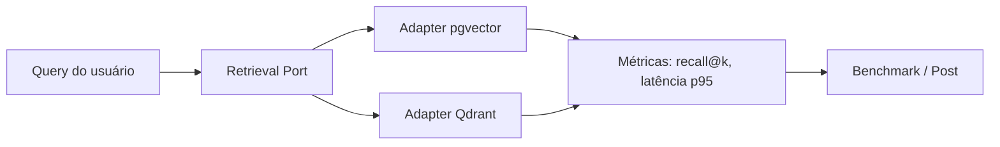

# Por que Postgres e pgvector

> [!abstract] TL;DR
> No `density` a escolha foi deliberada: **um único Postgres** guarda documentos, chunks, metadados relacionais **e** os vetores de embedding, via a extensão `pgvector`. Isso troca teto de escala e features especializadas por simplicidade operacional radical, transações ACID e a capacidade de fazer `JOIN` entre similaridade vetorial e filtros de metadados na mesma query. Este é o coração da decisão de infraestrutura do projeto, e entender o *porquê* — não só o *como* — é o que separa uma decisão de arquitetura de um cargo-cult de stack.

## O que é pgvector, conceitualmente

Você já domina Postgres. O que muda com `pgvector` é pequeno em superfície e enorme em consequência: é uma **extensão** (você habilita com `CREATE EXTENSION vector;`) que adiciona ao Postgres:

1. Um novo **tipo de coluna**, `vector(n)`, que armazena um array de `n` números de ponto flutuante (no nosso caso `n = 1536`, a dimensionalidade do `text-embedding-3-small` da OpenAI — veja [[Embeddings]]).
2. **Operadores de distância** entre vetores (`<->`, `<=>`, `<#>`) que permitem perguntar "quais linhas têm o vetor mais *próximo* deste aqui?" — o núcleo da [[Busca Vetorial (ANN)]]. Detalhes em [[pgvector - tipo vector e operadores de distância]].
3. **Tipos de índice ANN** (HNSW e IVFFlat) que tornam essa busca sublinear em vez de um scan sequencial `O(n)`. Detalhes em [[Índices ANN - HNSW vs IVFFlat]].

É isso. Não é um banco novo. É o seu Postgres de sempre, agora capaz de fazer *nearest-neighbor search* sobre embeddings. A profundidade da ideia está justamente aí: você não introduziu um segundo sistema de dados na sua arquitetura. Você ensinou um truque novo ao sistema que já estava lá.

> [!info] Por que isso importa para um RAG
> RAG (Retrieval-Augmented Generation) precisa, na hora da query, encontrar os `k` chunks mais relevantes para a pergunta do usuário. "Relevante" é medido por proximidade no espaço de embeddings. Sem uma estrutura como `pgvector`, você teria que carregar todos os vetores em memória na aplicação e calcular distâncias manualmente — o que não escala e joga fora tudo que um banco oferece (persistência, índices, concorrência, filtros).

## pgvector vs. vector DBs dedicados

Aqui está a decisão real. Os "vector databases dedicados" — **Qdrant**, **Weaviate**, **Pinecone**, **Milvus** — são sistemas construídos *do zero* para uma coisa: armazenar e buscar vetores em altíssima escala, com features de retrieval nativas. Eles são excelentes no que fazem. A questão nunca é "qual é o melhor em abstrato", e sim "qual é o melhor *para este projeto, neste estágio*".

> [!example] O trade-off central em uma frase
> Vector DB dedicado = **mais performance e features de retrieval, ao custo de um sistema a mais para operar e a perda do relacional junto do vetor**.
> pgvector = **um sistema só, relacional + vetor juntos, ao custo de teto de escala e features especializadas**.

### Prós do pgvector (por que o `density` escolheu ele)

- **Um banco para relacional + vetor.** `documents`, `chunks`, `embeddings` e seus metadados vivem lado a lado (veja [[Design do Schema (documents, chunks, embeddings)]]). Você não precisa sincronizar dois sistemas nem lidar com a inconsistência eventual entre "o vetor está no Pinecone mas o texto está no Postgres".
- **Transações ACID de verdade.** Ingerir um documento, criar seus chunks e gravar seus embeddings pode ser **uma transação atômica**. Se algo falha no meio, roll back e ponto. Com um vector DB separado, você tem escrita distribuída em dois sistemas sem transação abrangente — a fonte clássica de dados órfãos ("embedding sem chunk", "chunk sem embedding").
- **`JOIN` entre similaridade e metadados.** Esta é a mais subestimada. Você quer "os 10 chunks mais próximos desta query **que pertençam a documentos do tipo `contrato` criados depois de 2024**". Em `pgvector` isso é um `WHERE ... ORDER BY embedding <=> :q`. É SQL. Você já sabe fazer. Nos dedicados isso é "metadata filtering" — existe, mas com semântica e limitações próprias de cada produto.
- **Ops familiar.** Backup, replicação, monitoramento, permissões, migrations — tudo que você já domina de Postgres se aplica. Zero curva operacional nova. Para um projeto open-source que outras pessoas vão rodar, isso é ouro: `docker compose up` e acabou (veja [[Docker e docker-compose]]).
- **Sem serviço pago, sem lock-in.** Pinecone é SaaS. Postgres + `pgvector` roda no seu laptop, num container, num RDS, onde você quiser. Para uma ferramenta que se propõe *production-ready e reproduzível*, tirar a dependência de um serviço externo pago é uma decisão de design, não economia mesquinha.

### Contras do pgvector (e serão honestos aqui)

> [!warning] Onde o pgvector aperta
> - **Teto de escala.** Na casa de dezenas/centenas de milhões de vetores com alta QPS, os dedicados foram construídos para isso e o Postgres começa a sofrer — sharding de vetores não é o forte dele.
> - **Memória para o índice.** Um índice HNSW quer caber na RAM para performar. Muitos vetores de 1536 dims = muita memória. O Postgres compartilha esses recursos com toda a carga relacional (veja o trade-off memória×recall em [[Índices ANN - HNSW vs IVFFlat]]).
> - **Menos features nativas de retrieval.** Reranking nativo, quantização automática sofisticada, multi-tenancy vetorial, filtered-ANN otimizado — os dedicados trazem de fábrica; no Postgres você monta na mão ou vive sem.
> - **Filtragem + ANN combinados são um ponto delicado.** Quando você filtra por metadados *e* pede ANN, o planner do Postgres pode escolher caminhos subótimos (pré-filtrar e perder a aceleração do índice, ou pós-filtrar e ter que buscar `k` grande demais). Os dedicados investiram pesado em *filtered vector search*; o `pgvector` melhorou muito, mas é onde mais dói.

## Quando graduar para um dedicado

A regra prática que o `density` adota (e que você deve internalizar para entrevistas):

> [!tip] Sinais de que é hora de sair do pgvector
> - A contagem de vetores passa de **milhões** e a latência de busca sobe apesar do índice bem tunado.
> - Você precisa de **filtered-ANN pesado** (muitos filtros de metadados combinados com vetor) e o planner não coopera.
> - Você quer features que só os dedicados têm de fábrica: quantização escalar/produto avançada, hot-reindex sem downtime, sharding horizontal de vetores.
> - A carga vetorial começa a **competir por RAM/CPU** com a carga relacional a ponto de degradar as duas.
>
> Enquanto nenhum desses doer de verdade, **começar no pgvector é a decisão certa**. Regra de ouro de arquitetura: não pague o custo de complexidade de um sistema distribuído antes de ter o problema que justifica esse sistema.

## O ângulo de benchmark (isso vira post de blog)

Como o diferencial do `density` é a **avaliação rigorosa** (veja [[Avaliação com RAGAS]]), há uma oportunidade concreta: rodar o *mesmo* pipeline de retrieval sobre `pgvector` e sobre **Qdrant**, com o *mesmo* dataset e as *mesmas* métricas de recall/latência, e publicar o resultado. Isso transforma uma decisão de stack em conteúdo defensável com dados — exatamente o tipo de rigor que o projeto prega. A arquitetura já facilita isso: como o `store` é um port com adapters intercambiáveis (veja [[Repository Pattern]] e [[Adapter Pattern]]), trocar `pgvector` por `Qdrant` é implementar um adapter novo, não reescrever o pipeline.

## Onde isso aparece no density

- O adapter concreto vive em `src/density/store/pgvector.py`, implementando a interface abstrata definida em `src/density/store/base.py`. Essa separação port/adapter é o que permite o benchmark contra Qdrant sem tocar no pipeline (veja [[Arquitetura Hexagonal (Ports e Adapters)]]).
- A infraestrutura sobe via `docker-compose` com uma imagem de Postgres que já traz `pgvector` (tipicamente `pgvector/pgvector` ou `ankane/pgvector`), habilitando a extensão na migration inicial — veja [[Docker e docker-compose]].
- O tipo `vector(1536)` bate com o `text-embedding-3-small` configurado em `src/density/models.py`.
- A decisão "um banco só" é o que torna a ingestão (documento → chunks → embeddings) uma transação atômica no `store`.

## Conexões

- [[Índices ANN - HNSW vs IVFFlat]] — como a busca fica sublinear dentro do Postgres.
- [[pgvector - tipo vector e operadores de distância]] — o tipo `vector` e os operadores `<->`, `<=>`, `<#>`.
- [[Design do Schema (documents, chunks, embeddings)]] — como o relacional e o vetor convivem no schema.
- [[Full-text Search e Busca Híbrida no Postgres]] — o outro superpoder que "vem de graça" por estarmos no Postgres.
- [[Docker e docker-compose]] — como o Postgres+pgvector sobe no projeto.
- [[Busca Vetorial (ANN)]] — o conceito de retrieval que o pgvector materializa.
- [[Arquitetura Hexagonal (Ports e Adapters)]] · [[Repository Pattern]] · [[Adapter Pattern]] — por que trocar o vector DB é barato.
- [[PROJETO]] · [[APRENDIZADOS]]
