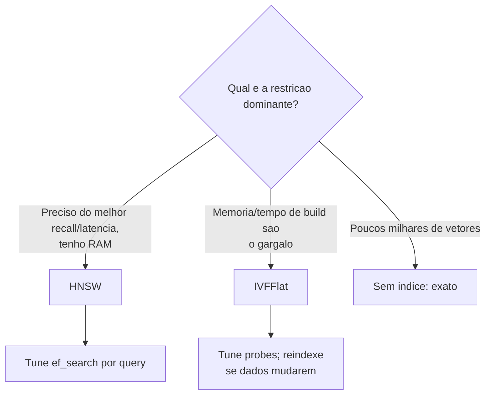

# Índices ANN - HNSW vs IVFFlat

> [!abstract] TL;DR
> Busca vetorial **exata** (KNN por scan sequencial) é `O(n)` e não escala. A saída é a busca **aproximada** (ANN): aceitar errar de vez em quando o vizinho mais próximo em troca de ser ordens de magnitude mais rápida. `pgvector` oferece dois índices ANN: **HNSW** (grafo hierárquico — recall alto, mais memória, build lento, não exige dados prévios) e **IVFFlat** (partições por k-means — build rápido, menos memória, exige dados para treinar, recall menor). A decisão vive na tríade **recall × latência × memória/build**.

## Exata vs. aproximada: por que abrimos mão da exatidão

A busca exata (KNN — *k nearest neighbors*) compara a query com **todos** os vetores e devolve os `k` verdadeiramente mais próximos. Correta, porém `O(n)`: dobrou o número de chunks, dobrou o tempo. Com milhões de vetores, um único `ORDER BY embedding <=> :q LIMIT 10` sem índice varre a tabela inteira — o `Seq Scan` que mata a latência.

> [!info] O insight que funda os vector DBs
> Em RAG você quase nunca precisa do vizinho **exato**. Se o 3º chunk mais relevante aparece na posição 4, ou se você pega 9 dos 10 melhores, a resposta final do LLM praticamente não muda. Essa tolerância a um errinho de ranking é o que autoriza trocar exatidão por velocidade. **ANN é uma aposta estatística**: quase sempre acerto os top-k, num tempo sublinear. A qualidade dessa aposta se chama **recall** (fração dos verdadeiros top-k que o índice recuperou), e é ela que você mede em [[Avaliação com RAGAS]].

> [!tip] Quando NÃO usar índice ANN
> Se a tabela tem poucos milhares de vetores, o `Seq Scan` exato é *rápido o bastante* e **100% de recall de graça**. Índice ANN só compensa quando `n` cresce. Para datasets pequenos do `density`, começar sem índice (exato) é legítimo — e serve de **baseline de recall = 1.0** para medir quanto o índice ANN degrada quando você o ligar.

## HNSW — Hierarchical Navigable Small World

Um **grafo de navegação em camadas**. Cada vetor é um nó ligado a seus vizinhos próximos; camadas superiores são esparsas (saltos longos), inferiores densas (ajuste fino). Buscar = entrar no topo, "descer" navegando greedy em direção à query, como um zoom progressivo.

**Parâmetros:**
- `m` — número de conexões por nó no grafo (build). Maior `m` = grafo mais denso = melhor recall, mais memória, build mais lento. Típico: 16.
- `ef_construction` — tamanho da lista de candidatos durante a **construção**. Maior = grafo de melhor qualidade, build mais lento. Típico: 64.
- `ef_search` — tamanho da lista de candidatos durante a **busca** (runtime, ajustável por query!). Maior = mais recall, mais latência. **Esta é a alavanca de tuning em produção**: você a gira sem reconstruir o índice.

> [!example] Perfil do HNSW
> ✅ **Recall alto** e latência baixa — geralmente a melhor qualidade de busca.
> ✅ **Não precisa de dados prévios** para construir — pode indexar uma tabela vazia e crescer incrementalmente (ótimo para ingestão contínua, o caso do `density`).
> ✅ `ef_search` ajustável em runtime, sem rebuild.
> ⚠️ **Mais memória** — o grafo inteiro quer caber na RAM.
> ⚠️ **Build lento** e uso maior de memória na construção.
>
> É o **default recomendado** do `pgvector` moderno, e o do `density`.

## IVFFlat — Inverted File with Flat compression

Particiona o espaço em `lists` clusters via **k-means**. Cada vetor mora no cluster do centróide mais próximo. Na busca, você não varre tudo: acha os `probes` centróides mais próximos da query e busca **só dentro desses clusters**.

**Parâmetros:**
- `lists` — número de clusters (build). Regra de bolso: `~sqrt(n_linhas)`. Mais listas = clusters menores, busca mais fina.
- `probes` — quantos clusters visitar na **busca** (runtime). Maior = mais recall, mais latência. `probes = 1` é rápido e impreciso; `probes = lists` vira busca exata.

> [!example] Perfil do IVFFlat
> ✅ **Build rápido** e **menos memória** que HNSW.
> ⚠️ **Recall menor** para a mesma latência.
> ⚠️ **PRECISA de dados representativos para treinar** o k-means — construir o índice numa tabela vazia ou quase vazia produz clusters ruins. Você tem que ingerir primeiro, indexar depois; e se a distribuição dos dados mudar muito, o índice envelhece e o recall cai (precisa reindexar).

> [!warning] O calcanhar do IVFFlat: o pós-filtro dos clusters
> Como a busca só olha `probes` clusters, se o verdadeiro vizinho caiu num cluster que você não visitou, ele **some** — recall perdido de forma que subir `ef_search` (que é do HNSW) não conserta; você tem que subir `probes`, pagando latência. Por isso, para qualidade, HNSW costuma ganhar.

## A tríade: recall × latência × memória/build

Toda escolha de índice ANN é negociar três coisas que puxam em direções opostas:

| Critério | HNSW | IVFFlat | Exato (Seq Scan) |
|----------|------|---------|------------------|
| **Recall** | Alto (ajustável via `ef_search`) | Médio (ajustável via `probes`) | 100% (perfeito) |
| **Latência de busca** | Muito baixa | Baixa–média | Alta (`O(n)`) |
| **Memória** | Alta | Baixa–média | Nenhuma extra |
| **Tempo de build** | Lento | Rápido | Nenhum |
| **Precisa de dados p/ treinar?** | Não | **Sim** (k-means) | Não |
| **Tuning em runtime** | `ef_search` | `probes` | — |



## Como escolher (a heurística do density)

> [!tip] Regra prática
> 1. **Comece com HNSW.** Melhor recall/latência, e crucialmente **não exige dados prévios** — casa com ingestão incremental. É o default do `density`.
> 2. **Só considere IVFFlat** se a memória do índice apertar ou se o tempo de build de reindexações completas doer, *e* você já tem um corpus estável e representativo para treinar o k-means.
> 3. **Meça sempre.** `ef_search`/`probes` mudam recall e latência drasticamente. O número "certo" é o que atinge seu alvo de recall no seu dataset — só o harness de avaliação diz qual é (veja [[Avaliação com RAGAS]]).
> 4. **Datasets pequenos:** fique no exato, use-o como baseline de recall = 1.0.

## O índice tem que casar com o operador de distância

Repetindo o ponto crítico de [[pgvector - tipo vector e operadores de distância]], porque é onde a maioria tropeça:

> [!danger] Classe de operador do índice = operador da query
> O índice é construído para **uma** métrica. Se ele é `vector_cosine_ops` e a query usa `<->` (L2), o índice é **ignorado** e você cai em `Seq Scan` silencioso. Escolha a métrica uma vez e mantenha índice e query coerentes.

```sql
-- HNSW para cosseno (casa com o operador <=> nas queries):
CREATE INDEX embeddings_hnsw
ON embeddings
USING hnsw (embedding vector_cosine_ops)
WITH (m = 16, ef_construction = 64);

-- IVFFlat para cosseno (note: exige dados na tabela ANTES de criar):
CREATE INDEX embeddings_ivf
ON embeddings
USING ivfflat (embedding vector_cosine_ops)
WITH (lists = 100);

-- Tuning em runtime:
SET hnsw.ef_search = 100;     -- HNSW: mais recall, mais latencia
SET ivfflat.probes = 10;      -- IVFFlat: mais recall, mais latencia
```

> [!info] Por que `vector_cosine_ops` no density
> Os embeddings da OpenAI vêm normalizados e o retrieval usa `<=>` (cosseno). Índice e query batem por construção. Veja o porquê da métrica em [[pgvector - tipo vector e operadores de distância]].

## Onde isso aparece no density

- A migration que cria o índice HNSW sobre `embeddings.embedding` roda quando o Postgres sobe via [[Docker e docker-compose]]; a classe de operador (`vector_cosine_ops`) casa com o `<=>` de `src/density/retrieval/dense.py`.
- `ef_search` é um parâmetro de retrieval exposto na configuração — a alavanca recall×latência que o harness de avaliação varre.
- HNSW vs IVFFlat vs exato, com recall/latência/memória medidos, é matéria-prima do benchmark pgvector vs Qdrant (veja [[Por que Postgres e pgvector]]).

## Conexões

- [[pgvector - tipo vector e operadores de distância]] — a métrica que o índice precisa espelhar.
- [[Busca Vetorial (ANN)]] — o conceito de retrieval que o índice acelera.
- [[Por que Postgres e pgvector]] — memória do índice como o teto de escala do pgvector.
- [[Design do Schema (documents, chunks, embeddings)]] — a coluna que recebe o índice.
- [[Avaliação com RAGAS]] — como medir recall e escolher `ef_search`/`probes`.
- [[Embeddings]] · [[Full-text Search e Busca Híbrida no Postgres]]
- [[PROJETO]] · [[APRENDIZADOS]]
