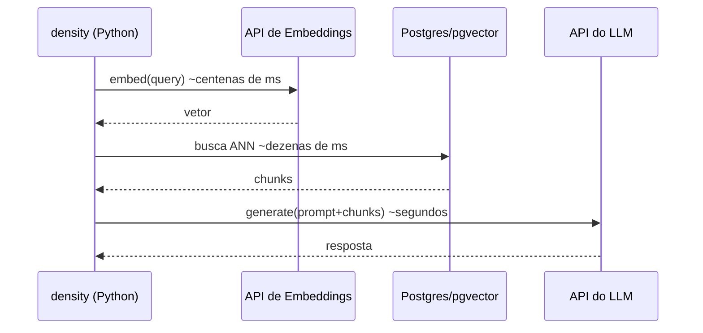
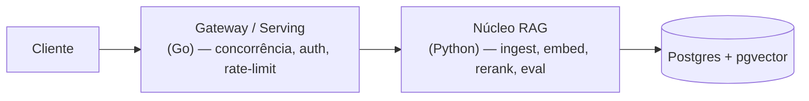

# Por que Python

> [!abstract] TL;DR
> Escolhi Python para o núcleo do `density` não porque seja "a melhor linguagem", mas porque é onde a **gravidade do ecossistema de IA/RAG** já está. As bibliotecas maduras (RAGAS, sentence-transformers, SDKs oficiais), a comunidade e o loop de experimentação (notebooks) formam um poço gravitacional que Go, apesar de excelente, ainda não tem para esse domínio. E, crucialmente, o gargalo do RAG é **I/O (chamadas a LLM/embeddings)**, não CPU — então o famoso GIL do Python quase não me penaliza aqui.

## O ponto de partida honesto: eu domino Go

Vale explicitar o trade-off desde o início, porque é o que torna essa decisão interessante. Eu (Gilson) sou sênior em Go. Go me daria binário único, concorrência estruturada com goroutines, latência de cauda (p99) previsível, tipagem forte de fábrica e deploy trivial. Para o meu **SaaS** — serving de alta concorrência, milhares de conexões, garantias de latência — Go é frequentemente a escolha certa.

Então por que não Go no `density`? Porque a pergunta não é "qual linguagem é melhor em abstrato", e sim **"onde está a alavancagem para ESTE domínio, HOJE"**. E para RAG/IA a resposta é inequívoca: Python.

## A gravidade do ecossistema ML/RAG

Software não vive no vácuo. O valor de uma linguagem para um domínio é, em boa parte, o valor das bibliotecas que você **não precisa escrever**. No RAG concreto:

- **RAGAS** — o framework de avaliação de RAG que ancora o diferencial do `density` (ver [[Avaliação com RAGAS]]) é Python-first. Não existe equivalente maduro em Go.
- **sentence-transformers / cross-encoders** — os modelos de [[Reranking]] e boa parte do tooling de [[Embeddings]] têm sua implementação de referência em Python (PyTorch/Hugging Face). Reescrever inferência de cross-encoder em Go é reinventar a roda com menos suporte.
- **SDKs oficiais maduros** — `openai` e `anthropic` publicam SDKs Python first-class, com tipagem, streaming, retries e paridade de features no dia do lançamento. Os SDKs em outras linguagens frequentemente chegam depois e com menos cobertura.
- **Notebooks (Jupyter)** — o loop de experimentação em RAG é empírico: você testa estratégias de [[Chunking]], compara métricas, inspeciona chunks recuperados. Notebooks tornam esse ciclo tight. Go não tem análogo real.
- **Comunidade e exemplos** — quando você trava, 90% dos exemplos, posts e respostas de RAG estão em Python. Isso é velocidade de desenvolvimento pura.

> [!tip] O princípio por trás
> Escolha a linguagem onde o **problema difícil do domínio já foi resolvido por outros**. Em RAG, o difícil (avaliação, reranking, embeddings) mora em Python. Lutar contra a corrente do ecossistema é dívida técnica auto-infligida — especialmente num projeto de portfólio onde o objetivo é demonstrar bom julgamento, não bravura.

## O contra-argumento clássico: "mas o GIL?"

A crítica reflexa a Python é o **GIL (Global Interpreter Lock)** — o lock que impede dois threads de executar bytecode Python ao mesmo tempo, serializando trabalho **CPU-bound** em threads. É uma crítica legítima... para o problema errado.

O RAG em runtime é **I/O-bound**, não CPU-bound. Pense no que o pipeline realmente faz:

Repare: o tempo de parede é dominado por **esperar respostas de rede** (embeddings, o banco, e sobretudo a geração do LLM, que leva segundos). O CPU local fica ocioso quase o tempo todo. Nesse regime:

- **`async`/`await` resolve concorrência de fato**: enquanto uma corrotina espera a resposta do LLM, o event loop atende outras. O GIL não atrapalha porque o trabalho pesado acontece **fora** do interpretador Python (dentro do syscall de rede, com o GIL liberado).
- O GIL só morderia se o gargalo fosse computação Python pura em múltiplos cores — o que **não** é o caso aqui. A parte pesada de CPU (matemática de embeddings, inferência do cross-encoder) roda em bibliotecas nativas (C/Rust/BLAS) que liberam o GIL.

> [!warning] Nuance honesta
> O reranking com cross-encoder local é o ponto mais CPU-intensivo do `density`. Mesmo aí, a inferência acontece em código nativo (PyTorch), não em loops Python, então o GIL raramente é o teto real. Se um dia isso virar gargalo de throughput sob carga, a resposta é escalar horizontalmente (mais workers/processos) ou empurrar o reranking para um serviço dedicado — não trocar a linguagem do núcleo.

## Onde Go ainda ganha — e onde eu dividiria

Ser sênior é resistir ao maximalismo. Python não é a resposta para tudo no sistema. Go continua superior para:

- **Serving de alta concorrência**: um gateway/API que segura milhares de conexões simultâneas com uso de memória enxuto e p99 previsível.
- **Latência de cauda previsível**: o GC do Go e o modelo de goroutines dão comportamento mais estável sob carga do que o async do Python.
- **Distribuição**: binário único, sem runtime nem venv para gerenciar em produção.

Por isso, a arquitetura madura que eu defenderia é **poliglota por camada**:

- **Núcleo de RAG em Python**: ingestão, [[Chunking]], embeddings, reranking, avaliação. Onde o ecossistema paga.
- **Serving/gateway em Go**: quando (e se) o SaaS precisar de uma borda de alta concorrência, ela fala com o núcleo Python via API/fila. Cada linguagem no seu ponto forte.

Essa separação é natural porque a [[Arquitetura Hexagonal (Ports e Adapters)]] do `density` já isola o núcleo de domínio da borda de entrega. O núcleo não sabe se quem o chama é um CLI, uma API Python ou um gateway Go — os **ports** definem o contrato. Trocar ou envelopar a camada de entrega não toca a lógica de RAG.

## Trade-offs que aceito conscientemente

| Custo do Python | Como mitigo / por que aceito |
|---|---|
| Tipagem dinâmica | Type hints + [[Pydantic v2]] validando toda entrada externa na borda ("parse, don't validate") |
| Performance de CPU inferior a Go | Irrelevante: workload é I/O-bound; partes pesadas rodam em código nativo |
| Empacotamento historicamente doloroso | Resolvido com [[uv (gerenciador de pacotes)]] (reprodutível e rápido) |
| GIL | Não morde num pipeline I/O-bound com `async` |
| Deploy mais pesado que binário Go | [[Docker e docker-compose]] padroniza o ambiente |

> [!question] E se o density virasse produto de altíssima escala?
> Aí eu manteria o núcleo de RAG/avaliação em Python (onde a inovação acontece) e moveria o caminho quente de serving para Go, comunicando-se via contratos bem definidos. Note que isso **não** é abandonar a decisão inicial — é a evolução que a arquitetura hexagonal já previa. A escolha por Python no dia 1 não me algema no dia 1000.

## Onde isso aparece no density

- O `pyproject.toml` fixa **Python 3.11+** — versão escolhida pelos ganhos de performance do interpretador e por `async`/typing maduros.
- Todo o núcleo em `src/density/` (config, models, pipeline de ingest/search/ask, adapters de LLM e embeddings) é Python idiomático moderno.
- Os SDKs `openai` e `anthropic` entram como adapters atrás de ports — Python é o que garante paridade de features desses SDKs.
- A dependência de **RAGAS** e do stack de reranking (`sentence-transformers`) só existe de forma madura em Python, cravando a decisão.

## Conexões

- [[Pydantic v2]]
- [[Arquitetura Hexagonal (Ports e Adapters)]]
- [[Camadas, Domínio e Fronteiras]]
- [[Avaliação com RAGAS]]
- [[Reranking]]
- [[Embeddings]]
- [[uv (gerenciador de pacotes)]]
- [[Docker e docker-compose]]
- [[PROJETO]]
- [[APRENDIZADOS]]
