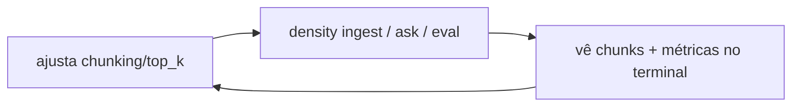

# Typer e Rich (o CLI)

> [!abstract] TL;DR
> **Typer** transforma type hints de funções Python num CLI completo (é construído sobre o Click, do mesmo autor). **Rich** faz a saída no terminal ficar bonita e legível — tabelas, barras de progresso, syntax highlighting, painéis. Juntos formam a **interface do `density` no dia 1**. E a decisão de fazer um **CLI antes de uma API web** é deliberada: em RAG, o que você mais precisa cedo é de um **loop de feedback rápido** para experimentar, medir e iterar — não de um frontend.

## Typer: type hints viram CLI

A sacada do Typer é usar o que você já escreve — assinaturas tipadas — como fonte da interface. Sem parsing manual de `argv`, sem `argparse` verboso:

```python
import typer
from pathlib import Path

app = typer.Typer(help="density — RAG com avaliação rigorosa")

@app.command()
def ingest(
    path: Path = typer.Argument(..., help="Arquivo ou pasta (PDF/TXT/MD)"),
    chunk_size: int = typer.Option(800, help="Tamanho do chunk em tokens"),
):
    """Ingere documentos: parseia, chunka, embedda e persiste."""
    ...

@app.command()
def ask(
    question: str,
    top_k: int = typer.Option(5, help="Chunks a recuperar"),
    rerank: bool = typer.Option(True, help="Aplicar reranking cross-encoder"),
):
    """Pergunta em linguagem natural sobre a base ingerida."""
    ...
```

O que o Typer deriva **automaticamente** disso:

- `--help` documentado (dos docstrings e `help=`).
- **Parsing e validação de tipos**: `chunk_size` vira `int`, `path` vira `Path` e a existência pode ser checada; entrada inválida gera erro amigável.
- Flags booleanas (`--rerank`/`--no-rerank`), valores default, argumentos obrigatórios vs opcionais.
- Autocompletar no shell.

> [!tip] Por que Typer e não argparse/Click direto
> `argparse` é stdlib mas verboso e stringly-typed. Click é poderoso mas pede muito decorator boilerplate. Typer fica **em cima do Click** (herda robustez) e usa **type hints** como API — a mesma filosofia de tipos-como-contrato que o [[Pydantic v2]] traz para os dados. Menos código, menos divergência entre a assinatura e a interface real.

## Rich: o terminal deixa de ser feio

Rich renderiza no terminal o que normalmente exigiria um frontend: tabelas alinhadas, barras de progresso, spinners, `print` com cores/estilos, syntax highlighting, painéis e árvores. Em RAG isso não é enfeite — é **observabilidade barata**.

Onde o Rich brilha no `density`:

- **Mostrar chunks recuperados**: numa busca, exibir cada chunk com seu score, origem (documento + índice) e um trecho — em painéis legíveis. Você *vê* por que o sistema respondeu o que respondeu (crucial para [[Grounding e Geração]]).
- **Tabela de scores do RAGAS**: a saída de `density eval` é naturalmente tabular (faithfulness, answer relevancy, context precision/recall por pergunta). Rich renderiza isso como tabela colorida com destaque para métricas abaixo do limiar (ver [[Avaliação com RAGAS]]).
- **Barra de progresso na ingestão**: parsear/chunkar/embeddar centenas de páginas leva tempo (I/O de rede nos embeddings). Uma `Progress` bar dá feedback e estimativa em vez de um terminal congelado.

```python
from rich.table import Table
from rich.console import Console

console = Console()

def show_eval(scores: list[dict]) -> None:
    table = Table(title="Avaliação RAGAS")
    for col in ("Pergunta", "Faithfulness", "Answer Rel.", "Ctx Precision"):
        table.add_column(col)
    for row in scores:
        table.add_row(
            row["question"][:40],
            f"{row['faithfulness']:.2f}",
            f"{row['answer_relevancy']:.2f}",
            f"{row['context_precision']:.2f}",
        )
    console.print(table)
```

> [!info] Detalhe de integração
> Typer já embute Rich para renderizar mensagens de erro e `--help` com formatação. Ou seja, ao escolher Typer você ganha parte do Rich "de graça", e adiciona uso explícito de Rich onde a saída de dados pede.

## Por que um CLI PRIMEIRO num projeto de RAG

Esta é a decisão de engenharia que vale defender numa entrevista. A ordem "CLI antes de API/frontend" não é preguiça — é priorizar o **loop de feedback**:



- **Loop de feedback rápido**: RAG é empírico. Você muda estratégia de [[Chunking]], `top_k` ou liga/desliga [[Reranking]] e precisa medir o efeito **agora**. Um comando é o caminho mais curto entre ideia e medição. Um frontend adicionaria semanas antes da primeira medição útil.
- **Scriptável e automável**: comandos entram em shell scripts, `Makefile`, CI. Rodar o [[Avaliação com RAGAS|benchmark de avaliação]] a cada mudança vira uma linha (`density eval suite.jsonl`), e regressões de qualidade aparecem no pipeline.
- **Sem estado de UI para gerenciar**: nada de servidor, rotas, auth, CORS, build de front. Toda a energia vai para o **núcleo de RAG**, que é o diferencial.
- **A borda certa da hexagonal**: o CLI é apenas mais um **adapter de entrada** (driving adapter) chamando os mesmos ports do núcleo. Quando o servidor MCP/API chegar depois, ele é **outro adapter** sobre o **mesmo** núcleo — o CLI não é trabalho jogado fora. Ver [[Arquitetura Hexagonal (Ports e Adapters)]] e [[Estrutura de Pastas do density]].

## Design dos comandos

O CLI espelha as fases do pipeline (ver [[Fluxo de Dados no Pipeline RAG]]):

| Comando | O que faz | Estágio |
|---|---|---|
| `density ingest <path>` | Parseia → chunka → embedda → persiste no pgvector | Indexação |
| `density search <query>` | Recupera chunks (vetorial/híbrida + rerank), sem gerar | Retrieval puro |
| `density ask <question>` | Recupera + gera resposta fundamentada com citações | Retrieval + geração |
| `density eval <suite>` | Roda o conjunto de avaliação e imprime métricas RAGAS | Avaliação |

> [!tip] Por que `search` separado de `ask`
> Separar recuperação de geração é uma escolha de diagnóstico. Se a resposta está ruim, `search` isola a pergunta: **o problema é o retrieval (chunks errados) ou a geração (chunks certos, síntese ruim)?** Sem essa separação, você depura os dois acoplados. Isso reflete a fronteira natural entre [[Busca Vetorial (ANN)]]/[[Reranking]] e [[Grounding e Geração]].

## Trade-off: CLI vs começar por uma API web

Ser honesto sobre o que o CLI **não** dá:

| CLI-first | API-web-first |
|---|---|
| Loop de iteração mais curto; foco no núcleo | Demonstra o produto para não-técnicos mais cedo |
| Scriptável, ótimo para benchmark/CI | Integra com frontends e outros serviços |
| Zero infra de serving | Exige rotas, auth, deploy, concorrência |
| Interface para **mim** (o dev) | Interface para **usuários** |

A decisão: **primeiro provar que o RAG é bom e mensurável (CLI), depois expor (MCP/API)**. Inverter a ordem é otimizar a embalagem antes de o produto funcionar. Como a hexagonal desacopla entrega de núcleo, adiar a API não custa retrabalho — só posterga o adapter de saída.

> [!question] E onde entra o servidor MCP?
> É o próximo adapter de entrega depois do CLI: expõe as mesmas capacidades (`ingest`/`search`/`ask`) para um cliente LLM em vez de para um humano no terminal. Mesmo núcleo, mesmos ports, porta de entrada diferente.

## Onde isso aparece no density

- `src/density/cli.py`: define o `typer.Typer()` e os comandos `ingest`, `search`, `ask`, `eval`, cada um chamando um serviço do núcleo via ports.
- Rich renderiza chunks recuperados, tabelas de score do RAGAS e barras de progresso da ingestão.
- `pyproject.toml`: `typer` e `rich` como dependências; um `[project.scripts]` expõe o entrypoint `density`.
- O CLI é o primeiro **driving adapter**; o servidor MCP/API virá como um segundo, reaproveitando o núcleo.

## Conexões

- [[Estrutura de Pastas do density]]
- [[Avaliação com RAGAS]]
- [[Arquitetura Hexagonal (Ports e Adapters)]]
- [[Fluxo de Dados no Pipeline RAG]]
- [[Grounding e Geração]]
- [[Pydantic v2]]
- [[Por que Python]]
- [[PROJETO]]
