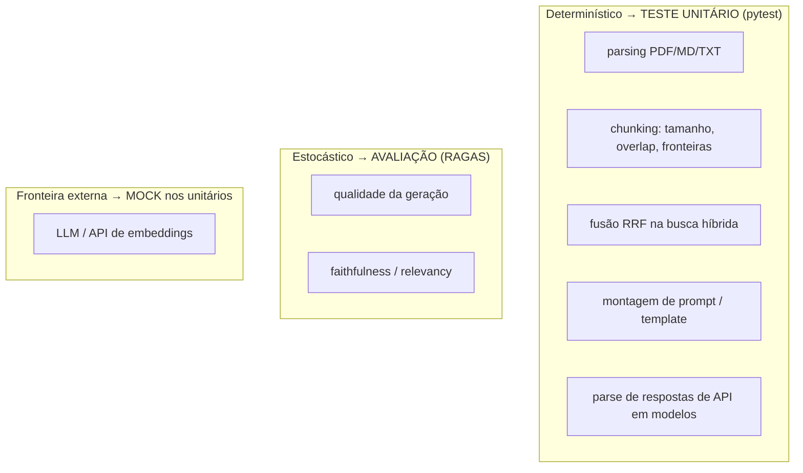

# pytest e ruff

> [!abstract] TL;DR
> **pytest** é o framework de testes; **ruff** é o linter+formatter (em Rust, da Astral — mesma casa do [[uv (gerenciador de pacotes)|uv]]) que substitui flake8+black+isort+mais numa ferramenta rapidíssima. O ponto não-óbvio e mais importante desta nota: **testar RAG é diferente**, porque sistemas com LLM são **não-determinísticos**. A resposta é separar dois mundos — teste com pytest as partes **determinísticas** (chunking, parsing, fusão RRF, montagem de prompt) e mocke o LLM; e trate **qualidade de geração** como **avaliação** ([[Avaliação com RAGAS]]), não como teste unitário.

## O desafio central: RAG não é determinístico

Um teste unitário clássico é uma afirmação binária: dado X, a saída **é exatamente** Y. Isso pressupõe **determinismo**. Um LLM viola isso na raiz:

- A mesma pergunta + mesmos chunks pode gerar respostas **textualmente diferentes** a cada chamada (mesmo com `temperature=0`, há variação de provedor).
- "Correto" em geração é **semântico e gradiente**, não uma igualdade de string. Uma resposta pode estar 90% certa.
- A saída depende de um serviço **externo, pago e mutável** (o modelo muda de versão sob você).

Escrever `assert answer == "texto esperado"` para uma resposta de LLM é frágil por construção: quebra por variação legítima, é lento, custa dinheiro por rodada e testa o provedor, não o **seu** código. A saída para o impasse é **dividir o sistema pela linha do determinismo**.

## A estratégia: separar o determinístico do estocástico



- **Determinístico → pytest.** Boa parte do `density` é lógica pura, testável de forma clássica:
  - **Chunking**: dado um texto de N tokens com `chunk_size`/`overlap` X, a saída tem contagem, fronteiras e sobreposição exatas (ver [[Chunking]]).
  - **Parsing**: extração de PDF/MD/TXT produz o texto/estrutura esperados.
  - **Fusão RRF**: dadas duas listas rankeadas (vetorial + textual), o [[Busca Híbrida e Reciprocal Rank Fusion|Reciprocal Rank Fusion]] produz uma ordenação **exata e verificável** — é pura matemática, alvo perfeito de teste.
  - **Montagem de prompt**: dado um conjunto de chunks, o template final contém as citações/estrutura esperadas.
  - **Parse de I/O**: os modelos [[Pydantic v2]] convertem respostas de API em objetos válidos e rejeitam malformados.
- **Fronteira externa → mock.** Nos testes unitários, o LLM e a API de embeddings são **substituídos por dublês**. Isso é limpo justamente porque a [[Arquitetura Hexagonal (Ports e Adapters)]] os isola atrás de **ports** — nos testes injeto um `FakeLLM`/`FakeEmbedder` (ver [[Injeção de Dependência]]) que retorna respostas fixas. Testes ficam **rápidos, grátis e determinísticos**, e verifico a **minha orquestração**, não o modelo.
- **Estocástico → avaliação.** A pergunta "a resposta gerada é boa?" **não** é teste unitário — é [[Avaliação com RAGAS|avaliação com RAGAS]], que mede faithfulness, relevancy e context precision/recall em escala contínua sobre um conjunto de perguntas. Roda separado (`density eval`), com limiares, como um benchmark — não como um `assert` verde/vermelho no CI unitário.

> [!warning] O erro clássico de quem começa em RAG
> Tentar "testar unitariamente" a qualidade da resposta do LLM. Isso gera testes **flaky** (quebram aleatoriamente), lentos e caros que a equipe logo desabilita. A disciplina sênior é reconhecer a fronteira: **determinístico vira teste, estocástico vira métrica de avaliação**. Confundir os dois envenena a suíte inteira.

## pytest na prática: fixtures e parametrize

Dois recursos carregam a maior parte do valor:

- **`fixtures`**: setup reutilizável e injetável (um documento de exemplo, um chunker configurado, um `FakeLLM`). Fixtures materializam [[Injeção de Dependência]] no nível de teste — o teste declara o que precisa e o pytest fornece.
- **`@pytest.mark.parametrize`**: roda o mesmo teste sobre muitos casos, ideal para as partes determinísticas (vários tamanhos de chunk, várias combinações de rank no RRF) sem duplicar código.

```python
import pytest
from density.chunking import chunk_text

@pytest.fixture
def long_text() -> str:
    return " ".join(f"palavra{i}" for i in range(1000))

@pytest.mark.parametrize("size, overlap", [(100, 0), (200, 20), (500, 50)])
def test_chunk_respeita_tamanho_e_overlap(long_text, size, overlap):
    chunks = chunk_text(long_text, chunk_size=size, overlap=overlap)
    assert all(len(c.tokens) <= size for c in chunks)
    assert chunks[0].text != chunks[1].text  # overlap não duplica chunk inteiro


def test_ask_usa_contexto_recuperado(fake_llm, fake_retriever):
    # LLM e retriever mockados via ports -> testo a orquestração, não o modelo
    answer = ask("qual o prazo?", llm=fake_llm, retriever=fake_retriever)
    assert fake_llm.last_prompt.count("[fonte") >= 1   # prompt cita as fontes
    assert answer.citations                             # resposta traz citações
```

Repare no segundo teste: não afirmo **o texto** da resposta (estocástico). Afirmo que **minha orquestração** montou o prompt com as fontes e propagou as citações — comportamento **determinístico do meu código**, com o LLM mockado.

## ruff: qualidade a custo quase zero

**ruff** unifica, numa ferramenta única em Rust, o que antes eram várias:

- **flake8** (lint de erros e estilo) + dezenas de plugins,
- **black** (formatação),
- **isort** (ordenação de imports),
- **pyupgrade**, **pydocstyle** e outros.

Vantagens sobre o stack antigo:

- **Velocidade**: 10–100x mais rápido; lint+format do projeto inteiro em milissegundos. Rápido o bastante para rodar **a cada save** no editor e como **pre-commit** sem atrito.
- **Uma config, uma ferramenta**: tudo em `pyproject.toml`, sem malabarismo entre flake8+black+isort com regras que brigam entre si.
- **Linter + formatter juntos**: `ruff check` (lint, com autofix de muitas regras) e `ruff format` (formatação estilo black).

```toml
[tool.ruff]
line-length = 100
target-version = "py311"

[tool.ruff.lint]
select = ["E", "F", "I", "UP", "B"]  # erros, pyflakes, isort, pyupgrade, bugbear
```

```bash
ruff check --fix    # lint + corrige o corrigível
ruff format         # formata
```

> [!tip] Sinergia com uv
> ruff e [[uv (gerenciador de pacotes)|uv]] são da mesma casa (Astral) e compartilham a filosofia "rápido em Rust, config no `pyproject.toml`". Rodo ambos via `uv run ruff ...`, no ambiente travado pelo lock — tooling consistente entre a minha máquina e a do revisor.

## Por que tooling de qualidade sinaliza senioridade

Num projeto de **portfólio** (ver [[PROJETO]]), a suíte de qualidade é lida como um sinal:

- **Testes nas partes certas** dizem que você entende **o que dá para garantir deterministicamente** e o que é intrinsecamente probabilístico — a distinção mais madura em engenharia de IA.
- **Linter/formatter configurados** dizem que o código é consistente, mantível e revisável — que você trabalha em time, não só faz funcionar na sua máquina.
- **RAGAS separado dos unitários** mostra que você conhece a diferença entre **teste** (o código faz o que eu programei?) e **avaliação** (o sistema de IA é bom o suficiente?). Poucos iniciantes em RAG fazem essa separação; fazê-la comunica senioridade diretamente.

## Integração com CI e pre-commit

Duas malhas de proteção:

- **pre-commit** (local): antes de cada commit, roda `ruff check`+`ruff format` e testes rápidos. Barra estilo quebrado e regressões óbvias **antes** de entrarem no histórico.
- **CI** (ex.: GitHub Actions): a cada push/PR, `uv sync` → `ruff check` → `ruff format --check` → `pytest`. Além disso, `density eval` pode rodar como job separado, publicando as métricas do RAGAS como um **relatório de qualidade** (não como gate binário — as métricas são gradientes, com limiares que evoluem).

```yaml
# .github/workflows/ci.yml (esboço)
- run: uv sync --frozen
- run: uv run ruff check .
- run: uv run ruff format --check .
- run: uv run pytest -q
# job separado, informativo:
- run: uv run density eval tests/suite.jsonl
```

> [!info] Cobertura sem fetichismo
> Uso `pytest-cov` para enxergar cobertura, mas o alvo não é 100% — é **cobrir a lógica determinística de valor** (chunking, RRF, parsing, montagem de prompt). Perseguir 100% num sistema cheio de fronteiras estocásticas mockadas gera testes-teatro que não pegam bug real. Cobertura é bússola, não meta.

## Trade-offs honestos

- **Mock demais testa o mock**: se eu mockar o LLM com respostas irreais, o teste passa mas não reflete a realidade. Por isso a rede de segurança real da **qualidade** é o RAGAS sobre chamadas reais, não os unitários mockados. Os unitários protegem a **orquestração**; a avaliação protege o **resultado**.
- **ruff é novo e opinativo**: regras mudam entre versões; ocasionalmente há falso-positivo que exige um `# noqa` justificado. O ganho de velocidade/unificação compensa largamente.
- **Suíte determinística não garante um bom RAG**: passar 100% dos unitários não significa que as respostas são boas — só que o encanamento funciona. É exatamente por isso que a [[Avaliação com RAGAS]] existe como camada separada e não como teste.

## Onde isso aparece no density

- `tests/`: unitários para chunking, parsing, fusão RRF e montagem de prompt; fixtures com `FakeLLM`/`FakeEmbedder` injetados via ports; `parametrize` cobrindo variações determinísticas.
- `pyproject.toml`: `[tool.ruff]` (lint+format) e o grupo de dev com `pytest`, `pytest-cov`, `ruff` (gerido pelo [[uv (gerenciador de pacotes)|uv]]).
- `density eval` (RAGAS) roda **separado** dos unitários — avaliação, não teste.
- `.pre-commit-config.yaml` e o workflow de CI encadeiam `ruff` + `pytest` a cada mudança.

## Conexões

- [[uv (gerenciador de pacotes)]]
- [[Avaliação com RAGAS]]
- [[Camadas, Domínio e Fronteiras]]
- [[Arquitetura Hexagonal (Ports e Adapters)]]
- [[Injeção de Dependência]]
- [[Chunking]]
- [[Busca Híbrida e Reciprocal Rank Fusion]]
- [[Pydantic v2]]
- [[PROJETO]]
- [[APRENDIZADOS]]
