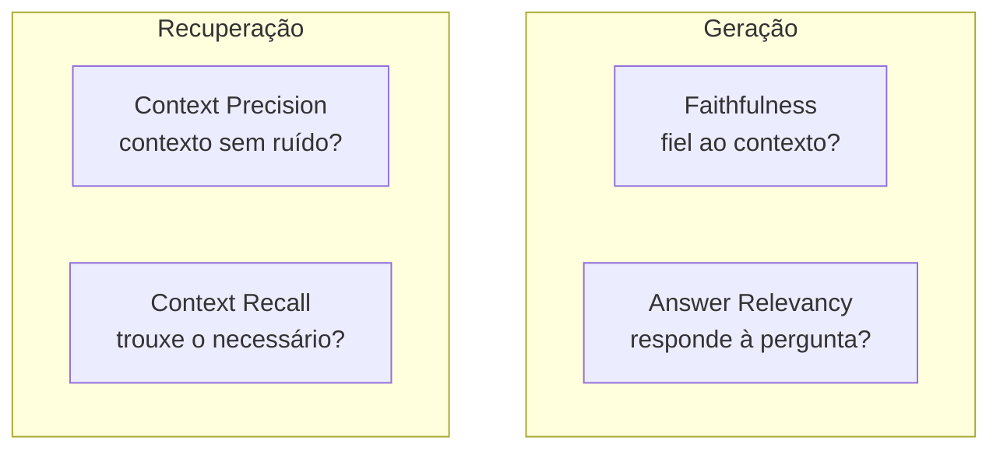

# Avaliação com RAGAS

> [!abstract]
> RAGAS é um framework que mede a qualidade de um pipeline RAG com métricas objetivas para *recuperação* e *geração*. É o **diferencial do density**: em vez de "achar" que ficou bom, você *prova* — e compara estratégias com números.

## Por que "parece bom no olho" não basta

Testar RAG olhando meia dúzia de respostas é uma armadilha. O sistema pode:

- Parecer ótimo nas queries que você lembrou de testar e falhar nas outras.
- Alucinar de forma *fluente* e convincente — bonito, mas errado.
- Melhorar numa dimensão e piorar em outra sem você perceber (trocou o chunking e o recall subiu, mas a fidelidade caiu).

Sem medição, você não sabe se híbrida bate densa, se o rerank vale o custo, se aquele chunk size novo ajudou. **RAG sem avaliação é otimização às cegas.** O density trata avaliação como cidadão de primeira classe justamente por isso.

## As métricas do RAGAS

RAGAS separa o que mede a **geração** do que mede a **recuperação** — crucial para saber *onde* está o problema.

- **Faithfulness** — a resposta é *fiel ao contexto recuperado*? Penaliza afirmações que não se sustentam nos chunks (ou seja, alucinação). É a métrica-âncora do [[Grounding e Geração]].
- **Answer Relevancy** — a resposta de fato *endereça a pergunta*, sem enrolação ou fuga do tema?
- **Context Precision** — dos chunks recuperados, quantos são *realmente relevantes*? Mede ruído na recuperação (chunks inúteis diluindo o contexto).
- **Context Recall** — a recuperação trouxe *tudo que era necessário* para responder? Mede o que ficou de fora.

A leitura conjunta diagnostica: recall baixo → problema na busca; faithfulness baixa com bom contexto → problema na geração/prompt.

## LLM-as-judge

Várias métricas do RAGAS usam **LLM-as-judge**: um LLM avalia a saída de outro (ex.: quebra a resposta em afirmações e checa, uma a uma, se cada uma se apoia no contexto). É poderoso — captura nuance que regra fixa não pega — mas exige cuidado:

- **Não-determinismo**: o juiz varia entre execuções; fixe temperatura baixa e considere médias.
- **Viés do juiz**: LLMs podem favorecer respostas longas ou do próprio estilo.
- **Custo**: cada avaliação são várias chamadas de LLM.

Trate o juiz como um instrumento calibrável, não como verdade absoluta.

## Golden dataset

Para métricas como *context recall* você precisa de um **golden dataset**: um conjunto de pares (pergunta → resposta/contexto esperado) considerado a referência. É o gabarito contra o qual o pipeline é pontuado. Montá-lo dá trabalho (idealmente com curadoria humana), mas é o que transforma avaliação em algo *reproduzível* — a mesma régua a cada mudança.

> [!example] 🌱 A aprofundar na Etapa 7
> - Implementar `density eval` rodando RAGAS sobre o pipeline.
> - Montar um golden set do domínio (perguntas + contexto/resposta de referência).
> - Gerar tabela de métricas *por estratégia* (densa × híbrida × +rerank) para comparação lado a lado.
> - Configurar o LLM-juiz (modelo, temperatura) e tratar o não-determinismo com médias.
> - Integrar a avaliação ao [[pytest e ruff]] como suíte reproduzível (regressão de qualidade).

## Onde isso aparece no density

É a **Etapa 7 (Avaliação — RAGAS)** e o coração do diferencial do projeto. Ela fecha o loop: cada escolha das Etapas 1–6 (chunking, embedding, densa/híbrida, rerank, prompt) deixa de ser opinião e vira número. É o que sustenta a Etapa 8 (Benchmark), onde as estratégias são comparadas sistematicamente.

## Conexões

- [[Grounding e Geração]] — o que a faithfulness/relevancy avalia.
- [[Busca Híbrida e Reciprocal Rank Fusion]] — o que context precision/recall ajudam a comparar contra a densa-só.
- [[pytest e ruff]] — onde a avaliação vira suíte automatizada e reproduzível.
- [[Reranking]] — outra estratégia cujo ganho o RAGAS quantifica.
