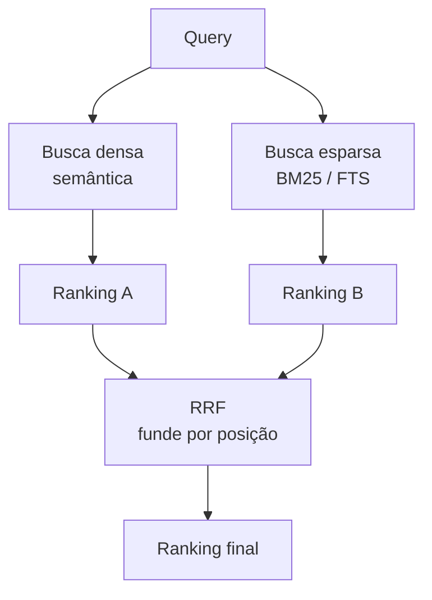

# Busca Híbrida e Reciprocal Rank Fusion

> [!abstract]
> Busca híbrida combina recuperação densa (semântica) com esparsa (lexical/BM25) e funde os dois rankings. O RRF (Reciprocal Rank Fusion) é o jeito robusto de fundir: soma por *posição*, não por score bruto — dispensa normalizar escalas incompatíveis.

## Por que densa sozinha falha

A [[Busca Vetorial (ANN)]] é ótima em *significado* e cega para *forma exata*. Ela erra justamente onde o token literal importa:

- **Siglas e códigos**: "STF", "CDC", "SKU-4471".
- **Números de lei/artigo**: "art. 927", "Lei 8.078".
- **Nomes próprios e termos raros**: um sobrenome, o nome de um contrato.

Nesses casos o embedding "entende o tema", mas não garante o match do termo exato — e é o termo exato que o usuário quer.

## A esparsa complementa

A busca **esparsa** (BM25, ou o full-text search do Postgres) trabalha por *casamento de termos*: conta e pondera as palavras que aparecem em query e documento. Ela é literal por natureza — acha "art. 927" porque a string está lá. A implementação no nosso stack está em [[Full-text Search e Busca Híbrida no Postgres]].

Densa + esparsa cobre os dois eixos: *o que o texto significa* e *quais termos ele contém*.

## O problema de fundir dois rankings

Densa devolve scores de similaridade de cosseno (ex.: 0.0–1.0); esparsa devolve scores BM25 (uma escala aberta, pode ir a 30, 40...). **Somar esses scores direto não faz sentido** — são unidades diferentes, e normalizar (min-max, z-score) é frágil e sensível a outliers. Um único documento com BM25 altíssimo distorce tudo.

## RRF: fundir por posição

O **Reciprocal Rank Fusion** resolve isso ignorando o score bruto e olhando só a **posição (rank)** de cada documento em cada lista. Para um documento *d*:

$$\text{RRF}(d) = \sum_{i} \frac{1}{k + \text{rank}_i(d)}$$

- `rank_i(d)` = posição de *d* no ranking *i* (1º, 2º, ...).
- `k` = constante de amortecimento (tipicamente **60**) que evita que o 1º lugar domine e suaviza a cauda.
- Soma-se a contribuição de *cada* ranking em que o documento aparece.

Estar bem colocado em *ambas* as listas empurra o documento para o topo do ranking fundido. Um documento no topo da densa mas ausente da esparsa ainda pontua — só menos.

## Por que RRF é robusto

- **Sem normalização**: usa posição, não magnitude — imune à diferença de escala entre cosseno e BM25.
- **Resistente a outliers**: um score gigante não contamina a fusão; só a posição conta.
- **Simples e sem parâmetros de treino**: só o `k`, e ele é pouco sensível.

É o *default* pragmático de fusão em RAG moderno justamente por dar 80% do ganho com quase nenhuma calibração.

> [!example] 🌱 A aprofundar na Etapa 4
> - Implementar `hybrid.py`: rodar densa e esparsa e fundir com RRF.
> - Comparar densa-só × híbrida no mesmo golden set — ver o ganho em queries com siglas/números.
> - Ajustar o `k` do RRF e observar o efeito no ranking final.
> - Decidir quantos candidatos puxar de cada lado antes da fusão.

## Onde isso aparece no density

É a **Etapa 4 (Sparse + Hybrid)**. Ela pega a busca densa da Etapa 3, soma a esparsa do Postgres e entrega um ranking fundido — que na sequência será refinado pelo [[Reranking]] (Etapa 5). É um dos pontos onde a avaliação rigorosa do density mostra valor: dá para *provar* que híbrida bate densa-só.

## Conexões

- [[Full-text Search e Busca Híbrida no Postgres]] — a implementação da parte esparsa.
- [[Busca Vetorial (ANN)]] — a metade densa da fusão.
- [[Reranking]] — o próximo refino, sobre o ranking já fundido.
- [[Avaliação com RAGAS]] — como medimos que a híbrida realmente ganhou.
