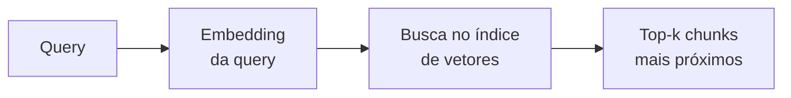

# Busca Vetorial (ANN)

> [!abstract]
> Dada a query embeddada, busca vetorial é achar os *k* chunks cujos vetores estão mais próximos dela no espaço semântico. É o coração da recuperação densa: "me traga os pedaços que *significam* algo parecido com a pergunta".

## O problema

Na Etapa 2 transformamos todos os chunks em vetores (ver [[Embeddings]]). Agora, no momento da pergunta, embeddamos a *query* com o **mesmo modelo** e procuramos no índice os vetores mais próximos dela. Esses são os candidatos que vão alimentar a geração.

O "mais próximo" usa uma métrica de distância/similaridade (cosseno, produto interno, L2) — os operadores concretos estão em [[pgvector - tipo vector e operadores de distância]].

## Exata × aproximada

- **Busca exata (brute force / KNN)** — compara a query com *todos* os vetores e retorna os k verdadeiros vencedores. Preciso, mas **O(n)**: com milhões de chunks, cada query varre o corpus inteiro. Não escala.
- **Busca aproximada (ANN — Approximate Nearest Neighbor)** — usa uma estrutura de índice para pular a maior parte das comparações e devolver os *quase* melhores k, muito mais rápido. Você abre mão de um pouquinho de recall em troca de ordens de magnitude em velocidade. Em RAG isso quase sempre vale a pena — perder ocasionalmente o 8º melhor de 10 não muda a resposta.

A sigla é a chave: **A**pproximate. Não é o vizinho perfeito, é o vizinho *bom o bastante, rápido*.

## A intuição dos índices ANN

Duas famílias dominam (o detalhe fica em [[Índices ANN - HNSW vs IVFFlat]]):

- **HNSW** — um grafo em camadas navegável; você "desce" saltando de nó em nó em direção ao vizinho. Ótima qualidade e latência, custa mais memória.
- **IVFFlat** — particiona o espaço em células (clusters); a busca só olha as células perto da query. Mais leve, exige treino e um bom ajuste de quantas células visitar.

Por ora, a intuição basta: **ambos evitam comparar com tudo**, cada um com um truque diferente.

## Escolhendo k

`k` é quantos chunks você recupera. Trade-off:

- **k baixo** → contexto enxuto, menos ruído, mas risco de deixar de fora o chunk certo (recall baixo).
- **k alto** → mais chance de pegar o relevante, mas mais ruído para o LLM (e, se houver rerank depois, mais candidatos para reordenar).

Um padrão comum: recuperar um k generoso na busca e deixar o [[Reranking]] afunilar para os poucos melhores.

## Onde a busca densa erra

Ela é forte em *semântica* e fraca em *literal*. Siglas raras, números de artigo de lei, códigos de produto, nomes próprios — coisas onde a *forma exata* importa mais que o sentido — a busca densa tende a errar, porque o embedding "entende o assunto" mas não casa o token exato. É exatamente essa lacuna que a [[Busca Híbrida e Reciprocal Rank Fusion]] fecha.

> [!example] 🌱 A aprofundar na Etapa 3
> - Implementar o comando `density search` que embedda a query e consulta o pgvector.
> - Sentir na prática onde a busca densa falha: siglas, números, nomes próprios.
> - Comparar recall entre k diferentes e medir latência do índice ANN.
> - Ligar a escolha de operador de distância à métrica com que os embeddings foram gerados.

## Onde isso aparece no density

É a **Etapa 3 (Dense retrieval)** — a primeira forma de recuperação do projeto e a linha de base contra a qual híbrida e reranking serão medidos. Consome os vetores da Etapa 2 e entrega candidatos para a geração (ou para o rerank).

## Conexões

- [[Índices ANN - HNSW vs IVFFlat]] — como a aproximação é feita por dentro.
- [[pgvector - tipo vector e operadores de distância]] — a implementação da distância no Postgres.
- [[Busca Híbrida e Reciprocal Rank Fusion]] — o próximo passo, que cobre as falhas da busca densa.
- [[Embeddings]] — a query e os chunks precisam do mesmo modelo.
