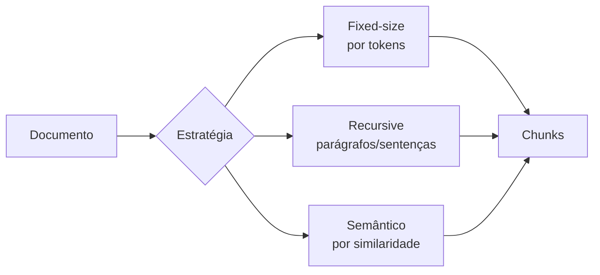

# Chunking

> [!abstract]
> Chunking é o ato de fatiar um documento longo em pedaços menores (chunks) que serão embeddados e indexados. É a primeira decisão de qualidade do pipeline: chunk ruim envenena tudo que vem depois.

## Por que chunking existe

Não dá para jogar um PDF de 300 páginas inteiro num embedding. Há duas razões, e a segunda é a que mais importa:

1. **Limite de contexto** — o modelo de embedding tem um teto de tokens de entrada (o `text-embedding-3-small` aceita 8191 tokens). Texto maior é simplesmente truncado.
2. **Diluição do sinal** — este é o ponto conceitual. Um embedding comprime *todo* o texto num único vetor. Quanto mais assunto você enfia num chunk, mais o vetor vira uma "média borrada" de tudo. Um chunk sobre juros de mora *e* prazos processuais *e* competência do foro produz um vetor que não representa bem nenhum dos três. Quando a query for específica ("qual a taxa de juros?"), a similaridade cai porque o sinal relevante ficou afogado no resto.

Chunking bem feito mantém cada pedaço **coeso** (um assunto por chunk) para que o embedding seja nítido.

## As estratégias

- **Fixed-size (por tokens)** — corta a cada N tokens (ex.: 512). Simples, previsível, rápido. Problema: é cego à estrutura, corta frases no meio e separa uma pergunta da sua resposta.
- **Recursive / estrutural** — respeita a hierarquia do texto: tenta quebrar por seções, depois parágrafos, depois sentenças, só caindo no corte bruto quando o pedaço ainda é grande demais. É o *default* pragmático — bom equilíbrio entre coesão e simplicidade.
- **Semântico** — usa embeddings das próprias sentenças para detectar onde o *assunto muda* e corta ali. Produz chunks mais coesos, mas custa mais (embedda para depois embeddar de novo) e é mais difícil de calibrar.

## O papel do overlap

Chunks adjacentes compartilham uma faixa de sobreposição (ex.: 50–100 tokens repetidos entre o fim de um e o começo do próximo). Isso evita que uma informação que "cai na fronteira" do corte perca contexto e fique irrecuperável. O overlap é um seguro barato contra cortes infelizes — o custo é redundância no índice.

## O trade-off central

**Tamanho do chunk: precisão × contexto.**

- **Chunk pequeno** → embedding nítido, recuperação precisa, mas o pedaço recuperado pode ser curto demais para o LLM responder bem (falta contexto ao redor).
- **Chunk grande** → mais contexto para a geração, mas embedding borrado e recuperação menos precisa (volta a diluição).

Não existe número mágico — depende do domínio e do tipo de query. Por isso o density trata isso como algo a **medir**, não a chutar.

> [!example] 🌱 A aprofundar na Etapa 1
> - Implementar as estratégias (fixed, recursive, semântico) como [[Strategy Pattern]], intercambiáveis sob uma interface comum.
> - Medir empiricamente fixo × semântico no mesmo corpus e ver a diferença na recuperação.
> - Calibrar tamanho e overlap por tokens (não por caracteres) usando o tokenizer do modelo.
> - Definir como o chunk carrega metadados de origem (documento, posição) para citação posterior.
> - Lidar com estrutura de PDF/MD (títulos, tabelas) sem quebrar a semântica.

## Onde isso aparece no density

É a **Etapa 1 (Ingestão + Chunking)** — a porta de entrada do pipeline. Cada chunk gerado vira uma linha na tabela `chunks` (ver [[Design do Schema (documents, chunks, embeddings)]]) e será posteriormente vetorizado na Etapa 2. A qualidade de tudo que vem depois — recuperação, reranking, geração — herda a qualidade do chunking. É o clássico *garbage in, garbage out* do RAG.

## Conexões

- [[Embeddings]] — cada chunk é transformado em vetor logo depois.
- [[Design do Schema (documents, chunks, embeddings)]] — onde os chunks são persistidos.
- [[Strategy Pattern]] — o padrão que torna as estratégias intercambiáveis.
- [[Fluxo de Dados no Pipeline RAG]] — o chunking como primeira etapa do fluxo.
