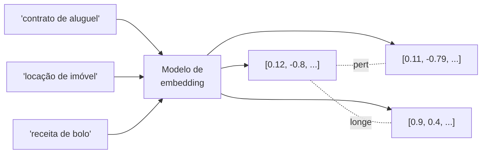

# Embeddings

> [!abstract]
> Um embedding transforma texto num vetor de números num espaço onde *proximidade geométrica = similaridade semântica*. É o mecanismo que faz o computador "entender" que "advogado" e "causídico" estão perto, mesmo sem compartilhar letras.

## O que é, de verdade

Um modelo de embedding é uma função `texto → vetor`. O `text-embedding-3-small` da OpenAI produz um vetor de **1536 dimensões** — 1536 números de ponto flutuante. Cada dimensão não tem um significado humano legível; o que importa é a *posição relativa*: textos com sentido parecido caem próximos nesse espaço de alta dimensão, textos sobre coisas diferentes caem longe.

A intuição: em vez de comparar palavras (frágil — sinônimos e paráfrases quebram), comparamos *significados* projetados como pontos num espaço.

## Similaridade por cosseno

A medida usual de "perto" é a **similaridade de cosseno**: o cosseno do ângulo entre dois vetores. Vale de -1 a 1; quanto mais perto de 1, mais semanticamente parecidos. Ela ignora a *magnitude* dos vetores e olha só a *direção* — o que casa bem com a ideia de "assunto", independente do tamanho do texto. (Os operadores concretos disso no banco estão em [[pgvector - tipo vector e operadores de distância]].)

## A regra de ouro: mesmo modelo para query e documento

Query e documento **têm que ser embeddados pelo mesmo modelo**. Espaços de embedding de modelos diferentes são incompatíveis — comparar um vetor do `text-embedding-3-small` com um de outro modelo é comparar coordenadas de mapas diferentes. Se você reindexar com um modelo novo, precisa reembeddar *todo* o corpus. É uma decisão com custo de migração real.

## Custo e batching

Embeddar é uma chamada de API paga por token. Em ingestão de documentos longos são milhares de chunks — então:

- **Batching**: mandar vários chunks por requisição reduz overhead e custo.
- **Idempotência**: não reembeddar o que já foi embeddado (guardar hash do conteúdo).

## Alternativas open-source

Você não está preso à OpenAI. Modelos como os da família **BAAI/bge** (`bge-small`, `bge-large`) rodam localmente, sem custo por chamada e sem mandar dados para fora — ao preço de você hospedar e servir o modelo. O trade-off clássico: **custo × qualidade × privacidade**. Para dados sensíveis (jurídico, saúde) o open-source local costuma valer a pena.

> [!example] 🌱 A aprofundar na Etapa 2
> - Gerar embeddings dos chunks da Etapa 1 e persistir na coluna `vector` do pgvector.
> - Comparar OpenAI (`text-embedding-3-small`) × `bge` medindo custo × qualidade de recuperação.
> - Implementar batching e idempotência (hash de conteúdo) na ingestão.
> - Isolar o provider de embedding atrás de uma interface (trocar OpenAI↔bge sem tocar no resto).
> - Decidir dimensionalidade e o impacto no tamanho do índice.

## Onde isso aparece no density

É a **Etapa 2 (Embeddings + Storage)**. Cada chunk da Etapa 1 vira um vetor persistido no pgvector, formando o índice sobre o qual a Etapa 3 fará a busca. O embedding é a ponte entre o texto bruto (chunks) e a recuperação semântica.

## Conexões

- [[Chunking]] — o que é embeddado são os chunks.
- [[pgvector - tipo vector e operadores de distância]] — onde os vetores vivem e como a distância é calculada.
- [[Busca Vetorial (ANN)]] — o que fazemos com os vetores depois de gerá-los.
- [[Fluxo de Dados no Pipeline RAG]] — a etapa de vetorização no fluxo geral.
