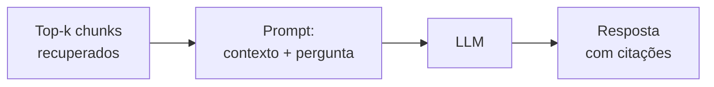

# Grounding e Geração

> [!abstract]
> Geração é a etapa em que o LLM finalmente responde ou sumariza — mas *fundamentado apenas nos chunks recuperados*. Esse ancoramento na fonte é o **grounding**, e é o que separa RAG de um chute confiante do modelo.

## O que é grounding

**Grounding** = obrigar a resposta a se apoiar em evidência recuperada, não no conhecimento paramétrico (o que o modelo "lembra" do treino). O pipeline até aqui existe para uma coisa: montar um contexto confiável ([[Chunking]] → [[Embeddings]] → recuperação → [[Reranking]]). Na geração, entregamos esse contexto ao LLM e pedimos que ele responda *usando aquilo*.

## Por que isso evita alucinação

Um LLM sozinho, perguntado sobre um documento que não viu, *inventa* com fluência — alucina. Ao ancorar a resposta em trechos reais e instruir o modelo a "responder só com base no contexto; se não estiver lá, diga que não sabe", você reduz drasticamente a fabricação. O grounding não elimina alucinação, mas a torna *mensurável* — dá para checar se a resposta é fiel ao contexto (é exatamente o que a métrica *faithfulness* do RAGAS mede, ver [[Avaliação com RAGAS]]).

## Citações e atribuição

Como cada chunk carrega a sua origem (documento + posição, definidos lá no [[Chunking]] e no [[Design do Schema (documents, chunks, embeddings)]]), a resposta pode **citar a fonte**: "segundo o §2º do art. 5º...". Isso dá:

- **Verificabilidade** — o usuário confere a origem.
- **Confiança** — respostas com fonte são auditáveis, essencial em domínio jurídico.
- **Rastreabilidade** — dá para debugar *de onde* saiu uma resposta ruim.

## Montando o prompt

O prompt de geração costuma ter três partes:

1. **Instrução/persona** — o papel e as regras (responder só pelo contexto, citar fonte, admitir ignorância).
2. **Contexto** — os chunks recuperados, delimitados e identificados.
3. **A pergunta/tarefa** do usuário.

Detalhes como ordem dos chunks, delimitadores e como pedir as citações são engenharia de prompt fina — território que o Gilson já domina.

## Conexão com Chain of Density

Para a tarefa de **sumarização** do density, a geração é o ponto natural de plugar o **Chain of Density** — a técnica de sumários progressivamente mais densos em entidades que o Gilson já publicou. Aqui ela ganha grounding: em vez de sumarizar texto solto, o CoD opera sobre chunks *recuperados e reordenados*, produzindo sumários densos, fiéis e atribuíveis à fonte. É a fusão do que o Gilson já sabe com o pipeline RAG novo.

## Abstração de LLM

OpenAI e Anthropic ficam atrás de uma interface comum (ver [[Adapter Pattern]]): a etapa de geração não sabe *qual* provider está gerando, só chama "gerar dado este prompt". Isso permite trocar/comparar modelos sem tocar no pipeline.

> [!example] 🌱 A aprofundar na Etapa 6
> - Implementar `density ask`: montar o prompt com contexto recuperado + pergunta.
> - Prompt com citações e regra de "não sei" quando o contexto não cobre.
> - Abstrair OpenAI ↔ Anthropic via [[Adapter Pattern]].
> - Plugar Chain of Density no fluxo de sumarização sobre chunks recuperados.
> - Orquestrar a geração como último passo do [[Pipeline (Chain of Responsibility)]].

## Onde isso aparece no density

É a **Etapa 6 (Geração)** — o ponto onde o pipeline vira resposta útil ao usuário. Consome o top-k do [[Reranking]] e produz a saída (resposta ou sumário) que a Etapa 7 vai avaliar. É a última etapa "produtiva" antes da medição.

## Conexões

- [[Reranking]] — fornece o contexto final e enxuto para gerar.
- [[Avaliação com RAGAS]] — mede se a geração é fiel e relevante.
- [[Pipeline (Chain of Responsibility)]] — a geração como elo final da cadeia.
- [[Adapter Pattern]] — a abstração que troca os providers de LLM.
