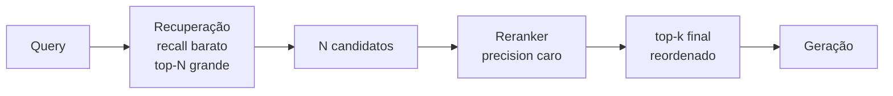

# Reranking

> [!abstract]
> Reranking reordena os candidatos já recuperados usando um modelo mais caro e mais preciso, aplicado só ao topo da lista. Divide o trabalho em duas fases: recuperação = "recall barato", rerank = "precision caro".

## A ideia das duas fases

Recuperar sobre milhões de chunks precisa ser *rápido* — por isso a busca ([[Busca Vetorial (ANN)]], [[Busca Híbrida e Reciprocal Rank Fusion]]) usa modelos baratos que priorizam **recall**: trazer o chunk certo *em algum lugar* do top-N, mesmo que mal ordenado. O rerank então pega esse punhado de candidatos e investe **precision**: um modelo pesado decide, com cuidado, quais realmente respondem à query e os coloca no topo.

Fazer o modelo caro rodar só sobre N candidatos (não sobre o corpus inteiro) é o que torna a precisão custeável.

## Bi-encoder × cross-encoder

Essa é a distinção conceitual central.

- **Bi-encoder** (o que a busca densa usa): embedda query e chunk **separadamente**, em vetores independentes, e compara por cosseno. Como os vetores dos chunks são pré-computados, a busca é rapidíssima — mas a query e o chunk nunca "se olham"; a interação entre eles é reduzida a um produto de vetores.
- **Cross-encoder** (o reranker): recebe **query e chunk juntos**, na mesma passagem do modelo, e produz um único score de relevância. Como ele lê os dois em conjunto, captura nuances que o produto de vetores perde (negação, correspondência termo-a-termo, contexto). É bem mais **preciso** — e bem mais **lento**, porque precisa de uma inferência por par (query, chunk) e nada pode ser pré-computado.

Por isso o cross-encoder é inviável sobre o corpus todo e perfeito sobre o top-N.

## Por que só o top-N

Rerankar 20–100 candidatos é barato; rerankar 1M é impossível. A recuperação faz a peneira grossa (garante que o certo está entre os N), o reranker faz a peneira fina. Se o N for pequeno demais e o chunk certo não entrar nele, nem o melhor reranker salva — o rerank não *recupera*, só *reordena* o que recebeu.

## Cohere Rerank × bge-reranker

- **Cohere Rerank** (API) — hospedado, sem infra sua, ótima qualidade; custa por chamada e manda dados para fora.
- **bge-reranker** (local) — roda na sua máquina/GPU, sem custo por chamada e sem vazar dados; você assume o custo de servir o modelo.

O trade-off: **latência/custo × qualidade × privacidade** — o mesmo dilema dos [[Embeddings]], agora na etapa de reordenação.

> [!example] 🌱 A aprofundar na Etapa 5
> - Implementar o reranker como [[Strategy Pattern]] (Cohere ↔ bge intercambiáveis).
> - Medir com × sem rerank no golden set — quanto de precision@k ele adiciona.
> - Calibrar o N de entrada e o k de saída.
> - Medir o custo real em latência e $ que o rerank injeta no pipeline.

## Onde isso aparece no density

É a **Etapa 5 (Reranking)**. Fica entre a busca híbrida (Etapa 4) e a geração (Etapa 6): recebe o ranking fundido, reordena com o cross-encoder e entrega ao LLM apenas os poucos chunks de maior relevância. É onde a qualidade do contexto que chega ao [[Grounding e Geração]] dá seu maior salto.

## Conexões

- [[Busca Híbrida e Reciprocal Rank Fusion]] — de onde vêm os candidatos a rerankar.
- [[Grounding e Geração]] — o consumidor do top-k reordenado.
- [[Strategy Pattern]] — o padrão que troca os rerankers.
- [[Avaliação com RAGAS]] — como comprovar o ganho do rerank.
